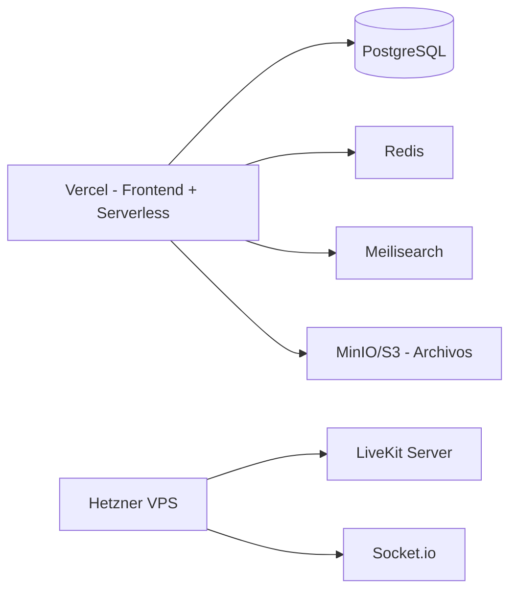

# Arquitectura — angelina-consultoria

## Principios

- **Clean Architecture**: separación en capas con dependencias hacia adentro
- **Type Safety**: tipos compartidos entre frontend y backend vía tRPC
- **Compliance First**: capa de compliance transversal para RGPD/LOPDGDD
- **Testabilidad**: dominio puro sin efectos secundarios

## Capas del proyecto

```
src/
├── domain/          # Entidades, value objects, reglas de negocio (puro TS)
├── application/     # Casos de uso, servicios de aplicación
├── infrastructure/  # DB, cache, storage, APIs externas
├── presentation/    # Componentes UI, layout, pages
├── shared/          # Tipos comunes, constantes, utilidades
├── compliance/      # Audit logging, consentimientos, DPO
└── seo/             # Blog, schema.org, meta tags
```

## Decisiones técnicas clave

### tRPC sobre REST
Tipado completo extremo a extremo. El frontend consume APIs con tipos inferidos
automáticamente del backend. Zero código duplicado de tipos.

### Drizzle ORM sobre Prisma
Drizzle es más ligero, SQL-first, y funciona mejor en entornos serverless.
Migraciones explícitas sin generación de cliente pesada.

### LiveKit Cloud para videoconsulta
Open-source WebRTC nativo, con grabación y transcripts compliant.
Gestionado via LiveKit Cloud (free tier). ADR-0001 documenta el cambio
desde self-host a Cloud.

### PostHog self-hosted
Analytics sin enviar datos de salud a terceros. Cumplimiento RGPD.
Alternativa a Google Analytics que evita transferencias a EEUU.

### ADR-0001: Vercel-Only Deployment
La plataforma se despliega exclusivamente en Vercel + servicios
gestionados (Vercel Postgres, Upstash REST, LiveKit Cloud, Vercel Blob).
La decisión arquitectónica está documentada en
[`docs/architecture/decisions/0001-vercel-only.md`](./docs/architecture/decisions/0001-vercel-only.md).
Cualquier propuesta que contradiga el ADR debe llamar explícitamente
el override.

### Meilisearch para búsqueda
Búsqueda con typo tolerance, filtros geo, por especialidad y aseguradora.
Mucho más rápido y simple que Elasticsearch para el volumen proyectado (500-2000 req/s).

## Capa de Compliance

```
src/compliance/
├── audit-log.ts         # Trazabilidad de accesos a datos clínicos
├── consent-manager.ts   # Gestión de consentimientos informados
├── dpo-portal.ts        # Portal para solicitudes ARCO
├── data-encryption.ts   # Cifrado pgcrypto + TLS
└── breach-notification.ts # Notificación de brechas (72h)
```

## Roles y permisos

Ver definición completa en memoria: `architecture/user-roles`.

Resumen por fase:
- **Fase 1**: Paciente, Doctor, Admin
- **Fase 2** (pre-lanzamiento): DPO, Superadmin
- **Fase 3** (escalando): Tutor, Staff, Content, Finanzas, Aseguradora

## Modelo de datos

Relacional con PostgreSQL. Tablas principales:

- `usuarios` — base para RBAC con todos los roles
- `doctores` — perfil profesional verificado
- `pacientes` — datos clínicos con tutores
- `citas` — agenda y estado de consultas
- `historial_clinico` — notas, diagnósticos, recetas
- `audit_log` — trazabilidad compliance
- `consentimientos` — versionado de consentimientos

## Estructura de BD

```sql
-- Relación base: un usuario puede ser doctor, paciente o ambos (según rol)
usuarios 1──N doctores
usuarios 1──N pacientes
pacientes N──M tutores (via tabla pivote)
usuarios 1──N audit_log
usuarios 1──N consentimientos
```

## Despliegue



## Seguridad

- Cifrado en reposo: pgcrypto para datos clínicos
- Cifrado en tránsito: TLS obligatorio
- Auth: Auth.js con sesiones JWT
- Validación: Zod en capa API y formularios
- Headers: HSTS, CSP, X-Frame-Options, Permissions-Policy
- Rate limiting: en API routes
