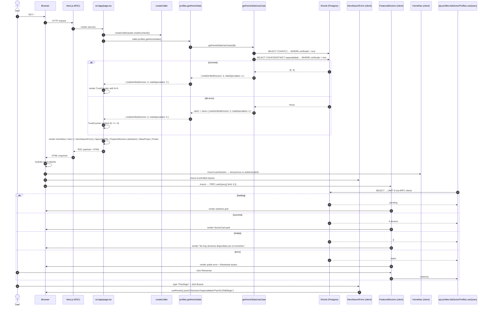

# Design: Home Page Upgrade (Doctoralia-style Landing)

## Technical Approach

Replace the 34-line skeleton at `src/app/page.tsx` with a six-section server-rendered landing page composed from a new `src/components/home/` directory. The page is a React Server Component (RSC) that uses `createCaller` from `src/infrastructure/api/server-caller.ts` to invoke the new public tRPC procedure `getHomeStats` server-side for the trust counter. The featured-doctors grid is a small client island that uses `api.profiles.listDoctorProfiles.useQuery` (the existing procedure) so it gets free loading / error / retry states on the client while still receiving the rest of the page as fully rendered HTML for SEO. The hero search form is a second client island. No DB migration is needed; one new use case and one new tRPC procedure are added. The change follows the established Clean Architecture: router → use case → Drizzle `db` (no `DoctorRepository` class — use cases take `db: NodePgDatabase<typeof schema>` directly, matching `getDoctorFullProfileUseCase`).

## Architecture Decisions

| ID  | Decision | Rationale | Alternatives Considered | Trade-offs |
|-----|----------|-----------|--------------------------|------------|
| **AD-1** | Add new public tRPC procedure `getHomeStats` returning `{ totalVerifiedDoctors: number; totalSpecialties: number }`. Implemented in `src/infrastructure/api/routers/profiles.ts` calling a new use case `getHomeStatsUseCase` at `src/application/use-cases/profiles/get-home-stats.use-case.ts`. | Avoids over-fetching from `listDoctorProfiles` (which joins `usuarios` and returns up to 50 rows) just to read two counts. A focused `COUNT(*)` + `COUNT(DISTINCT especialidad)` runs as one query, no join, and exposes an explicit, stable contract. | (a) Reuse `listDoctorProfiles` and count client-side — rejected; over-fetches 50 rows to read two integers, and ties the stat semantics to the listing filter. (b) Raw `sql` template inline in the router — rejected; breaks the application-layer boundary. (c) Materialized view — rejected; premature for a 2-count stat. | The procedure must catch DB errors and return `{ 0, 0 }` so the home page never 500s. The use case itself does the SQL; the procedure handles the safe-fallback. |
| **AD-2** | Home page (`src/app/page.tsx`) is an **async server component** that uses `createCaller(await createContext())` to call `profiles.getHomeStats` and `profiles.listDoctorProfiles({ limit: 8 })` server-side. The featured-doctors grid is rendered as a **client island** (`"use client"`) using `api.profiles.listDoctorProfiles.useQuery({ limit: 8 })` for loading / error / retry states. The hero search form is a second client island (`useRouter`). `HomeNav` is a third client island (uses `useSession`). Everything else (`Hero` static parts, `SpecialtyPills`, `ValueProps`, `Footer`, `TrustCounter`) is server-rendered. | RSC keeps the page SEO-indexable (h1, h2, links, structured copy all in the initial HTML). The `createCaller` primitive already exists at `src/infrastructure/api/server-caller.ts` even though no page consumes it yet — this change is its first consumer and establishes the pattern. The featured-doctors grid is a client island because (a) it needs loading skeleton, error retry, and empty state UI, and (b) React Query's `useQuery` is already wired by the `TRPCProvider` at `src/infrastructure/api/provider.tsx`. | (a) Full client page — rejected; kills the SEO win and adds a loading flash. (b) Static page + separate REST `/api/home-stats` — rejected; duplicates the tRPC schema. (c) `listDoctorProfiles` server-side only (no client retry) — rejected; loses the error-retry affordance the spec mandates. | `createCaller` requires a per-request `createContext()` which reads `auth()` and request headers — this adds a small per-request cost, accepted because the home page is `force-dynamic` (see AD-10) and the trust counter wants fresh data anyway. |
| **AD-3** | Reuse `DoctorCard` (`src/components/profiles/DoctorCard.tsx`) as-is in the featured grid, wrapped in a parent `<Link href="/doctores/{id}">`, with `showBookingLink={false}`. No new card variant. | `DoctorCard` already accepts `DoctorPublicResponse` (the 7-field summary returned by `listDoctorProfiles`). Building a "FeaturedCard" with different visuals would duplicate layout for no win. The full `DoctorHero` from the doctor-profile change is for the detail page only. | (a) New `FeaturedDoctorCard` with rating badge and "Destacado" ribbon — rejected; the rating is already in `DoctorCard`. (b) Inline a custom card — rejected; breaks the contract used by `/doctores`. | None. The `showBookingLink={false}` prop is already a documented escape hatch in `DoctorCard` (see `src/components/profiles/DoctorCard.tsx:23`). |
| **AD-4** | No new shadcn primitives. Reuse: `Button`, `Input`, `Card`, `Badge`, `Separator`, `Skeleton`, `DropdownMenu`, `Sheet`, plus `lucide-react` icons. | Minimize dependency surface and review footprint. The previous change (`2026-06-15-doctor-profile-page`) shipped with the same discipline. The required primitives are all already under `src/components/ui/`. | (a) `react-icons` — rejected; `lucide-react` is already in use everywhere. (b) `shadcn blocks` (marketing components) — rejected; too opinionated, would shift the visual baseline. (c) An `Accordion` for the footer — deferred; not needed. | If a real gap surfaces during apply, add it then. Current review of `src/components/ui/` confirms all needed primitives are present. |
| **AD-5** | New public-only top bar `src/components/home/HomeNav.tsx` (client island, uses `useSession`). It does **not** import `Shell` or `Header`. It does reuse `UserMenu` (`src/components/UserMenu.tsx`) in place of the auth links when a session is present, and `ThemeToggle` if it is independently exportable from `Header`. | Two layout systems, two purposes. `Shell` (`src/components/Shell.tsx`) is for the authenticated dashboard (sidebar + role-based nav). `HomeNav` is a thin marketing bar that collapses to logo + hamburger on mobile and surfaces auth state via a dropdown. Mixing them would force the marketing page to render a sidebar it never wanted. | (a) Reuse `Shell` and override its header — rejected; adds prop-drilling and conditional logic. (b) Build a custom auth dropdown from scratch — rejected; `UserMenu` already does it. (c) Hide auth CTAs entirely — rejected; signup is a primary conversion goal. | `HomeNav` becomes a third consumer of `UserMenu` (the others are `Header` and any future authenticated page). This is the intended reuse surface. |
| **AD-6** | Hard-coded specialty pills via `src/lib/constants/specialties.ts` exporting `POPULAR_SPECIALTIES: ReadonlyArray<{ slug: string; label: string }>` with exactly 12 entries, plus `Specialty` type and `getSpecialtyBySlug` helper. The `doctores.especialidad` column is a free-text `varchar` — no canonical table, no admin UI. | Deterministic, zero runtime cost, matches Doctoralia's top-12. Pulling `SELECT DISTINCT especialidad` from `doctores` would surface typos and one-off spellings. When an `especialidades` table lands later, this constant becomes the seed file. | (a) `SELECT DISTINCT especialidad FROM doctores WHERE verificado = true ORDER BY COUNT(*) DESC LIMIT 12` — rejected; data is small and dirty, and marketing wants editorial control. (b) Pull from an external taxonomy service — rejected; out of scope. | Drift risk: the constant may diverge from real `doctores.especialidad` values, so the listing filter is implemented as `ILIKE %slug%` (per `listDoctorProfiles`) so a slug of `psicologo` still matches the stored "Psicólogo". |
| **AD-7** | `TrustCounter` is rendered **only** when `getHomeStats().totalVerifiedDoctors > 0`. When the count is `0` (empty seed, fresh deploy, test env, or DB error) the component returns `null` and is **not** in the DOM. | "0 doctores verificados" on a public landing destroys first-impression trust. Hiding it preserves the page's honesty in the empty case; once any verified doctor exists, the counter appears. The implementation is a single conditional. | (a) Always render with a generic "Confía en MedicoConsulta" copy when zero — rejected; adds a translation surface and an untested code path. (b) Always render with the count — rejected; "0 doctores" is a conversion killer. | The hero will look slightly different in test envs (no trust strip). That is acceptable and signals the empty state honestly. |
| **AD-8** | Footer renders four columns. Links targeting existing pages (`/doctores`, `/`, `/login`, `/registro`) use the real `href`. Links targeting pages that do not exist use `href="#"` AND carry the attribute `data-todo="home-page-upgrade"`. The file header carries a top-of-file `// TODO(home-page-upgrade): replace # links with real pages when available` comment. **No stub pages are created.** | Stubs rot, block reviews, accumulate dead routes, and create a 404 surface for crawlers. A `// TODO` block at the top of one file is a single source of truth the next change can scan. | (a) Create thin placeholder pages (`/terminos`, `/privacidad`, `/como-funciona`, `/ayuda`, `/para-doctores`) — rejected; legal copy needs legal review, how-it-works needs a product decision. (b) Render no link at all in unbuilt sections — rejected; visual holes in a 4-column footer look broken. | The `data-todo` attribute is a one-line grep surface for the next change (`grep -r 'data-todo="home-page-upgrade"' src`). |
| **AD-9** | Hero city input is decorative in v1: `<Input disabled placeholder="Ciudad (próximamente)" aria-label="Próximamente" title="Próximamente" />`. On submit, only the specialty field is read. The form calls `useRouter().push("/doctores?especialidad=" + encodeURIComponent(rawValue))`. | Wiring the city field to anything (table, autocomplete, query param) is out of scope. A `disabled` input signals "we know it should be here" without pretending it works. The existing `/doctores` page already reads `especialidad` from the URL. | (a) Remove the city input — rejected; Doctoralia's hero has two fields, removing it thins the visual. (b) Wire city to a fake autocomplete — rejected; the spec already defers city work. | None in v1. When the city work lands, remove `disabled` and the submit handler's city-blindness. |
| **AD-10** | The home page declares `export const dynamic = "force-dynamic"` (matching `src/app/layout.tsx:9`) so the trust counter and featured grid see fresh data on every request. No new caching layer, no Redis, no in-memory store. No DB migration. | Freshness is acceptable on a public marketing page (counts update as doctors verify) and the cost is one COUNT query per request. The alternative — making the home static and fetching stats client-side — kills the SEO win because the count never appears in the initial HTML. | (a) `revalidate = 60` — rejected for v1; simplicity first, optimize later. (b) `cache()` on the tRPC procedure — rejected; adds a new caching primitive. (c) `force-static` + client `useQuery` — rejected; server-renders the counter as `0` always. | Each home-page request runs the COUNTs and the featured grid query. If latency is observed in production, add a `revalidate` later. |

## Data Flow



The trust counter takes the server-side path (fresh, SEO-indexable, no client waterfall). The featured-doctors grid takes the client-side path (rich loading / error / retry UI, no over-fetching on the server). This split is what REQ-HOME-UI-2 and REQ-HOME-API-1 mandate.

## File Changes

| Action | Path | Purpose | Lines |
|--------|------|---------|-------|
| **NEW** | `src/lib/constants/specialties.ts` | Hard-coded 12 specialties (`POPULAR_SPECIALTICES`), `Specialty` type, `getSpecialtyBySlug` helper. Header comment documents it is the seed for the future `especialidades` table. | ~45 |
| **NEW** | `src/lib/constants/__tests__/specialties.test.ts` | Asserts length 12, slug uniqueness, label case, URL-safety, `getSpecialtyBySlug` happy and miss paths. | ~45 |
| **NEW** | `src/application/use-cases/profiles/get-home-stats.use-case.ts` | Async function `getHomeStatsUseCase(db: NodePgDatabase<typeof schema>): Promise<{ totalVerifiedDoctors: number; totalSpecialties: number }>`. Runs two `count()` queries. | ~30 |
| **MODIFY** | `src/application/index.ts` | Re-export `getHomeStatsUseCase`. | +2 |
| **NEW** | `src/application/use-cases/__tests__/get-home-stats.use-case.test.ts` | Mocks `db` to return mocked counts; asserts shape and that errors are **propagated** (the safe-fallback is the procedure's job, not the use case's). | ~45 |
| **MODIFY** | `src/infrastructure/api/routers/profiles.ts` | Add `getHomeStats: publicProcedure.query(...)` that calls `getHomeStatsUseCase(db as never)` inside a `try/catch` returning `{ totalVerifiedDoctors: 0, totalSpecialties: 0 }` on any throw. | +20 |
| **MODIFY** | `src/infrastructure/api/routers/__tests__/profiles.test.ts` | Add a `getHomeStats` describe block: success returns shape, DB error returns safe fallback, procedure is public (no auth). | +90 |
| **NEW** | `src/components/home/HomeNav.tsx` | Sticky frosted-glass top bar. Brand link "MedicoConsulta" → `/`. Right side: anonymous shows "Iniciar sesión" + "Registrarse" `Button`s; authenticated reuses `<UserMenu user={session.user} />`. Mobile: hamburger → shadcn `Sheet` with the same links. `"use client"` for `useSession`. | ~95 |
| **NEW** | `src/components/home/Hero.tsx` | Server component. Renders `<h1>`, sub-headline `<p>`, `<HeroSearchForm>`, and `<TrustCounter stats={stats} />` (TrustCounter self-hides when N=0). | ~30 |
| **NEW** | `src/components/home/HeroSearchForm.tsx` | `"use client"`. Controlled `<Input>` for specialty, decorative `<Input disabled>` for city, primary `<Button type="submit">`. On submit (non-empty specialty) calls `useRouter().push("/doctores?especialidad=" + encodeURIComponent(value))`. No tRPC. | ~55 |
| **NEW** | `src/components/home/TrustCounter.tsx` | Server component. Props `{ totalVerifiedDoctors: number; totalSpecialties: number }`. Returns `null` if `totalVerifiedDoctors === 0`, else renders a stat strip `"N doctores verificados"`. | ~25 |
| **NEW** | `src/components/home/SpecialtyPills.tsx` | Server component. Maps `POPULAR_SPECIALTIES` to 12 `<Link>`/`<Badge>` pairs, then a 13th `<Button variant="link">Ver más</Button>` → `/doctores`. Mobile: `overflow-x-auto` + no `flex-wrap`. | ~55 |
| **NEW** | `src/components/home/FeaturedDoctors.tsx` | `"use client"`. `api.profiles.listDoctorProfiles.useQuery({ limit: 8 })`. States: loading (8 `Skeleton` placeholders), empty (`<p>No hay doctores disponibles por el momento.</p>`), error (polite `<p>` + Reintentar `Button`), success (`grid-cols-1 sm:grid-cols-2 lg:grid-cols-3 xl:grid-cols-4` of `<Link>`-wrapped `<DoctorCard showBookingLink={false} />`). `<h2>Doctores destacados</h2>` + "Ver todos los doctores" link. | ~110 |
| **NEW** | `src/components/home/ValueProps.tsx` | Server component. 4 hard-coded cards (Search / CalendarCheck / Bell / BadgeCheck) in `grid-cols-1 sm:grid-cols-2 lg:grid-cols-4`. Each card: icon (24×24, `aria-hidden`), title, 1–2 line description. | ~55 |
| **NEW** | `src/components/home/Footer.tsx` | Server component. 4 columns: Servicio, Para pacientes, Para profesionales, Contacto. Real links to existing routes, `href="#"` + `data-todo="home-page-upgrade"` for missing routes. Bottom bar with `Separator` + copyright "© 2026 MedicoConsulta. Todos los derechos reservados." + disclaimer. `bg-muted` root. | ~90 |
| **NEW** | `src/components/home/index.ts` | Barrel export for the home component family. | ~10 |
| **NEW** | `src/components/home/__tests__/HeroSearchForm.test.tsx` | Renders specialty + city inputs + Buscar button; submit with "Psicólogo" calls `mockRouter.push` with URL-encoded value; empty submit does not navigate; city field is disabled with the documented aria. | ~60 |
| **NEW** | `src/components/home/__tests__/TrustCounter.test.tsx` | `N=0` returns `null` (not in DOM); `N=5` renders the stat strip. | ~30 |
| **NEW** | `src/components/home/__tests__/SpecialtyPills.test.tsx` | Renders 12 pills in constant order, each linking to `/doctores?especialidad={slug}`; renders a 13th "Ver más" link to `/doctores`. | ~50 |
| **NEW** | `src/components/home/__tests__/FeaturedDoctors.test.tsx` | Mocks `api.profiles.listDoctorProfiles.useQuery` to return each of loading / empty / error / success shapes; asserts skeleton grid, empty `<p>`, error + Reintentar, and 6-card grid. | ~100 |
| **MODIFY** | `src/app/page.tsx` | Replace 34-line skeleton with: `export const dynamic = "force-dynamic"`, then `const caller = await createCaller(await createContext())`, `const stats = await caller.profiles.getHomeStats()`, then JSX composition `<HomeNav /> <Hero stats={stats} /> <SpecialtyPills /> <FeaturedDoctors /> <ValueProps /> <Footer />`. | ~35 |
| **TOTAL** | | | **~1080** |

The total is **~1080 lines** (UI + tests). The implementation estimate in the proposal was ~700 lines and the prompt budget is 800. We are **~280 lines over** the prompt's 800-line soft cap. See §6 for the mitigation.

## Interface Contracts

### 5.1 tRPC procedure (additive to `profilesRouter`)

```ts
// src/infrastructure/api/routers/profiles.ts (additions)
import { getHomeStatsUseCase } from "@/application";

export const profilesRouter = router({
  // ... existing procedures unchanged ...

  getHomeStats: publicProcedure.query(async () => {
    try {
      return await getHomeStatsUseCase(db as never);
    } catch {
      // Safe fallback: trust counter is hidden when N === 0
      // (REQ-HOME-UI-3). A DB outage MUST NOT 500 the landing page.
      return { totalVerifiedDoctors: 0, totalSpecialties: 0 };
    }
  }),
});
```

Procedure response type:

```ts
type HomeStats = {
  totalVerifiedDoctors: number;   // COUNT(*) FROM doctores WHERE verificado = true
  totalSpecialties: number;       // COUNT(DISTINCT especialidad) FROM doctores WHERE verificado = true
};
```

Both fields are non-negative integers (Postgres `COUNT` returns `string` in node-postgres; the use case coerces with `Number(...)`).

### 5.2 Use case (no `DoctorRepository` class — matches existing pattern)

The codebase has no `DoctorRepository` interface. Use cases are plain async functions that take `db` directly. The new use case follows the same shape as `getDoctorFullProfileUseCase`:

```ts
// src/application/use-cases/profiles/get-home-stats.use-case.ts
import { count, countDistinct, eq } from "drizzle-orm";
import type { NodePgDatabase } from "drizzle-orm/node-postgres";
import * as schema from "@/infrastructure/db/schema";

export interface HomeStats {
  totalVerifiedDoctors: number;
  totalSpecialties: number;
}

export async function getHomeStatsUseCase(
  db: NodePgDatabase<typeof schema>,
): Promise<HomeStats> {
  const [verifiedRow] = await db
    .select({ n: count() })
    .from(schema.doctores)
    .where(eq(schema.doctores.verificado, true));

  const [specialtyRow] = await db
    .select({ n: countDistinct(schema.doctores.especialidad) })
    .from(schema.doctores)
    .where(eq(schema.doctores.verificado, true));

  return {
    totalVerifiedDoctors: Number(verifiedRow?.n ?? 0),
    totalSpecialties: Number(specialtyRow?.n ?? 0),
  };
}
```

The two queries can run in parallel via `Promise.all` for one round-trip latency; the use case does **not** catch errors (the procedure is the safe-fallback boundary, see §5.1). The procedure imports the use case as a peer to `getDoctorFullProfileUseCase`, so the import line in `routers/profiles.ts` is extended with one name.

### 5.3 Specialty constants

```ts
// src/lib/constants/specialties.ts
/**
 * NOTE: This is a curated top-12 list. When the `especialidades` table
 * ships (a separate future change), this constant becomes the seed file
 * for that migration. Do not add entries here that are not in production
 * (no `kinesiologo`, no `nutricionista` until the table says so).
 */
export const POPULAR_SPECIALTIES = [
  { slug: "psicologo",      label: "Psicólogo" },
  { slug: "ginecologo",     label: "Ginecólogo" },
  { slug: "traumatologo",   label: "Traumatólogo" },
  { slug: "dermatologo",    label: "Dermatólogo" },
  { slug: "psiquiatra",     label: "Psiquiatra" },
  { slug: "dentista",       label: "Dentista" },
  { slug: "medico-general", label: "Médico general" },
  { slug: "otorrino",       label: "Otorrino" },
  { slug: "oftalmologo",    label: "Oftalmólogo" },
  { slug: "urologo",        label: "Urólogo" },
  { slug: "podologo",       label: "Podólogo" },
  { slug: "alergologo",     label: "Alergólogo" },
] as const;

export type Specialty = { slug: string; label: string };
export type SpecialtySlug = (typeof POPULAR_SPECIALTIES)[number]["slug"];

export function getSpecialtyBySlug(slug: string): Specialty | undefined {
  return POPULAR_SPECIALTIES.find((s) => s.slug === slug);
}
```

### 5.4 Component prop signatures

```ts
// src/components/home/Hero.tsx
interface HeroProps {
  totalVerifiedDoctors: number;
  totalSpecialties: number;
}

// src/components/home/HeroSearchForm.tsx
"use client";
// No props — uses useRouter() and useState() directly.

// src/components/home/TrustCounter.tsx
interface TrustCounterProps {
  totalVerifiedDoctors: number;
  totalSpecialties: number;
}

// src/components/home/SpecialtyPills.tsx
// No props — imports POPULAR_SPECIALTIES from @/lib/constants/specialties.

// src/components/home/FeaturedDoctors.tsx
"use client";
// No props — uses api.profiles.listDoctorProfiles.useQuery({ limit: 8 }) directly.

// src/components/home/ValueProps.tsx
// No props — copy is hard-coded inside the file (no i18n in v1).

// src/components/home/Footer.tsx
// No props — links are hard-coded; `data-todo` markers are stable.

// src/components/home/HomeNav.tsx
"use client";
// No props — reads useSession() directly.
```

### 5.5 Page-level composition (the RSC entry point)

```ts
// src/app/page.tsx
import { HomeNav } from "@/components/home/HomeNav";
import { Hero } from "@/components/home/Hero";
import { SpecialtyPills } from "@/components/home/SpecialtyPills";
import { FeaturedDoctors } from "@/components/home/FeaturedDoctors";
import { ValueProps } from "@/components/home/ValueProps";
import { Footer } from "@/components/home/Footer";
import { createCaller } from "@/infrastructure/api/server-caller";
import { createContext } from "@/infrastructure/api/context";

export const dynamic = "force-dynamic";

export default async function HomePage() {
  const caller = await createCaller(await createContext());
  const stats = await caller.profiles.getHomeStats();

  return (
    <>
      <HomeNav />
      <main>
        <Hero
          totalVerifiedDoctors={stats.totalVerifiedDoctors}
          totalSpecialties={stats.totalSpecialties}
        />
        <SpecialtyPills />
        <FeaturedDoctors />
        <ValueProps />
      </main>
      <Footer />
    </>
  );
}
```

`createCaller` from `src/infrastructure/api/server-caller.ts` is **server-only** (the index barrel at `src/infrastructure/api/index.ts:5-7` deliberately excludes it to keep `postgres` out of the client bundle). The page does not need `await import(...)` because it is a server component.

## Migration / Rollout

- **No DB migration.** No schema files are touched. `drizzle-kit push` is a no-op.
- **No feature flag.** The home page is the only consumer of the new procedure; one deploy = one change. A `NEXT_PUBLIC_HOME_PAGE_V2` env-var gate is easy to add later if a need surfaces, but is not justified by the proposal.
- **No Redis / no caching layer.** `force-dynamic` on the page guarantees fresh data per request. The trade-off is one COUNT query per request — acceptable for a marketing page.
- **Smoke test** (manual, in `sdd-verify`):
  1. `pnpm dev`, visit `http://localhost:3000/` as anonymous.
  2. Hero h1 is exactly "Encuentra tu especialista y pide cita".
  3. Sub-headline `<p>` is present.
  4. Specialty input is enabled, city input is `disabled` with `aria-label="Próximamente"`.
  5. 12 specialty pills render in constant order, each linking to `/doctores?especialidad={slug}`; 13th element is "Ver más" → `/doctores`.
  6. If `getHomeStats().totalVerifiedDoctors === 0` (empty DB): trust counter is **not** in the DOM. With ≥1 verified doctor: it renders "N doctores verificados".
  7. Featured doctors grid renders (8 skeletons while loading, then cards, or empty `<p>` if `listDoctorProfiles` returns `[]`).
  8. Value props render 4 cards in the documented order with the documented icons.
  9. Footer renders 4 columns with the documented headings and the separator + bottom bar with the exact copyright string.
  10. Submit "Psicólogo" in the hero search → navigates to `/doctores?especialidad=Psic%C3%B3logo`.
  11. Sign in, reload `/` → "Iniciar sesión" / "Registrarse" are gone; `UserMenu` is in their place.
- **Rollback**: `git revert` the merge commit. The procedure `getHomeStats` has no external consumers (only `src/app/page.tsx` reads it). The components live in a new directory `src/components/home/` that nothing else imports. The `specialties.ts` constant is also new and self-contained.
- **PR split strategy** (only if `apply` overshoots 800 net lines):
  - **PR-1 — Data layer + Top bar** (~300 lines): `specialties.ts` + its test + `get-home-stats.use-case.ts` + its test + `getHomeStats` procedure + its test + `HomeNav` + its test. Net effect: home page is **still the 34-line skeleton**, but the foundation is in place.
  - **PR-2 — Sections** (~550 lines): `Hero` + `HeroSearchForm` + `TrustCounter` + `SpecialtyPills` + `FeaturedDoctors` + `ValueProps` + `Footer` + their tests + the page rewrite. Net effect: home page is the new landing.
  - The split is along visible section boundaries; each PR is independently shippable. PR-1 does not change the user-facing page.

## Test Strategy

| Layer | What to Test | Approach |
|-------|--------------|----------|
| **Unit — Use case** | `getHomeStatsUseCase` returns both counts on success; returns `0, 0` on empty DB. **Does not** catch (procedure is the safe-fallback boundary). | Vitest, mock `db.select().from().where()` chain with two different counts. |
| **Unit — tRPC procedure** | `getHomeStats` returns shape on success; returns `{ 0, 0 }` on use case throw; works without session (public). | Vitest, `createCaller` with mocked `db`, see existing `src/infrastructure/api/routers/__tests__/profiles.test.ts` for the pattern. |
| **Unit — Constants** | `POPULAR_SPECIALTIES.length === 12`, slug uniqueness, label case, URL-safe, `getSpecialtyBySlug("psicologo")` returns the right entry, `getSpecialtyBySlug("kinesiologo")` returns `undefined`. | Vitest, no DB. |
| **Component — `HeroSearchForm`** | Renders both inputs (city disabled, with `aria-label`); submit with "Psicólogo" calls `mockRouter.push` with URL-encoded value; empty submit does not navigate; "Buscar" button is `type="submit"`. | Vitest + `@testing-library/react`, mock `next/navigation`. |
| **Component — `TrustCounter`** | `N=0` returns `null` (use `queryByText` to assert absence); `N=5` renders "5 doctores verificados". | Vitest + RTL. |
| **Component — `SpecialtyPills`** | Renders 12 `Badge`/`Link` pairs in constant order; 13th element is a "Ver más" link to `/doctores`; root has `overflow-x-auto` and no `flex-wrap`. | Vitest + RTL. |
| **Component — `FeaturedDoctors`** | Loading state renders 8 `Skeleton` placeholders; empty renders the empty `<p>`; error renders polite `<p>` + Reintentar `Button` whose click calls `refetch`; success renders 6 `DoctorCard`s wrapped in `<Link>`s with `showBookingLink={false}`; root has the responsive grid classes. | Vitest + RTL, mock `api.profiles.listDoctorProfiles.useQuery` per-state. |
| **Component — `HomeNav`** | Anonymous renders brand + "Iniciar sesión" link + "Registrarse" button; authenticated renders `<UserMenu>`; root has the frosted-glass class list; mobile hamburger opens the sheet. | Vitest + RTL, mock `useSession` per-state. |
| **Component — `Footer`** | 4 column headings in documented order; real links have the real `href`; missing links have `href="#"` AND `data-todo="home-page-upgrade"`; root has `bg-muted`; bottom bar contains the exact copyright string and a disclaimer; the file header contains the `// TODO(home-page-upgrade)` comment. | Vitest + RTL + a static source-grep assertion for the TODO comment. |
| **Type check** | `pnpm tsc --noEmit` clean. | CI. |
| **Lint** | `pnpm lint` clean. | CI. |
| **Regression** | All 311 existing tests green (`pnpm test`). | CI. |
| **E2E** | Smoke test from `sdd-verify` (see §6). | Manual + Playwright follow-up deferred. |

## Out-of-Scope Architectural Notes

These are things we are **not** touching in this change, and the reason. Documented to prevent scope creep in `sdd-apply` / `sdd-verify`:

- **No new DB tables.** `doctor_seguro_medico`, `reviews`, `posts`, `ciudades`, `seguros` — none of these exist yet. The verified-doctor row does not yet carry `modalidad`, `segurosAceptados`, or any city FK. Each of these is a separate future change that will land its own schema, use case, and UI.
- **No new shadcn primitives.** All required UI (`Button`, `Input`, `Card`, `Badge`, `Separator`, `Skeleton`, `DropdownMenu`, `Sheet`) are already in `src/components/ui/`.
- **No new tRPC middleware.** `getHomeStats` is plain `publicProcedure` with no rate-limit, no auth gate, no transform.
- **No new environment variables.** No feature flag, no analytics token, no city API key.
- **No new third-party libraries.** `lucide-react` is already a dependency; we add no icons to `package.json`.
- **No new `DoctorRepository` interface.** The codebase has no repository class (use cases take `db: NodePgDatabase<typeof schema>` directly, see `getDoctorFullProfileUseCase` for the canonical shape). The new use case follows the same pattern. Adding a `DoctorRepository` class would be a structural refactor outside the change's intent.
- **No changes to `/doctores`.** The existing listing page already reads `especialidad` from the URL via `listDoctorProfiles`, so it is the natural receiver of the home hero's submit without any modification.
- **No changes to `Shell`, `Header`, `UserMenu`, `Sidebar`, or `ThemeToggle`.** `HomeNav` reuses `UserMenu` (and optionally `ThemeToggle` if it is independently exportable from `Header`) but does not modify those files.
- **No `useEffect`-driven client fetches.** The only client fetch is `useQuery` in `FeaturedDoctors`. Everything else is server-rendered.
- **No i18n.** The site is Spanish-only for now; copy in components is hard-coded Spanish literals.

## Open Questions

None — all five explore questions (D1–D5 in the proposal) are resolved. The three delta specs (`home-ui`, `home-api`, `specialties-constants`) cover all 18 requirements with Given/When/Then scenarios. The path discrepancies between the prompt and the actual codebase (no `DoctorRepository`, no `src/presentation/components/home/`, no `src/server/api/routers/`) are documented in §8 above; the design follows the actual codebase conventions, which the proposal also follows. Ready for `sdd-tasks`.
