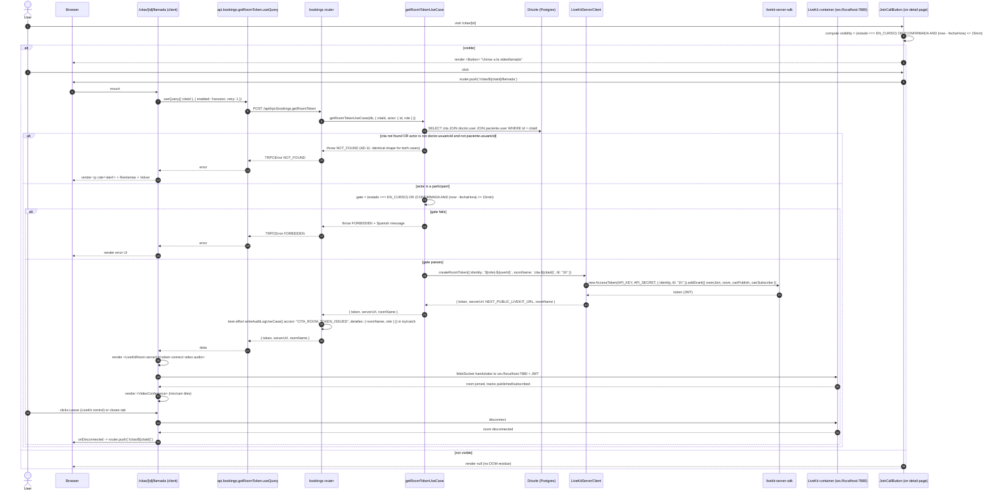

# Design: Video Calls (LiveKit self-hosted)

## Technical Approach

This change adds in-platform video consultations to the appointment flow. The doctor and patient, when both authenticated, both participants of the same `Cita`, and within the status and time-window gate, can join a LiveKit room and see and hear each other. The call is a capability that becomes available on top of the existing `PENDIENTE → CONFIRMADA → EN_CURSO → COMPLETADA / CANCELADA / NO_ASISTIO` state machine — the call does NOT own the state.

The implementation lands across all four Clean Architecture layers with no new third-party runtime beyond a self-hosted LiveKit Docker container. The data plane adds a single nullable column `citas.livekit_room_name` (reserved for future use; unused in MVP) and a `Cita.livekitRoomName` getter that derives the LiveKit room name from the cita's `id` server-side. The application layer adds `getRoomTokenUseCase`, which enforces auth (the actor is the cita's doctor or patient), the status and time-window gate, and returns the token + serverUrl + roomName. The infrastructure layer adds `LiveKitServerClient` (a thin wrapper around `livekit-server-sdk`'s `AccessToken`) and a new `bookings.getRoomToken` tRPC procedure that calls the use case, returns the result, and writes a best-effort `audit_logs` entry. The presentation layer adds the `/citas/[id]/llamada` call page (client component, mounts `<LiveKitRoom>` + `<VideoConference>`) and a `JoinCallButton` on the existing detail page. The Docker Compose stack gains a `livekit` service in dev mode with no TLS. The change ships in two chained PRs (PR-1 data + API + specs, PR-2 UI + tests), each under 800 lines.

## Architecture Decisions

| ID | Decision | Rationale | Alternatives Considered | Trade-offs |
|----|----------|-----------|--------------------------|------------|
| **AD-1** | New `bookings.getRoomToken({ citaId })` procedure on the existing `bookings` router — NOT a new `videoCallsRouter`. | The auth context (which user is calling, what role, what session), the `findDoctorByUserId` / `findPacienteByUserId` helpers, and the existing audit-log plumbing already live in `bookings.ts`. A new router would duplicate the helpers and the procedure would feel orphaned from the booking domain. The call is part of the booking flow, not a top-level resource. | (a) New `videoCallsRouter` — rejected, creates a cross-router dependency for `protectedProcedure` and the `find*ByUserId` helpers. (b) Reuse `createAppointment` — rejected, mixes the data-mutation flow with the read-only token issuance. | The procedure is appended after `updateAppointmentNotes`. The `bookings` router grows by one procedure; the tRPC client API gains `api.bookings.getRoomToken` without restructuring. |
| **AD-2** | LiveKit server client wrapper at `src/infrastructure/livekit/livekit-server.ts` — NOT in the use case. | Separation of concerns: the use case orchestrates (auth, status gate, time window, audit); the `LiveKitServerClient` is a thin adapter around `livekit-server-sdk`'s `AccessToken`. The use case is testable without mocking the SDK; the wrapper owns the SDK detail and the env-var lifecycle. | (a) Put the `AccessToken` call in the use case — rejected, couples domain logic to a third-party SDK and makes the use case mock-heavy. (b) Put the wrapper in `src/infrastructure/api/` — rejected, `livekit-server.ts` is an SDK adapter, not an API adapter. | The wrapper exports a singleton `livekitServerClient` and a `createRoomToken` method. Future features (recording, webhooks) can extend the class with a `RoomServiceClient` passthrough without touching the use case. |
| **AD-3** | Server-side room name derivation (`cita-${uuid}`) via the `Cita.livekitRoomName` getter. The DB column `citas.livekit_room_name` is added but UNUSED in MVP. | The getter is the source of truth: server-side derivation prevents clients from enumerating `cita-1` … `cita-N` to probe room names. The column is reserved for a future where ad-hoc room names (group sessions, breakout rooms) are supported without breaking the API. | (a) Store the room name on every `Cita` row on creation — rejected, adds a second source of truth that can drift. (b) Read the column at runtime — rejected, would need a fallback for `NULL`; derivation is trivial and stable. | The getter is a one-liner; the column is dead weight by design (per D1) and exists for future flexibility only. The migration is forward-only and trivially reversible. |
| **AD-4** | No new shadcn primitives. Reuse `Button`, `Card`, `Skeleton`, `Alert`, plus the `Video`, `ArrowLeft`, `Loader2`, `PhoneOff` icons from `lucide-react`. | The call page is mostly LiveKit components (`<LiveKitRoom>`, `<VideoConference>`, `<ControlBar>`); the wrapper UI is minimal. Adding new shadcn primitives for a thin chrome would be review overhead with no win. The `JoinCallButton` is a single `Button` with conditional render. | (a) A custom "call panel" component — rejected, `VideoConference` already provides the call panel. (b) A custom loading skeleton — rejected, `Skeleton` + `animate-pulse` covers it. | The `Spinner` and `Alert` patterns match the existing detail page (see `src/app/citas/[id]/page.tsx:74-87` for the skeleton and `:171-187` for the error pattern). |
| **AD-5** | Call page is a client component (`"use client"`). The page calls `api.bookings.getRoomToken.useQuery(...)` from the client. NO server-side pre-fetch. | Tokens are short-lived (1h) and the call is a client-side interaction. Pre-fetching server-side would require a redirect dance (server fetches token, stuffs it into a query param, client reads it from the URL — leaky and ugly). The client-side `useQuery` gets a fresh token on every page mount, which is the right semantic. | (a) Server-side token fetch in the RSC — rejected, the token is sensitive and would be in the HTML payload. (b) Server-side fetch + cookie handoff — rejected, over-engineered for a 1h token. | The `useQuery` is called with `{ enabled: !!session, retry: 1 }` so the request does not fire before the session resolves, and a single transient retry absorbs flaky first WebSocket handshakes. |
| **AD-6** | Two chained PRs (PR-1 data + API + specs, PR-2 UI + tests). PR-1 ships the data plane (column, migration, domain getter, LiveKit client, use case, procedure, Docker, env, audit union, 3 new specs, 4 delta specs, 3 tests). PR-2 ships the UI plane (call page, join button, 1 new UI spec, 1 delta spec, 2 component tests). PR-2 depends on PR-1. The chain is `stacked-to-main`. | Total estimated size is ~1,220 lines, which exceeds the 800-line review budget. The split is along the natural data-vs-UI boundary: PR-1 proves end-to-end token issuance can be tested with the tRPC client before the UI exists (de-risking the LiveKit integration); PR-2 lands the visible affordance. This mirrors the `home-page-upgrade` and `doctor-profile-page` precedents. | (a) Single PR — rejected, the 800-line cap exists for review focus. (b) Three PRs (data, API, UI) — rejected, the API is not useful without the data and the data is not useful without the API. | The chain is `stacked-to-main` (cached engram preference): PR-1 merges to `main`, PR-2 stacks on top and merges to `main` after PR-1 lands. The intermediate state (PR-1 only) is callable from the tRPC client but has no UI. |
| **AD-7** | Dev mode (`--dev --bind 0.0.0.0`) with no TLS. The browser connects via `ws://localhost:7880`. Production requires `wss://` + real certs (out of MVP). The `LiveKitServerClient` wrapper throws at module load time if the env vars are missing — NOT per-request. | `localhost` is exempt from the browser's secure-context rule for WebRTC, so `ws://` works for dev. The `--dev` flag enables permissive defaults (no auth on the management API, in-memory room store) that are fine for `localhost` and unsafe for production. Eager env-var validation (boot-time fail) surfaces the missing var in the boot log, not on the first user's first call. | (a) Self-signed TLS for dev — rejected, adds `mkcert` to bootstrap for no functional benefit on `localhost`. (b) Lazy env-var check (on first use) — rejected, the first user to call `getRoomToken` gets a confusing `INTERNAL_SERVER_ERROR` instead of a clear boot-log message. | The eager check is loud: a missing `LIVEKIT_API_KEY` or `LIVEKIT_API_SECRET` makes `pnpm dev` fail to boot with the message `"LiveKit env vars missing. Set LIVEKIT_API_KEY and LIVEKIT_API_SECRET in .env.local. See docs/livekit.md for setup."` Per the spec REQ-LK-INF-4. |
| **AD-8** | Status machine: keep the existing flow unchanged. Doctor clicks "Iniciar consulta" → `EN_CURSO`. Both join the call. Doctor clicks "Completar" or "No asistio" → `COMPLETADA` or `NO_ASISTIO`. The video call is a feature ON TOP of the status machine, not a replacement. | Respects the existing design: the status machine is the source of truth for billing, audit, and the doctor's dashboard. A new `CALL_ACTIVE` state would be redundant — `EN_CURSO` already means "the call is happening". The call is gated by the status (D4) but does not own the state. The D10 limitation (both leave without "Completar" → `EN_CURSO` stuck) is documented in three places. | (a) Replace the status machine with a call-aware state — rejected, requires a status migration on every existing `EN_CURSO` cita and breaks the audit log. (b) Add `callActive: boolean` to `citas` — rejected, the same information is already in `estado`. | The D10 gap is closed by a future `livekit-webhooks` change (a `room_finished` event handler that calls `updateAppointmentStatus` with `NO_ASISTIO` after a grace period). For MVP, doctors close the cita manually from `/citas/[id]`. |
| **AD-9** | `JoinCallButton` is a separate component at `src/components/booking/JoinCallButton.tsx`, not inline in `/citas/[id]`. | The visibility logic (status + time window + role-aware label) is non-trivial and benefits from a focused component with its own test suite. The detail page stays a `"use client"` component; the button is the only NEW client-side interactive addition to the page (the page was already a client component for the existing action buttons). | (a) Inline the button in the page — rejected, the visibility test would be coupled to the page's other logic and harder to maintain. (b) Make a new client component for the whole page — rejected, the page is already a client component, no refactor is needed. | The component receives `citaId`, `estado`, `fechaHora`, `isDoctor` as props (no DB access, no tRPC). The `isDoctor` prop is for future-proofing (D7 commits to a single label today but the prop exists for a future role-aware copy). |
| **AD-10** | Audit log entry for `getRoomToken` includes `citaId` (via `entidadId`), `roomName`, and `role` in `detalles`. The JWT `token` MUST NOT appear in `detalles` (or anywhere in the row). | Secrets do not go in audit logs. The audit log is persisted in `audit_logs.detalles` (jsonb) and is potentially readable by admins and DPOs. The token is a 1h credential; logging it would be a 1h credential leak per audit log query. The audit `detalles` is built from a fixed shape `{ roomName, role }` — the token value is never threaded through the use case return value into the audit call. | (a) Include a redacted version of the token — rejected, redacted tokens are still reconnaissance value for an attacker. (b) Omit the audit log entirely — rejected, compliance requires every token issuance to be logged. | The use case's return value `{ token, serverUrl, roomName }` is destructured by the procedure; the procedure builds the audit `detalles` from `result.roomName` and `ctx.session!.user.role`. The token is never serialized into a variable that flows toward the audit call. |
| **AD-11** | The use case throws `TRPCError({ code: 'NOT_FOUND' })` for both "cita does not exist" and "actor is not a participant" cases. The `FORBIDDEN` code is reserved for the status and time-window gates (where the actor is confirmed to be a participant). | `NOT_FOUND` for non-participants avoids leaking cita existence. A non-participant probing a cita id gets the same error shape as a non-existent id, so they cannot enumerate. Once the actor is confirmed to be a participant, the gates return `FORBIDDEN` with a specific Spanish message (which is fine because the actor already knows the cita exists). | (a) `FORBIDDEN` for the non-participant case — rejected, leaks cita existence (the user can distinguish "not your cita" from "no such cita"). (b) Two different error messages for the two NOT_FOUND cases — rejected, the spec requires the shapes to be identical so a probe cannot distinguish them. | The procedure surfaces `NOT_FOUND` to the call page; the page renders the same error UI for both cases. The audit log entry is written only on success, so the non-participant probe does not leak via the audit table. |
| **AD-12** | The `writeAuditLogUseCase` call in the `getRoomToken` procedure is wrapped in a `try/catch`. If the audit write fails (DB drop, constraint, etc.), the procedure logs a warning via `console.warn` and returns the token. The procedure MUST NOT throw a `TRPCError` because the audit failure happens AFTER the token has been issued and the user is waiting in the call page. | Failing the call because of an audit log error is the worse outcome: the user sees an error and cannot join, while the token is already in the wild. A missing audit row is recoverable (the operator can backfill from server logs or the LiveKit container logs); a dropped call is not. The pattern matches the `captureEvent` fire-and-forget pattern in `updateAppointmentStatusUseCase:67-75`. | (a) Throw on audit failure — rejected, the token is already issued, dropping the call is the worse UX. (b) Omit the audit log entirely — rejected, compliance requirement. | The `console.warn` line includes the cita id and the error message. A future change can wire a Sentry breadcrumb or a Redis-backed dead-letter queue; the MVP is fine with the warning. |

## Data Flow

The call join flow is a client-side fetch of a server-issued token, followed by a LiveKit WebSocket handshake. The server validates the actor's identity and the cita's status before issuing the token; the client uses the token to join the room.



Key invariants enforced by the flow:

- The token is issued ONLY after the actor is confirmed as a participant of the cita (NOT_FOUND otherwise).
- The token is issued ONLY when the status + time gate passes (FORBIDDEN otherwise, with Spanish message).
- The audit log entry is written on success only — failure paths do not pollute the audit table.
- The audit log entry is best-effort: an audit DB drop does not fail the call (AD-12).
- The token is never serialized into the audit `detalles` (AD-10) — only `roomName` and `role`.
- The LiveKit `identity` is `${role.toLowerCase()}-${userId}` (e.g. `doctor-<uuid>`), so the participant panel surfaces the role.
- The room name is `cita-${citaId}`, derived server-side from the cita's id; clients never construct it.

## File Changes

### New files (PR-1)

| Action | Path | Purpose | Lines | PR |
|--------|------|---------|-------|----|
| NEW | `src/infrastructure/livekit/livekit-server.ts` | `LiveKitServerClient` class. Constructor reads `LIVEKIT_API_KEY` / `LIVEKIT_API_SECRET` / `NEXT_PUBLIC_LIVEKIT_URL` and throws at module load if missing. `createRoomToken({ identity, roomName, ttl })` returns `{ token, serverUrl, roomName }`. Singleton export. | ~55 | PR-1 |
| NEW | `src/application/use-cases/bookings/get-room-token.use-case.ts` | Auth (actor is doctor.usuarioId or paciente.usuarioId; NOT_FOUND otherwise per AD-11) + status/time gate (FORBIDDEN with Spanish message) + token issuance + return shape. | ~115 | PR-1 |
| NEW | `src/infrastructure/db/migrations/0003_*.sql` | Drizzle-generated `ALTER TABLE citas ADD COLUMN livekit_room_name varchar(128)`. Drizzle Kit picks the sequence number. | ~5 | PR-1 |
| NEW | `docs/livekit.md` | 4-topic dev doc: (1) `docker compose up -d livekit` start command, (2) dev key/secret are `devkey` / `secret`, (3) `.env.local` snippet with the three env vars, (4) production `wss://` + cert note pointing to a future change. | ~35 | PR-1 |
| NEW | `src/application/use-cases/bookings/__tests__/get-room-token.test.ts` | 5-6 scenarios: cita not found (NOT_FOUND), non-participant (NOT_FOUND), doctor participant passes auth, patient participant passes auth, PENDIENTE rejected (FORBIDDEN + Spanish), CONFIRMADA outside window (FORBIDDEN + Spanish), CONFIRMADA inside window (success), EN_CURSO (success regardless of time), COMPLETADA rejected, CANCELADA + NO_ASISTIO rejected. | ~160 | PR-1 |
| NEW | `src/infrastructure/livekit/__tests__/livekit-server.test.ts` | 2-3 scenarios: env vars present instantiate singleton, missing `LIVEKIT_API_KEY` throws with the documented message, missing `LIVEKIT_API_SECRET` throws with the documented message, second import returns same instance. | ~55 | PR-1 |
| NEW | `src/infrastructure/api/routers/__tests__/bookings.getRoomToken.test.ts` | 3-4 scenarios: procedure is callable from a participant (returns shape), non-participant rejected with NOT_FOUND, PENDIENTE rejected with FORBIDDEN + Spanish, audit log written on success, audit log NOT written on FORBIDDEN, audit log best-effort (audit throw does not fail the call). | ~90 | PR-1 |
| NEW | `openspec/specs/video-calls-api/spec.md` | 6 requirements (getRoomToken, authorization, status/time gate, token issuance, audit log, AuditAction union extension). | (already created) | archive |
| NEW | `openspec/specs/video-calls-ui/spec.md` | 6 requirements (call page, LiveKitRoom config, top bar, JoinCallButton, detail page integration, accessibility). | (already created) | archive |
| NEW | `openspec/specs/livekit-infrastructure/spec.md` | 5 requirements (Docker service, dev API key/secret, public URL + TLS exemption, boot-time env validation, documentation). | (already created) | archive |

### New files (PR-2)

| Action | Path | Purpose | Lines | PR |
|--------|------|---------|-------|----|
| NEW | `src/app/citas/[id]/llamada/page.tsx` | Client component. Reads `citaId` via `useParams`, calls `api.bookings.getRoomToken.useQuery({ citaId }, { enabled: !!session, retry: 1 })`. Renders 3 states: loading (Spinner + `"Conectando con la sala…"`), error (`<p role="alert">` + Reintentar + Volver), success (`<LiveKitRoom>` + `<VideoConference>` + top bar + D10 footer note). `onDisconnected -> router.push(\`/citas/${citaId}\`)`. | ~140 | PR-2 |
| NEW | `src/components/booking/JoinCallButton.tsx` | Client component. Props: `{ citaId, estado, fechaHora, isDoctor }`. Visibility: `estado === EN_CURSO` OR (`estado === CONFIRMADA` AND `Math.abs(Date.now() - fechaHora.getTime()) <= 15 * 60 * 1000`). Renders `null` otherwise. Click → `router.push(\`/citas/${citaId}/llamada\`)`. shadcn `Button` + lucide `Video` icon. | ~60 | PR-2 |
| NEW | `src/app/citas/[id]/llamada/__tests__/page.test.tsx` | 3 scenarios: loading state (Spinner + "Conectando con la sala…" in DOM, no LiveKitRoom), error state (role="alert" + Reintentar + Volver, refetch called on click), success state (LiveKitRoom + VideoConference mounted with token + serverUrl). Mocks `useQuery` per-state. | ~110 | PR-2 |
| NEW | `src/components/booking/__tests__/JoinCallButton.test.tsx` | 7-8 scenarios: EN_CURSO shows button, CONFIRMADA +5min shows, CONFIRMADA -10min shows (symmetric window), PENDIENTE hidden, CONFIRMADA +30min hidden, COMPLETADA hidden, CANCELADA hidden, NO_ASISTIO hidden, click navigates. | ~110 | PR-2 |

### Modified files (PR-1)

| Action | Path | Purpose | Lines | PR |
|--------|------|---------|-------|----|
| MODIFY | `src/infrastructure/db/schema/citas.ts` | Add `livekitRoomName: varchar("livekit_room_name", { length: 128 })` (nullable, no default, no notNull, no index, no unique). | +3 | PR-1 |
| MODIFY | `src/domain/entities/cita.ts` | Add `get livekitRoomName(): string { return \`cita-${this.id}\`; }` getter. No constructor change. | +5 | PR-1 |
| MODIFY | `src/domain/entities/__tests__/cita.test.ts` | Add 2 scenarios for the new getter: (a) returns the documented `cita-${id}` format, (b) is a property accessor (not a method), (c) does not read the DB column (returns the same value for any cita instance). | +30 | PR-1 |
| MODIFY | `src/application/use-cases/audit/write-audit-log.use-case.ts` | Add `"CITA_ROOM_TOKEN_ISSUED"` to the `AuditAction` union. Existing values untouched. | +1 | PR-1 |
| MODIFY | `src/application/index.ts` | Re-export `getRoomTokenUseCase` and its input/output types. | +3 | PR-1 |
| MODIFY | `src/infrastructure/api/routers/bookings.ts` | Add `getRoomToken: protectedProcedure.input(z.object({ citaId: z.string().uuid() })).output(z.object({ token: z.string().min(1), serverUrl: z.string().url(), roomName: z.string().regex(/^cita-[0-9a-f-]{36}$/) })).query(...)`. Procedure body: call the use case, then best-effort `writeAuditLogUseCase` in try/catch, return the result. | +38 | PR-1 |
| MODIFY | `docker-compose.yml` | Add the `livekit` service block per REQ-LK-INF-1: image `livekit/livekit-server:latest`, container_name `medico-livekit`, ports 7880:7880 / 7881:7881 / 7882:7882/udp, command `--dev --bind 0.0.0.0`, healthcheck `wget -qO- http://localhost:7880/` every 10s with 5 retries. | +18 | PR-1 |
| MODIFY | `.env.example` | Add 3 LiveKit env var placeholders with the documented comment header. | +6 | PR-1 |
| MODIFY | `.env.local.example` | Add 3 LiveKit env vars with the real dev values (`devkey` / `secret` / `ws://localhost:7880`). | +5 | PR-1 |
| MODIFY | `package.json` | Add `livekit-server-sdk` to dependencies. Pin to an exact version (no caret) per the risk-register entry. | +1 | PR-1 |
| MODIFY | `docs/SETUP.md` | Append a one-paragraph "LiveKit" section in the dev stack list: "LiveKit runs in Docker. `docker compose up -d livekit`. Set `LIVEKIT_API_KEY=devkey` and `LIVEKIT_API_SECRET=secret` in `.env.local`. See `docs/livekit.md`." | +3 | PR-1 |
| MODIFY | `openspec/specs/booking-api/spec.md` | Append delta section "Video Calls Additions" with the `getRoomToken` requirement + scenarios (forward pointer to `video-calls-api/spec.md`). | (already created) | archive |
| MODIFY | `openspec/specs/booking-ui/spec.md` | Append delta section "Video Calls Additions" with the `JoinCallButton on Detail Page` requirement + scenarios. | (already created) | archive |
| MODIFY | `openspec/specs/db-schema/spec.md` | Append delta section "Video Calls Additions" with the `citas.livekit_room_name column` requirement + scenarios. | (already created) | archive |
| MODIFY | `openspec/specs/domain-entities/spec.md` | Append delta section "Video Calls Additions" with the `Cita.livekitRoomName getter` requirement + scenarios. | (already created) | archive |

### Modified files (PR-2)

| Action | Path | Purpose | Lines | PR |
|--------|------|---------|-------|----|
| MODIFY | `src/app/citas/[id]/page.tsx` | Mount `<JoinCallButton citaId={cita.id} estado={cita.estado} fechaHora={new Date(cita.fechaHora)} isDoctor={isDoctor} />`. Placement: inside the existing doctor action card for DOCTOR view; in a new dedicated `<Card>` for the PACIENTE view (after the summary card, before the cancel option). | +12 | PR-2 |
| MODIFY | `openspec/specs/booking-ui/spec.md` | Already updated in PR-1 archive phase (the delta spec is the same file). | 0 | PR-2 (no-op) |

### PR subtotals

- **PR-1**: ~580 lines (data + API + specs). Breakdown: ~310 code + ~35 docs + ~235 tests.
- **PR-2**: ~640 lines (UI + tests). Breakdown: ~200 code + ~220 component tests + ~220 page tests.

Both PRs are under the 800-line review cap. PR-2 stacks on PR-1 (`stacked-to-main` per cached engram preference).

## Interface Contracts

### 5.1 Drizzle schema addition

```ts
// src/infrastructure/db/schema/citas.ts (additions)
import { pgTable, uuid, timestamp, varchar, text, integer, numeric, index } from "drizzle-orm/pg-core";
import { doctores } from "./doctores";
import { pacientes } from "./pacientes";

export const citas = pgTable(
  "citas",
  {
    id: uuid("id").defaultRandom().primaryKey(),
    doctorId: uuid("doctor_id").notNull().references(() => doctores.id, { onDelete: "cascade" }),
    pacienteId: uuid("paciente_id").notNull().references(() => pacientes.id, { onDelete: "cascade" }),
    fechaHora: timestamp("fecha_hora").notNull(),
    estado: varchar("estado", { length: 20 }).notNull().default("PENDIENTE"),
    motivo: text("motivo").notNull(),
    duracionMinutos: integer("duracion_minutos").notNull().default(30),
    precio: numeric("precio"),
    notas: text("notas"),
    // ── video-calls: nullable, unused in MVP, reserved for future explicit room naming ──
    livekitRoomName: varchar("livekit_room_name", { length: 128 }),
  },
  (table) => ({
    doctorFechaIdx: index("citas_doctor_fecha_idx").on(table.doctorId, table.fechaHora),
    estadoIdx: index("citas_estado_idx").on(table.estado),
    pacienteIdx: index("citas_paciente_idx").on(table.pacienteId),
  }),
);
```

The column is nullable, no default, no `notNull`, no index, no unique constraint, no foreign key — per REQ-DB-VC-1.

### 5.2 Cita entity getter

```ts
// src/domain/entities/cita.ts (additions)
export class Cita {
  private constructor(
    readonly id: string,
    readonly doctorId: string,
    readonly pacienteId: string,
    readonly fechaHora: Date,
    readonly estado: ConsultationStatus,
    readonly motivo: string,
    readonly duracionMinutos: number,
    readonly precio: number | undefined,
  ) {}

  // ... existing factory + withEstado ...

  /**
   * Server-side derived LiveKit room name.
   *
   * Source of truth for the room name in MVP. The DB column
   * `citas.livekit_room_name` is reserved for future use (explicit
   * naming, audit, persistence) and is NOT read by this getter.
   *
   * Format: `cita-${this.id}` (e.g. `cita-8d2a1f8e-2b1c-4f00-aaaa-000000000001`).
   */
  get livekitRoomName(): string {
    return `cita-${this.id}`;
  }
}
```

The constructor signature is unchanged. `livekitRoomName` is a `get` accessor (property access, not a method call). The result is always non-null and matches `/^cita-[0-9a-f-]{36}$/`.

### 5.3 LiveKit server client wrapper

```ts
// src/infrastructure/livekit/livekit-server.ts
import { AccessToken } from "livekit-server-sdk";

interface CreateRoomTokenInput {
  identity: string;
  roomName: string;
  ttl?: string; // default "1h"
}

interface CreateRoomTokenOutput {
  token: string;
  serverUrl: string;
  roomName: string;
}

class LiveKitServerClient {
  private readonly apiKey: string;
  private readonly apiSecret: string;
  private readonly serverUrl: string;

  constructor() {
    const apiKey = process.env.LIVEKIT_API_KEY;
    const apiSecret = process.env.LIVEKIT_API_SECRET;
    const serverUrl = process.env.NEXT_PUBLIC_LIVEKIT_URL;
    if (!apiKey || !apiSecret || !serverUrl) {
      throw new Error(
        "LiveKit env vars missing. Set LIVEKIT_API_KEY and LIVEKIT_API_SECRET in .env.local. " +
        "See docs/livekit.md for setup."
      );
    }
    this.apiKey = apiKey;
    this.apiSecret = apiSecret;
    this.serverUrl = serverUrl;
  }

  async createRoomToken(input: CreateRoomTokenInput): Promise<CreateRoomTokenOutput> {
    const at = new AccessToken(this.apiKey, this.apiSecret, {
      identity: input.identity,
      ttl: input.ttl ?? "1h",
    });
    at.addGrant({
      roomJoin: true,
      room: input.roomName,
      canPublish: true,
      canSubscribe: true,
      canPublishData: false, // in-call chat is out of scope
    });
    const token = await at.toJwt();
    return { token, serverUrl: this.serverUrl, roomName: input.roomName };
  }
}

// Singleton — module-level instantiation throws at boot if env vars are missing.
export const livekitServerClient = new LiveKitServerClient();
```

The module-level `new LiveKitServerClient()` is what makes the env-var check eager. If the vars are missing, the import of this module throws during the Next.js server boot (per AD-7 and REQ-LK-INF-4).

### 5.4 Use case signature

```ts
// src/application/use-cases/bookings/get-room-token.use-case.ts
import { TRPCError } from "@trpc/server";
import type { NodePgDatabase } from "drizzle-orm/node-postgres";
import { eq, and } from "drizzle-orm";
import * as schema from "@/infrastructure/db/schema";
import { ConsultationStatus, UserRole } from "@/domain/enums";
import { livekitServerClient } from "@/infrastructure/livekit/livekit-server";

export interface GetRoomTokenInput {
  citaId: string;
  actor: { id: string; role: UserRole };
}

export interface GetRoomTokenOutput {
  token: string;
  serverUrl: string;
  roomName: string;
}

const FIFTEEN_MIN_MS = 15 * 60 * 1000;

export async function getRoomTokenUseCase(
  db: NodePgDatabase<typeof schema>,
  input: GetRoomTokenInput
): Promise<GetRoomTokenOutput> {
  // 1. Load the cita with doctor.usuarioId and paciente.usuarioId in one query.
  const [row] = await db
    .select({
      id: schema.citas.id,
      fechaHora: schema.citas.fechaHora,
      estado: schema.citas.estado,
      doctorUsuarioId: schema.doctores.usuarioId,
      pacienteUsuarioId: schema.pacientes.usuarioId,
    })
    .from(schema.citas)
    .innerJoin(schema.doctores, eq(schema.citas.doctorId, schema.doctores.id))
    .innerJoin(schema.pacientes, eq(schema.citas.pacienteId, schema.pacientes.id))
    .where(eq(schema.citas.id, input.citaId))
    .limit(1);

  // 2. AD-11: cita not found AND non-participant share the same NOT_FOUND shape.
  const isParticipant =
    row && (row.doctorUsuarioId === input.actor.id || row.pacienteUsuarioId === input.actor.id);
  if (!isParticipant) {
    throw new TRPCError({ code: "NOT_FOUND" });
  }

  // 3. Status + time-window gate (the actor is confirmed to be a participant at this point).
  const estado = row.estado as ConsultationStatus;
  const inWindow = Math.abs(Date.now() - row.fechaHora.getTime()) <= FIFTEEN_MIN_MS;
  if (estado === ConsultationStatus.EN_CURSO) {
    // pass — time bypassed
  } else if (estado === ConsultationStatus.CONFIRMADA && inWindow) {
    // pass
  } else if (estado === ConsultationStatus.PENDIENTE) {
    throw new TRPCError({
      code: "FORBIDDEN",
      message: "La cita debe estar confirmada antes de unirse a la videollamada.",
    });
  } else if (estado === ConsultationStatus.CONFIRMADA) {
    throw new TRPCError({
      code: "FORBIDDEN",
      message: "La videollamada se habilita 15 minutos antes de la hora de la cita.",
    });
  } else {
    throw new TRPCError({
      code: "FORBIDDEN",
      message: "Esta cita ya no permite unirse a una videollamada.",
    });
  }

  // 4. Issue the token. Room name is derived server-side from cita.id.
  const roomName = `cita-${row.id}`;
  const identity = `${input.actor.role.toLowerCase()}-${input.actor.id}`;
  return livekitServerClient.createRoomToken({ identity, roomName, ttl: "1h" });
}
```

The use case does NOT write the audit log. The audit call lives in the procedure (see §5.5) so the procedure is the single seam that can wrap the audit call in `try/catch` per AD-12.

### 5.5 tRPC procedure

```ts
// src/infrastructure/api/routers/bookings.ts (additions)
import { getRoomTokenUseCase, type GetRoomTokenInput, type GetRoomTokenOutput } from "@/application";

// ... inside the router() object, after updateAppointmentNotes:

getRoomToken: protectedProcedure
  .input(z.object({ citaId: z.string().uuid() }))
  .output(
    z.object({
      token: z.string().min(1),
      serverUrl: z.string().url(),
      roomName: z.string().regex(/^cita-[0-9a-f-]{36}$/),
    })
  )
  .query(async ({ ctx, input }): Promise<GetRoomTokenOutput> => {
    const result = await getRoomTokenUseCase(ctx.db as never, {
      citaId: input.citaId,
      actor: {
        id: ctx.session!.user.id,
        role: ctx.session!.user.role as UserRole,
      },
    });

    // AD-10: audit detalles are { roomName, role } ONLY — the token MUST NOT appear.
    // AD-12: best-effort — an audit write failure logs a warning and does NOT fail the call.
    try {
      await writeAuditLogUseCase(ctx.db as never, {
        usuarioId: ctx.session!.user.id,
        accion: "CITA_ROOM_TOKEN_ISSUED",
        entidadAfectada: "citas",
        entidadId: input.citaId,
        detalles: { roomName: result.roomName, role: ctx.session!.user.role },
      });
    } catch (err) {
      console.warn(
        `[getRoomToken] audit log failed for citaId=${input.citaId}:`,
        err instanceof Error ? err.message : err
      );
    }

    return result;
  }),
```

The procedure is a thin wire adapter. All business logic lives in the use case; the audit call lives here so the try/catch can wrap it without leaking the boundary into the use case.

### 5.6 Component prop signatures

```ts
// src/components/booking/JoinCallButton.tsx
import { useRouter } from "next/navigation";
import { Button } from "@/components/ui/button";
import { Video } from "lucide-react";
import { ConsultationStatus } from "@/domain/enums";

interface JoinCallButtonProps {
  citaId: string;
  estado: ConsultationStatus;
  fechaHora: Date;
  isDoctor: boolean; // reserved for future role-aware copy (D7)
}

const FIFTEEN_MIN_MS = 15 * 60 * 1000;

export function JoinCallButton(props: JoinCallButtonProps) {
  const router = useRouter();

  const inWindow = Math.abs(Date.now() - props.fechaHora.getTime()) <= FIFTEEN_MIN_MS;
  const visible =
    props.estado === ConsultationStatus.EN_CURSO ||
    (props.estado === ConsultationStatus.CONFIRMADA && inWindow);

  if (!visible) return null;

  return (
    <Button onClick={() => router.push(`/citas/${props.citaId}/llamada`)}>
      <Video className="mr-2 size-4" aria-hidden="true" />
      Unirse a la videollamada
    </Button>
  );
}
```

The visibility check is a client-side filter. The procedure re-validates the same rule server-side (defense in depth). The `isDoctor` prop is declared but unused today (D7 commits to a single label for MVP).

### 5.7 AuditAction union extension

```ts
// src/application/use-cases/audit/write-audit-log.use-case.ts (additions)
export type AuditAction =
  | "CITA_CREATED"
  | "CITA_CANCELLED"
  | "CITA_STATUS_CHANGED"
  | "CITA_NOTES_UPDATED"
  | "PROFILE_UPDATED"
  | "DOCTOR_AVAILABILITY_UPDATED"
  | "PATIENT_LIST_VIEWED"
  | "APPOINTMENT_LIST_VIEWED"
  | "CITA_ROOM_TOKEN_ISSUED"; // ← new
```

The extension is additive. Existing call sites that destructure `AuditAction` and existing switch statements over the union keep compiling (REQ-VC-API-6).

## Migration / Rollout

- **Migration `0003_*.sql`**: generated by `pnpm db:generate` after the schema change. The migration is a single `ALTER TABLE` statement, backward-compatible (nullable column with no default). The Drizzle Kit sequence number is picked automatically; the file lives at `src/infrastructure/db/migrations/0003_<hash>.sql`. The DOWN step is `ALTER TABLE citas DROP COLUMN livekit_room_name`. No data backfill is required.
- **Env vars**: added to `.env.example` (placeholders) and `.env.local.example` (real dev values `devkey` / `secret` / `ws://localhost:7880`). The Next.js server FAILS TO BOOT if `LIVEKIT_API_KEY` or `LIVEKIT_API_SECRET` is missing (per AD-7 / REQ-LK-INF-4). The error message points at `docs/livekit.md`. The eager check is intentional: a missing var surfaces in the boot log, not on the first user's first call. The trade-off vs a lazy check is documented in AD-7.
- **Docker service**: opt-in. `docker compose up -d livekit` brings up the `medico-livekit` container alongside `medico-postgres`, `medico-redis`, `medico-minio`, `medico-meilisearch`. The Next.js server runs without it; the call page shows the error UI ("Servicio de videollamada no disponible") when the LiveKit container is down.
- **Package change**: `livekit-server-sdk` is added to `dependencies` in `package.json` with an exact version pin (no caret) per the risk register entry for SDK drift. The client-side `@livekit/components-react` and `livekit-client` are already in `package.json` from earlier prep work and are reused by the call page (PR-2).
- **Smoke test** (manual, in `sdd-verify`):
  1. `docker compose up -d livekit` — confirm `docker ps` shows `medico-livekit` and `curl -sS http://localhost:7880` returns a LiveKit server identification response.
  2. Start `pnpm dev`. Confirm the server boots without the env-var error.
  3. Seed a `CONFIRMADA` cita in the DB with `fechaHora` = now + 5 min.
  4. Log in as the doctor in browser A. Navigate to `/citas/[id]`. Verify the `<JoinCallButton>` is visible.
  5. Click "Unirse a la videollamada". Verify the call page renders the loading state, then the success state, then connects to the LiveKit room.
  6. Log in as the patient in browser B. Repeat the join. Verify both browsers see and hear each other.
  7. Click "Completar" on the doctor detail page. Verify the cita moves to `COMPLETADA`.
  8. Inspect `audit_logs` for a `CITA_ROOM_TOKEN_ISSUED` row per call, with `detalles.roomName` matching the regex and `detalles` NOT containing the JWT.
- **Rollback**: revert the PR. The migration is additive (the column can be dropped with the DOWN step). The Docker service is one block in `docker-compose.yml`. The env vars are three lines in each env file. The `getRoomToken` procedure has no consumers outside the call page (PR-2). The `livekit-server-sdk` dep is a `pnpm remove` away. The client-side `@livekit/components-react` and `livekit-client` are left in place (tiny; may be reused by a future change; removing them is a separate cleanup).
- **PR-1 smoke test** (before PR-2 lands): the `getRoomToken` procedure is callable from the tRPC client (curl or a small Node script). For a known `CONFIRMADA` cita within ±15 min, the procedure returns `{ token, serverUrl, roomName }` with a valid JWT. Decode the JWT and verify the `room`, `identity`, `video.canPublish`, `video.canSubscribe`, and `exp - iat <= 3600` claims.

## Test Strategy

| Layer | What to Test | Approach |
|-------|--------------|----------|
| **Unit — `getRoomTokenUseCase`** | Cita not found → `NOT_FOUND`; non-participant (doctor.usuarioId and paciente.usuarioId neither match) → `NOT_FOUND` with the same shape; doctor.usuarioId matches → auth passes; paciente.usuarioId matches → auth passes; PENDIENTE → `FORBIDDEN` + Spanish message; CONFIRMADA +30 min future → `FORBIDDEN` + Spanish message; CONFIRMADA -10 min past → success; CONFIRMADA +5 min future → success; EN_CURSO → success regardless of time; COMPLETADA → `FORBIDDEN` + Spanish message; CANCELADA → `FORBIDDEN` + Spanish message; NO_ASISTIO → `FORBIDDEN` + Spanish message. | Vitest. Mock the Drizzle query chain with `vi.fn()` returning canned rows. Mock `livekitServerClient.createRoomToken` to return a fixture. |
| **Unit — `LiveKitServerClient`** | Env vars present instantiate the singleton; missing `LIVEKIT_API_KEY` throws with the documented message; missing `LIVEKIT_API_SECRET` throws with the documented message; the error message contains `"LiveKit env vars missing"`, `"LIVEKIT_API_KEY"`, `"LIVEKIT_API_SECRET"`, and `"docs/livekit.md"`. | Vitest. Set/unset `process.env` in `beforeEach`. Re-import the module via `vi.resetModules()` to trigger the constructor on a fresh env. |
| **Unit — `Cita.livekitRoomName` getter** | Returns the documented `cita-${id}` format; matches `/^cita-[0-9a-f-]{36}$/`; is a property accessor (not a method — `typeof cita.livekitRoomName === "string"`); returns the same value for any cita instance regardless of the DB column (i.e. the getter ignores the column). | Vitest, extend `src/domain/entities/__tests__/cita.test.ts`. |
| **Unit — `JoinCallButton` visibility** | 7 scenarios: EN_CURSO visible; CONFIRMADA +5 min visible; CONFIRMADA -10 min visible (symmetric window); PENDIENTE hidden; CONFIRMADA +30 min hidden; COMPLETADA hidden; CANCELADA hidden; NO_ASISTIO hidden. Click navigates to `/citas/${citaId}/llamada`. | Vitest + `@testing-library/react`. Mock `useRouter`. Use `vi.useFakeTimers()` to pin `Date.now()` and assert the symmetric window without flake. |
| **Component — call page** | Loading state: `Spinner` + `"Conectando con la sala…"` in DOM, no `<LiveKitRoom>`. Error state: `<p role="alert">` with the error message, "Reintentar" `Button` whose click calls `refetch()`, "Volver" link to `/citas/${citaId}`. Success state: `<LiveKitRoom>` mounted with `serverUrl` + `token` props; `<VideoConference>` rendered inside; no spinner. | Vitest + `@testing-library/react`. Mock `api.bookings.getRoomToken.useQuery` per-state. Mock `<LiveKitRoom>` to a `<div data-testid="livekit-room" />` stub. |
| **Component — call page accessibility** | `aria-live="polite"` on the `"En vivo"` status indicator; icon-only buttons have `aria-label`; the error message is in a `<p role="alert">`; the LiveKit control bar buttons are reachable by `Tab`. | Vitest + `@testing-library/react`, `jest-dom` matchers. |
| **Integration — tRPC procedure** | Procedure is callable from a participant and returns the expected shape; non-participant rejected with `NOT_FOUND`; PENDIENTE rejected with `FORBIDDEN` + Spanish; audit log written on success (verify the row exists with `accion: "CITA_ROOM_TOKEN_ISSUED"` and `detalles: { roomName, role }`); audit log NOT written on `FORBIDDEN` or `NOT_FOUND`; audit log write failure does NOT fail the procedure (mock `writeAuditLogUseCase` to throw and assert the procedure still resolves with the token). | Vitest. Use `createCaller` with a mocked `db` and a mocked `writeAuditLogUseCase`. Mirror the pattern in `src/infrastructure/api/routers/__tests__/profiles.test.ts`. |
| **Type check** | `pnpm tsc --noEmit` clean. | CI. |
| **Lint** | `pnpm lint` clean. | CI. |
| **Regression** | All existing tests green (`pnpm test:run`). | CI. |
| **E2E** | Smoke test from `sdd-verify` (see §6). | Manual + Playwright follow-up deferred. |
| **No integration test for the use case → DB** | The use case has no DB integration test for MVP. The auth + status + time logic is pure (input rows → decision). A future change can add an integration test that uses a real DB. | Documented as a known limitation in the apply phase. |

## Out-of-Scope Architectural Notes

These things are explicitly NOT in this change, and the reason. Documented to prevent scope creep in `sdd-apply` / `sdd-verify`:

- **No new DB tables.** The only schema change is a new column on the existing `citas` table.
- **No new shadcn primitives.** All required UI (`Button`, `Card`, `Spinner`, `Alert`, `Skeleton`) is already in `src/components/ui/`.
- **No new tRPC middleware.** `getRoomToken` uses the existing `protectedProcedure` with no custom transform.
- **No new env vars beyond the 3 LiveKit ones.** No feature flag, no analytics token, no city API key.
- **No new third-party libraries beyond the 2 LiveKit ones.** `livekit-server-sdk` is the only new server-side dep. The client-side `@livekit/components-react` and `livekit-client` are already in `package.json` from earlier prep work.
- **No `livekit/` migrations directory.** We use `src/infrastructure/db/migrations/`.
- **No `JoinCallButton` variant for the doctor's view vs the patient's view** in MVP. The `isDoctor` prop is declared for future role-aware copy (D7); the MVP uses a single label. The visibility rule is the same for both roles.
- **No `DoctorHero` `tel:` "Llamar" button removal.** That cleanup is the "doctor-hero-cleanup" follow-up change. The `tel:` button stays for now.
- **No pre-call waiting room** (a `WaitingRoom` page where the patient waits for the doctor to "admit" them). The MVP accepts that the patient may land in an empty room and waits for the doctor to join. The "Doctor aún no se ha unido" UX is deferred to a follow-up.
- **No D10 webhook integration** (a `room_finished` event handler that auto-closes the cita). The D10 limitation is documented in three places (the `video-calls-ui` spec, the call page footer, and the archive report). The `livekit-webhooks` follow-up change will close the gap.
- **No TURN server** for production. The dev container ships with a built-in TURN, fine for `localhost`. Production needs coturn + a public IP. The `livekit-turn-prod` follow-up change will address it.
- **No real TLS** for production. The dev container has no TLS. Production needs `wss://` + a real cert + a reverse proxy. The `livekit-tls-prod` follow-up change will address it.
- **No recording / transcription / playback.** LiveKit Egress + object storage is a separate build.
- **No in-call chat.** `canPublishData` is `false` in the JWT grant.
- **No multi-party calls.** The MVP is 1:1 only. The room name is `cita-${uuid}` and the grants allow any number of publishers, but no UX for 3+ participants is built.
- **No doctor-initiated call push notifications** (FCM/APNS, "doctor is calling" UI, ringtone). The `video-call-push` follow-up change will address it.
- **No modality toggle** (`presencial` / `online`). All `CONFIRMADA` and `EN_CURSO` citas are video-capable in MVP. The `appointment-modality` follow-up change will add a `citas.modalidad` column and a UI toggle.
- **No i18n.** The site is Spanish-only. All UI copy in the new components and the call page is hard-coded Spanish literals.

## PR Split

### PR-1: Data + API + specs (≈580 lines)

**Files** (from §4 above) marked PR-1.

**Dependencies**: none. PR-1 is the root of the chain.

**Acceptance gates** (CI + local):

- `pnpm tsc --noEmit` — clean.
- `pnpm lint` — clean.
- `pnpm test:run` — all existing + new tests green.
- `pnpm db:generate` produces a single `0003_*.sql` migration.
- `pnpm db:migrate` applies the migration forward and back without errors.
- A manual curl-equivalent test (via the tRPC client, e.g. `curl -X POST http://localhost:3000/api/trpc/bookings.getRoomToken -H 'content-type: application/json' -d '{"json": {"citaId": "<known CONFIRMADA citaId>"}}' -b '<auth cookie>'`) returns `{ token, serverUrl, roomName }` with a valid JWT (decodable at `https://jwt.io`).
- Decoding the JWT shows the `room`, `identity`, `video.canPublish`, `video.canSubscribe`, and `exp - iat <= 3600` claims per the spec.
- Inspecting `audit_logs` shows a `CITA_ROOM_TOKEN_ISSUED` row per issuance, with `detalles.roomName` and `detalles.role` and NO `token` field.
- Booting the Next.js server without `LIVEKIT_API_KEY` set throws the documented error at boot, not per-request.

**Strategy**: `stacked-to-main` — PR-1 merges to `main` first. PR-2 stacks on top of `main` (which now contains PR-1) and merges to `main` after PR-1 lands.

### PR-2: UI + tests (≈640 lines)

**Files** (from §4 above) marked PR-2.

**Dependencies**: PR-1 MUST be merged first. The call page uses the procedure added in PR-1.

**Acceptance gates** (CI + local):

- `pnpm tsc --noEmit` — clean.
- `pnpm lint` — clean.
- `pnpm test:run` — all existing + new component tests green.
- `pnpm test:run src/app/citas/[id]/llamada/__tests__/page.test.tsx` — call page states test green.
- `pnpm test:run src/components/booking/__tests__/JoinCallButton.test.tsx` — visibility states test green.
- A manual smoke test: doctor + patient in two browsers can complete a call (the §6 smoke test steps 1-8).

**Strategy**: `stacked-to-main` — PR-2 stacks on PR-1 and merges to `main` after PR-1 lands.

## Open Questions

None — all 10 D-decisions (D1-D10) and all 12 ADs (AD-1 through AD-12) cover the design space. The three new specs (`video-calls-api`, `video-calls-ui`, `livekit-infrastructure`) and four delta specs (`booking-api`, `booking-ui`, `db-schema`, `domain-entities`) are complete. The boot-time env-var check (REQ-LK-INF-4) and the best-effort audit pattern (AD-12) are both explicitly documented in §5.3 and §5.5. Ready for `sdd-tasks`.
