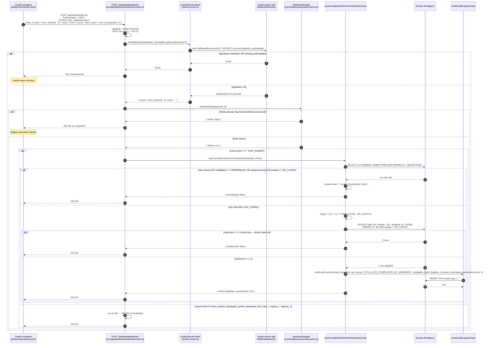

# Design: LiveKit Room-Finished Webhook (Auto-Complete Citas)

## 1. Overview

The medico-consulta platform started marketing online (video-call) consultations weeks ago, but two pieces of the loop never closed. The `2026-06-16-video-calls` change shipped the call mechanics — `LiveKitServerClient.createRoomToken`, `getRoomToken`, `JoinCallButton`, the `/citas/[id]/llamada` page, and the `livekit` Docker service. The `2026-06-19-modality-toggle` change shipped the business rule (`citas.modalidad`, `doctores.acepta_online`) that decides which citas get a token. Neither change, however, addressed a documented limitation stamped into the call page footer (D10): when a patient and doctor leave a LiveKit room without either side clicking "Completar" or "No asistio", the cita stays in `EN_CURSO` indefinitely and the doctor must close it manually from `/citas/[id]`. The footer text on `src/app/citas/[id]/llamada/page.tsx` confesses this in Spanish, and the same note is duplicated in `openspec/specs/video-calls-ui/spec.md`, the video-calls archive report, and `docs/livekit.md`.

This change is the D10 mitigation. The self-hosted LiveKit container is taught to fire a `room_finished` webhook (D11), a Next.js route handler at `POST /api/livekit/webhook` receives it, the signature is verified via the SDK's `WebhookReceiver` (D1, AD-2), the event is deduped by `event.id` in Redis (D4), and a new internal use case `autoCompleteOnRoomFinishedUseCase` atomically transitions an `ONLINE` cita from `EN_CURSO` to `COMPLETADA` (when at least one participant joined) or `NO_ASISTIO` (when nobody joined), then writes a system-actor `audit_logs` row tagged `'CITA_AUTO_COMPLETED_BY_WEBHOOK'`. The D10 footer is removed from the call page; the `video-calls-ui` spec marks D10 as RESOLVED. The change is **additive at the data plane** (one `ALTER TABLE ... ALTER COLUMN ... DROP NOT NULL` on `audit_logs.usuario_id`, D9), **additive at the infra plane** (one new `livekit.yaml` mounted into the existing container, one docker-compose tweak for `extra_hosts` on Linux), **additive at the HTTP plane** (one new route handler, NOT a tRPC procedure), **additive at the domain plane** (one new use case, NOT exposed via tRPC), and **subtractive at the UI plane** (one footer removed). It reuses everything the video-calls and modality-toggle changes already shipped: the `livekit-server-sdk@2.15.4` (already a dep), the `LiveKitServerClient` wrapper, the `Cita.livekitRoomName` derivation (`cita-${uuid}`), the `citas.modalidad` column, the `getRoomToken` modality gate, and the audit-log write pattern. No new third-party dependencies.

The implementation lands across all four Clean Architecture layers with the same mechanical pattern that modality-toggle set: **infra** (LiveKit config + env vars + Redis helper + route handler + SDK wrapper extension), **domain** (no entity changes — the state machine `transitionStatus` already permits `EN_CURSO → {COMPLETADA, NO_ASISTIO}`), **application** (one new use case, one union extension on `AuditAction`, one type widening on `writeAuditLogUseCase`), **UI** (one footer block deletion in `src/app/citas/[id]/llamada/page.tsx`). The migration is the only schema change. The change ships as a single PR at ~800 lines; if it lands over the cap it splits cleanly along the infra / domain seam (D10, AD-12). Per the 400-line review budget, the forecast is **Low risk** (PR-1 infra ~400, PR-2 domain ~400) — `Decision needed before apply: No`, `Chained PRs recommended: Yes (if over 800)`, `400-line budget risk: Medium` (single-PR plan is at the cap, the chained fallback is mechanically defined).

Scope summary:

- Add a `POST /api/livekit/webhook` Next.js route handler at `src/app/api/livekit/webhook/route.ts` that reads the raw body via `await req.text()`, verifies the JWT signature via `LiveKitServerClient.verifyWebhook(rawBody, authHeader)` (D1, AD-2), dedupes by `event.id` via `webhookDedupe()` in Redis with a 24h TTL (D4), and dispatches `room_finished` events to the new use case while returning 200 OK no-op for every other event (D5).
- Extend the existing `LiveKitServerClient` class at `src/infrastructure/livekit/livekit-server.ts` with a new `verifyWebhook(rawBody, authHeader): WebhookEvent` method that wraps `new WebhookReceiver(LIVEKIT_API_KEY, LIVEKIT_API_SECRET).receive(rawBody, authHeader)` from `livekit-server-sdk@2.15.4`. The wrapper is a single statement; the constructor remains unchanged.
- Add a `webhookDedupe(eventId, ttlSeconds?)` helper to `src/infrastructure/redis/cache.ts` that returns `{ isNew: boolean }` via `SET livekit:webhook:${eventId} 1 NX EX ${ttlSeconds ?? 86400}`. Degrade-open on Redis unreachable: returns `{ isNew: true }` so a stale replay can re-run the use case (the use case is itself idempotent — terminal states are no-ops, the optimistic UPDATE catches races).
- Add the new use case `autoCompleteOnRoomFinishedUseCase(event)` at `src/application/use-cases/bookings/auto-complete-on-room-finished.use-case.ts` that parses the cita UUID from `event.room.name` via `/^cita-([0-9a-f-]{36})$/`, loads the cita, applies the modality gate (PRESENCIAL → no-op per D7), the terminal-state no-op (D6 idempotent branch), the non-`EN_CURSO` no-op (D8), the participant-count branch (`>=1` → COMPLETADA, `===0` → NO_ASISTIO), the atomic optimistic `UPDATE citas SET estado = $1 WHERE id = $2 AND estado = 'EN_CURSO'` (D6, AD-7), and the audit row write with `usuarioId: null` and `detalles: { eventId, roomName, participantCount, finalState }`.
- Add the migration `0005_*.sql` with a single `ALTER TABLE "audit_logs" ALTER COLUMN "usuario_id" DROP NOT NULL;` (D9, OQ7=yes); update `src/infrastructure/db/schema/audit-logs.ts` to drop `.notNull()` from `usuarioId`; widen `writeAuditLogUseCase`'s `usuarioId` input to `string | null`; add `'CITA_AUTO_COMPLETED_BY_WEBHOOK'` to the `AuditAction` union in `src/application/use-cases/audit/write-audit-log.use-case.ts`.
- Add `docker/dev/livekit.yaml` (new file) with the `webhook:` block (`api_key: devkey`, `urls: [${LIVEKIT_WEBHOOK_URL:-http://host.docker.internal:3000/api/livekit/webhook}]`, base64-encoded `keys:` block per D11), mount it at `/etc/livekit.yaml` in `docker-compose.yml`, append `--config /etc/livekit.yaml` to the existing `--dev --bind 0.0.0.0` command, and add `extra_hosts: - "host.docker.internal:host-gateway"` for Linux parity (R8). Document `LIVEKIT_WEBHOOK_URL` in both `.env.example` and `.env.local.example` with the default.
- Remove the D10 footer `<p>` block from `src/app/citas/[id]/llamada/page.tsx` (the "Si la videollamada termina, recuerda marcar la cita como completada..." confession); update the existing call-page test (`src/app/citas/[id]/llamada/__tests__/page.test.tsx`) to delete the "footer renders" assertion and replace it with a "footer does NOT render" assertion. Update `docs/livekit.md` to add a "Webhooks" section and remove the D10 paragraph.
- Add ~20 new test scenarios: 4 for `verifyWebhook`, 4 for `webhookDedupe`, 5 for the route handler (signature OK / fail / dedupe hit / dedupe miss / dispatch called with correct event), 7 for the use case (≥1 participant → COMPLETADA, 0 participants → NO_ASISTIO, PRESENCIAL rejected, terminal-state no-op, non-`EN_CURSO` no-op, race lost → no-op, audit row written with correct shape), and 1 footer-does-NOT-render.

## 2. Architecture Diagram

The `room_finished` webhook is the only live data flow in this change. It is a single linear pipeline: the LiveKit container posts to our route handler, we verify the signature, dedupe in Redis, and dispatch to the use case if the event is new. The use case then runs a single atomic SQL UPDATE and writes an audit row.



Key invariants enforced by the flow:

- The signature is the trust boundary. The route handler does NOT call the use case on a 401; the use case is never invoked for forged webhooks.
- Deduping by `event.id` (every LiveKit event has a UUID) means a replay is silently absorbed. 200 OK on replay tells LiveKit "we got it, stop retrying" without re-running the side effect.
- The atomic `UPDATE ... WHERE estado = 'EN_CURSO'` is the race-safety primitive. The database does the compare-and-swap in one round-trip — no distributed lock, no SELECT FOR UPDATE, no application-level mutex.
- The audit row is written only on a successful transition. Terminal-state, modality-rejected, and race-lost branches all return success-no-op without writing an audit row.
- The handler returns 200 OK for every event LiveKit could send, including signature-failure-adjacent edge cases (D5 — keep LiveKit from retrying indefinitely).

## 3. Self-Hosted LiveKit Configuration

The LiveKit container currently runs with `--dev --bind 0.0.0.0` only (lines 85 of `docker-compose.yml`), which is permissive defaults with no `webhook:` block — webhooks are silently disabled. To enable webhooks, three coordinated changes are required: a new YAML config file mounted at `/etc/livekit.yaml`, the `--config` flag appended to the existing command, and `extra_hosts` for cross-platform `host.docker.internal` resolution.

### 3.1 `docker/dev/livekit.yaml` (NEW)

A new file at `docker/dev/livekit.yaml` (peer to the existing `docker/dev/postgres/init.sql`):

```yaml
port: 7880
bind_addresses:
  - ""
rtc:
  tcp_port: 7881
  udp_port: 7882
turn:
  enabled: false
webhook:
  api_key: devkey
  urls:
    - ${LIVEKIT_WEBHOOK_URL:-http://host.docker.internal:3000/api/livekit/webhook}
keys:
  devkey: c2VjcmV0
```

Notes on the exact shape:

- `port: 7880` and the `rtc:` block mirror the existing docker-compose `ports:` mapping (`7880:7880`, `7881:7881`, `7882:7882/udp`).
- `bind_addresses: [""]` is the YAML equivalent of `--bind 0.0.0.0` (the empty string means "all interfaces" in LiveKit's config).
- `turn.enabled: false` matches the dev posture (no production TURN; the `livekit-turn-prod` follow-up change handles it).
- `webhook.api_key: devkey` MUST match the dev token key in `.env.local.example:18` (`LIVEKIT_API_KEY=devkey`). LiveKit uses this same key for BOTH signing webhooks AND validating incoming JWTs, so a mismatch means 401 on every webhook.
- `webhook.urls:` lists the destination(s) LiveKit will POST to. The `${LIVEKIT_WEBHOOK_URL:-<default>}` syntax is Docker Compose's env-var indirection: if `LIVEKIT_WEBHOOK_URL` is set in the environment (e.g., staging), it overrides the default; if unset, the default fires. This lets the same YAML work for staging/prod with different URLs (no re-mount).
- `keys.devkey: c2VjcmV0` is the base64-encoded form of the literal string `secret` (the dev API secret per `docs/livekit.md:30`). The `devkey: <secret>` shorthand that works under `--dev` WITHOUT `--config` does NOT work once `--config` is added; the base64 form is required by LiveKit's config schema. The base64 value `c2VjcmV0` is computed once and committed (it's the dev secret, not a real secret).

### 3.2 `docker-compose.yml` edits

Three edits to the `livekit` service block (lines 77-90 of `docker-compose.yml`):

```yaml
  livekit:
    image: livekit/livekit-server:latest
    container_name: medico-livekit
    restart: unless-stopped
    ports:
      - "7880:7880"   # HTTP signaling
      - "7881:7881"   # WebRTC over TCP
      - "7882:7882/udp"  # WebRTC over UDP
    volumes:
      - ./docker/dev/livekit.yaml:/etc/livekit.yaml:ro  # ← NEW (D11, AD-13)
    extra_hosts:  # ← NEW (D11, R8 / AD-14)
      - "host.docker.internal:host-gateway"
    command: --dev --bind 0.0.0.0 --config /etc/livekit.yaml  # ← MODIFIED (D11)
    healthcheck:
      test: ["CMD", "wget", "-qO-", "http://localhost:7880/"]
      interval: 10s
      timeout: 3s
      retries: 5
```

Notes on the edits:

- The `volumes:` mount is read-only (`:ro`); the YAML is config, not state. The path `./docker/dev/livekit.yaml` is relative to the docker-compose project root (the directory containing `docker-compose.yml`).
- `--config /etc/livekit.yaml` MUST be appended AFTER the existing `--dev --bind 0.0.0.0` flags (preserves the project's dev posture per D11's "drop --dev and use config-only mode" rejection). Without `--config`, the mounted file is ignored.
- `extra_hosts: - "host.docker.internal:host-gateway"` is added unconditionally (NOT behind a platform conditional). Mac and Windows Docker Desktop already provide `host.docker.internal` out of the box, but Linux requires the explicit `host-gateway` mapping; the cost of adding it on Mac/Windows is zero (the host resolves the same way), and the cost of forgetting it on Linux is a silent 24h debug session (R8 / AD-14).
- The healthcheck is unchanged (still `wget http://localhost:7880/` every 10s).

### 3.3 `LIVEKIT_WEBHOOK_URL` env var

A single new env var is documented in both `.env.example` (placeholder) and `.env.local.example` (real dev default):

```bash
# LiveKit webhook delivery URL (self-hosted SFU).
# Used by docker/dev/livekit.yaml via ${LIVEKIT_WEBHOOK_URL:-<default>}.
# The default host.docker.internal works on Mac/Windows Docker Desktop out of the box.
# On Linux, docker-compose.yml's extra_hosts maps host.docker.internal to host-gateway
# so the LiveKit container can reach the Next.js dev server on the host.
LIVEKIT_WEBHOOK_URL=http://host.docker.internal:3000/api/livekit/webhook
```

The default `http://host.docker.internal:3000/api/livekit/webhook` assumes the Next.js dev server runs on port 3000 (the Next.js default; the project's `pnpm dev` does not override this). If a developer runs `pnpm dev --port 3001`, they MUST set `LIVEKIT_WEBHOOK_URL=http://host.docker.internal:3001/api/livekit/webhook` in `.env.local` and restart `docker compose up -d livekit` so the container picks up the new env var.

## 4. Webhook Endpoint

The route handler is a Next.js App Router POST handler at `src/app/api/livekit/webhook/route.ts`. It is NOT a tRPC procedure (AD-1 / D2) — the trust boundary sits OUTSIDE the tRPC schema because LiveKit's webhook POST is untrusted input that must be parsed with the raw body intact for signature verification.

### 4.1 File shape (NEW, ~90 lines)

```ts
// src/app/api/livekit/webhook/route.ts
import { NextResponse } from "next/server";
import type { WebhookEvent } from "livekit-server-sdk";
import { getLiveKitServerClient } from "@/infrastructure/livekit/livekit-server";
import { webhookDedupe } from "@/infrastructure/redis/cache";
import { autoCompleteOnRoomFinishedUseCase } from "@/application";

/**
 * Next.js App Router POST handler for LiveKit webhooks.
 *
 * Lives at /api/livekit/webhook (NOT under /api/trpc/ — AD-1 / D2).
 *
 * Trust boundary. The signature is the entire auth model — no
 * Auth.js session, no IP allowlist. JWT verification is delegated to
 * livekit-server-sdk's WebhookReceiver (D1 / AD-2).
 *
 * The dedupe step runs for ALL events so a replay of any event from
 * any LiveKit event family cannot re-run a side effect. Only
 * room_finished is dispatched (D5).
 *
 * Response codes:
 *   200 — success (including dedupe hits and non-room_finished events).
 *   401 — signature mismatch or missing authorization header.
 *   400 — malformed JSON body.
 */
export async function POST(req: Request): Promise<NextResponse> {
  // 1. Read raw body. NOT req.json() — the JWT signature hashes the
  //    exact bytes LiveKit sent; parse-and-restringify breaks the hash
  //    (AD-3).
  const rawBody = await req.text();
  const authHeader = req.headers.get("authorization") ?? "";

  // 2. Verify signature. Throws on mismatch or missing header.
  let event: WebhookEvent;
  try {
    event = getLiveKitServerClient().verifyWebhook(rawBody, authHeader);
  } catch (err) {
    console.warn(
      "[livekit webhook] signature verification failed:",
      err instanceof Error ? err.message : err,
    );
    return new NextResponse("Unauthorized", { status: 401 });
  }

  // 3. Parse early so a malformed JSON body (which the SDK tolerates
  //    for non-events) does not slip through.
  if (!event?.event) {
    return new NextResponse("Bad Request", { status: 400 });
  }

  // 4. Dedupe by event.id. The TTL is 24h (D4). Degrade-open on
  //    Redis unreachable — the use case is itself idempotent.
  const { isNew } = await webhookDedupe(event.id);
  if (!isNew) {
    return NextResponse.json({ ok: true, deduped: true });
  }

  // 5. Dispatch only room_finished (D5). Every other event returns
  //    200 OK no-op.
  if (event.event !== "room_finished") {
    return NextResponse.json({ ok: true, ignored: event.event });
  }

  // 6. Dispatch to the internal use case. The route handler is the
  //    ONLY caller (AD-9). Errors are swallowed and 200 OK is returned
  //    so LiveKit stops retrying — but use-case invariants make
  //    throws rare (only DB-level errors).
  try {
    const result = await autoCompleteOnRoomFinishedUseCase(event);
    return NextResponse.json({ ok: true, ...result });
  } catch (err) {
    console.error(
      "[livekit webhook] auto-complete use case threw:",
      err instanceof Error ? err.message : err,
    );
    // Return 200 anyway — LiveKit will stop retrying. The error is
    // logged for ops follow-up.
    return NextResponse.json({ ok: false, error: "internal" }, { status: 200 });
  }
}

// Next.js route config — disable the body parser (we use req.text()).
export const runtime = "nodejs"; // WebhookReceiver uses node:crypto.
export const dynamic = "force-dynamic"; // Never cache a webhook POST.
```

### 4.2 Pseudocode for the full pipeline

```pseudo
POST /api/livekit/webhook(req):
  rawBody = req.text()                                 # NOT req.json() — AD-3
  authHeader = req.headers.get("authorization") ?? ""
  
  try:
    event = LiveKitServerClient.verifyWebhook(rawBody, authHeader)
  catch:
    return 401 "Unauthorized"
  
  if not event or not event.event:
    return 400 "Bad Request"
  
  { isNew } = webhookDedupe(event.id)                  # Redis SET NX EX 86400 — D4
  if not isNew:
    return 200 { ok: true, deduped: true }
  
  switch event.event:
    case "room_finished":
      result = autoCompleteOnRoomFinishedUseCase(event)
      return 200 { ok: true, ...result }
    default:                                            # D5 — every other event no-ops
      return 200 { ok: true, ignored: event.event }
```

The error-handling pattern (return 200 OK on use-case throws so LiveKit stops retrying) is intentional. The state machine and the optimistic UPDATE are themselves defensive (terminal states no-op, race lost → no-op); the only way the use case throws is a DB-level failure (constraint, connection drop), which is ops territory and not something a retry would fix.

## 5. Signature Verification

The signature verification primitive is `WebhookReceiver` from `livekit-server-sdk@2.15.4` (already in `package.json:59` as a dependency, brought in by the video-calls change). The wrapper is added to the existing `LiveKitServerClient` class at `src/infrastructure/livekit/livekit-server.ts`.

### 5.1 `LiveKitServerClient.verifyWebhook` (EXTEND)

A single new method on the existing class (the constructor, the env-var check, the lazy singleton, and `createRoomToken` are unchanged):

```ts
import { AccessToken, WebhookReceiver } from "livekit-server-sdk";
import type { WebhookEvent } from "livekit-server-sdk";

// ... existing class shape ...

export class LiveKitServerClient {
  // ... existing private apiKey, apiSecret, serverUrl fields ...
  // ... existing constructor (unchanged) ...
  // ... existing createRoomToken method (unchanged) ...

  /**
   * Verifies a LiveKit webhook POST and returns the parsed event.
   *
   * Wraps livekit-server-sdk's WebhookReceiver (D1, AD-2). The SDK
   * validates the JWT in the Authorization header against
   * LIVEKIT_API_KEY / LIVEKIT_API_SECRET and additionally verifies
   * that the JWT's sha256 claim matches the sha256 of the raw body —
   * so a tampered body or a tampered header produces a throw.
   *
   * Throws on signature mismatch, missing header, or expired token.
   * The route handler catches the throw and maps it to 401.
   *
   * AD-3: the body MUST be the raw bytes LiveKit sent. The route
   * handler reads `await req.text()`, NOT `req.json()`.
   */
  verifyWebhook(rawBody: string, authHeader: string): WebhookEvent {
    const receiver = new WebhookReceiver(this.apiKey, this.apiSecret);
    return receiver.receive(rawBody, authHeader);
  }
}
```

The `WebhookEvent` type is imported from `livekit-server-sdk`. Its `event` field is a string union of all event names (`"room_finished"`, `"room_started"`, `"participant_joined"`, `"participant_left"`, etc.); the route handler switches on `event.event` and only dispatches `"room_finished"`.

### 5.2 Test approach

The unit tests for `verifyWebhook` (in a new section of `src/infrastructure/livekit/__tests__/livekit-server.test.ts`, see Section 11 for the full inventory) cover four scenarios:

1. **Valid signature returns the parsed event.** Generate a JWT with the SDK's own `AccessToken` + `addGrant({ roomAdmin: true, room: "cita-<uuid>" })`, sign it with the same `LIVEKIT_API_KEY` / `LIVEKIT_API_SECRET` as the test client, then call `verifyWebhook(rawBody, authHeader)` and assert the returned event has the expected `event.event === "room_finished"` and `event.room.name`.
2. **Invalid signature throws.** Take the JWT from scenario 1 and tamper with one character in the signature segment. `verifyWebhook` MUST throw with a message containing "sha256" (the SDK's documented mismatch error).
3. **Missing `Authorization` header throws.** Call `verifyWebhook(rawBody, "")`. The SDK MUST throw with a message containing "authorization header is empty" (verified directly from the SDK source at `node_modules/livekit-server-sdk/dist/WebhookReceiver.js`).
4. **Lazy singleton is unchanged.** Two calls to `getLiveKitServerClient()` return the same instance; the env-var check is unchanged (covered by the existing lazy-singleton test block, lines 106-167 of the current `livekit-server.test.ts`).

The unit tests mock the SDK directly via `vi.mock("livekit-server-sdk", ...)` for tests that need to assert specific throw paths. The valid-signature test uses the real SDK because the JWT signing is the value being verified (mocking the SDK to "return success" would be testing the mock).

## 6. Idempotency Layer

LiveKit explicitly warns "no delivery guarantees, retries on transient failure". A receiver MUST be idempotent — the same event may arrive multiple times (network glitch, server restart, etc.), and the state transition must be applied at most once. The idempotency mechanism is a Redis-backed dedupe keyed by `event.id`, with a 24-hour TTL.

### 6.1 `webhookDedupe` helper (EXTEND)

A new function appended to `src/infrastructure/redis/cache.ts` (the file is currently 50 lines; the extension adds ~25 lines):

```ts
// src/infrastructure/redis/cache.ts (addition at the end of the file)

/**
 * Idempotency helper for LiveKit webhook deliveries.
 *
 * Uses Redis `SET key value NX EX <ttl>` to atomically claim the
 * event id. Returns `{ isNew: true }` if this is the FIRST time the
 * event id is seen (caller proceeds with the side effect), or
 * `{ isNew: false }` if the event id was already claimed (caller
 * no-ops, e.g. returns 200 OK to LiveKit without re-running the
 * dispatch).
 *
 * Degrades OPEN on Redis unreachable: returns `{ isNew: true }`
 * because the state machine is itself idempotent (terminal states
 * are no-ops, the optimistic UPDATE catches races — D4 / AD-5).
 * A degrade-CLOSED behavior would silently drop legitimate events
 * when Redis is down, which is worse than a replay that re-runs
 * the side effect.
 *
 * @param eventId LiveKit's per-event UUID (every LiveKit event
 *                has a unique `id` field).
 * @param ttlSeconds TTL in seconds. Defaults to 86400 (24h). Events
 *                older than 24h are stale and can be silently
 *                dropped — the cita state has long since moved on.
 */
export async function webhookDedupe(
  eventId: string,
  ttlSeconds: number = 86400,
): Promise<{ isNew: boolean }> {
  if (!redis) return { isNew: true }; // degrade-open: no Redis = treat as fresh
  try {
    // ioredis set signature: set(key, value, "EX", seconds, "NX")
    // returns "OK" on first set, null if key already exists.
    const result = await redis.set(
      `livekit:webhook:${eventId}`,
      "1",
      "EX",
      ttlSeconds,
      "NX",
    );
    return { isNew: result === "OK" };
  } catch {
    return { isNew: true }; // degrade-open: error = treat as fresh
  }
}
```

The `redis` client is the existing singleton from `src/infrastructure/redis/index.ts` (already a graceful-null ioredis client — verified: `redis === null` when `REDIS_URL` is unset, per `index.ts:14`). No new connection setup is needed.

The key shape `livekit:webhook:${eventId}` is namespaced under the existing `cache.ts` key pattern (the file already uses `slots:${doctorId}:${date}` for slot caching). The `eventId` is a UUID string from LiveKit's payload, which is the canonical "is this a new event" discriminator.

### 6.2 24h TTL rationale

The TTL is generous but bounded. LiveKit's retry behavior on transient failure is documented at "minutes, not days" — a 24h TTL covers any realistic retry window (network blip, container restart, ops debugging) while bounding the memory footprint of the dedupe keyspace. Events older than 24h are stale (the cita state has long since moved on; the use case's terminal-state no-op would catch them anyway, but we don't even bother running the use case for a 24h-old replay).

The alternative — an unbounded dedupe table in Postgres — was rejected because (a) Redis is the right tool for short-lived dedupe keys, (b) an extra DB round-trip per event is real latency, and (c) a Postgres `webhook_events` table requires a Drizzle model and a migration, which is more moving parts for a 5-line helper (D4 / AD-4).

### 6.3 Degrade-open rationale

On Redis unreachable, the helper returns `{ isNew: true }` — the route handler proceeds to dispatch. This is the inverse of "fail closed": a Redis outage does NOT cause the handler to silently drop legitimate webhooks. The trade-off is that a stale replay during a Redis outage could re-run the use case — but the use case is itself idempotent (the optimistic `UPDATE ... WHERE estado = 'EN_CURSO'` is the canonical compare-and-swap; a `rowCount === 0` is a safe no-op). A degrade-CLOSED helper would be a worse failure mode (AD-5).

## 7. Auto-Completion Use Case

The new use case `autoCompleteOnRoomFinishedUseCase(event)` orchestrates the dedupe → modality check → optimistic state transition → audit row pipeline. It is NOT exposed via tRPC (AD-9) — only the route handler invokes it. Its safety comes from being reachable only by the trusted route handler, which validates the LiveKit signature first.

### 7.1 File shape (NEW, ~110 lines)

```ts
// src/application/use-cases/bookings/auto-complete-on-room-finished.use-case.ts
import { TRPCError } from "@trpc/server";
import type { NodePgDatabase } from "drizzle-orm/node-postgres";
import { eq } from "drizzle-orm";
import type { WebhookEvent } from "livekit-server-sdk";
import * as schema from "@/infrastructure/db/schema";
import { ConsultaModalidad, ConsultationStatus } from "@/domain/enums";
import { writeAuditLogUseCase } from "@/application";

export interface AutoCompleteOnRoomFinishedInput {
  event: WebhookEvent;
}

export interface AutoCompleteOnRoomFinishedOutput {
  citaId: string;
  finalState: ConsultationStatus.COMPLETADA | ConsultationStatus.NO_ASISTIO;
  transitioned: true;
}

const UUID_RE = /^cita-([0-9a-f-]{36})$/;

/**
 * Auto-completes an ONLINE cita when its LiveKit room is finished.
 *
 * Sequence (D6 / AD-7):
 *   1. Parse the cita UUID from event.room.name.
 *   2. Load the cita by id. PRESENCIAL → no-op (D7).
 *   3. Terminal state (COMPLETADA / CANCELADA / NO_ASISTIO) → no-op.
 *   4. Non-EN_CURSO state (PENDIENTE / CONFIRMADA) → no-op (D8).
 *   5. Determine target state from event.room.num_participants
 *      (>= 1 → COMPLETADA, === 0 → NO_ASISTIO).
 *   6. Atomic UPDATE citas SET estado = $1 WHERE id = $2 AND estado = 'EN_CURSO'.
 *      rowCount === 0 → race lost (doctor beat us) → no-op.
 *   7. Write audit_logs row with usuarioId: null and
 *      accion: 'CITA_AUTO_COMPLETED_BY_WEBHOOK' (D9).
 *
 * The use case NEVER calls updateAppointmentStatusUseCase — that path
 * is doctor-only and requires cita.doctorId === actor.doctorId. The
 * webhook is a system actor, NOT a human user (REQ-BA-WH-1 / AD-9).
 */
export async function autoCompleteOnRoomFinishedUseCase(
  event: WebhookEvent,
): Promise<AutoCompleteOnRoomFinishedOutput> {
  // 1. Parse UUID.
  const match = UUID_RE.exec(event.room?.name ?? "");
  if (!match) {
    console.warn(
      `[livekit webhook] room name "${event.room?.name}" does not match expected pattern, ignoring.`,
    );
    throw new TRPCError({ code: "BAD_REQUEST", message: "Invalid room name" });
  }
  const citaId = match[1]!;

  // 2. Load cita + its modality + estado.
  const db = await getDb(); // existing app-level DB accessor (one global)
  const [cita] = await db
    .select({
      id: schema.citas.id,
      estado: schema.citas.estado,
      modalidad: schema.citas.modalidad,
    })
    .from(schema.citas)
    .where(eq(schema.citas.id, citaId))
    .limit(1);

  if (!cita) {
    console.warn(
      `[livekit webhook] room name matched but no cita with id=${citaId}, ignoring.`,
    );
    throw new TRPCError({ code: "NOT_FOUND", message: "Cita no encontrada" });
  }

  // 3. Modality gate (D7). PRESENCIAL is defensively ignored — a
  //    PRESENCIAL cita should never have received a token.
  if (cita.modalidad === ConsultaModalidad.PRESENCIAL) {
    console.warn(
      `[livekit webhook] cita ${citaId} is PRESENCIAL, ignoring room_finished event.`,
    );
    throw new TRPCError({
      code: "FORBIDDEN",
      message: "Cita presencial no procesa webhooks de LiveKit",
    });
  }

  // 4. Terminal-state no-op (D6 idempotent branch).
  const estado = cita.estado as ConsultationStatus;
  if (
    estado === ConsultationStatus.COMPLETADA ||
    estado === ConsultationStatus.CANCELADA ||
    estado === ConsultationStatus.NO_ASISTIO
  ) {
    console.info(
      `[livekit webhook] cita ${citaId} is already in terminal state ${estado}, ignoring.`,
    );
    return {
      citaId,
      finalState: estado as ConsultationStatus.COMPLETADA | ConsultationStatus.NO_ASISTIO,
      transitioned: true,
    };
  }

  // 5. Non-EN_CURSO no-op (D8 — out-of-order event).
  if (estado !== ConsultationStatus.EN_CURSO) {
    console.warn(
      `[livekit webhook] cita ${citaId} is in ${estado} (not EN_CURSO), ignoring room_finished event.`,
    );
    return {
      citaId,
      finalState: estado as ConsultationStatus.COMPLETADA | ConsultationStatus.NO_ASISTIO,
      transitioned: true,
    };
  }

  // 6. Determine target state from participant count.
  const participantCount = (event.room as { num_participants?: number }).num_participants ?? 0;
  const finalState: ConsultationStatus.COMPLETADA | ConsultationStatus.NO_ASISTIO =
    participantCount >= 1
      ? ConsultationStatus.COMPLETADA
      : ConsultationStatus.NO_ASISTIO;

  // 7. Atomic optimistic UPDATE. The WHERE clause is the compare-and-swap.
  const result = await db
    .update(schema.citas)
    .set({ estado: finalState, updatedAt: new Date() })
    .where(
      and(
        eq(schema.citas.id, citaId),
        eq(schema.citas.estado, ConsultationStatus.EN_CURSO),
      ),
    )
    .returning({ id: schema.citas.id });

  // 8. rowCount === 0 → doctor beat us.
  if (result.length === 0) {
    console.info(
      `[livekit webhook] cita ${citaId} was no longer in EN_CURSO when UPDATE ran (race lost), ignoring.`,
    );
    return {
      citaId,
      finalState,
      transitioned: true, // NO-OP transition; the doctor got there first
    };
  }

  // 9. Write audit row. usuarioId: null because the actor is the LiveKit
  //    server, not a human user (D9, AD-10). The detalles include
  //    eventId so the audit row is traceable to the exact LiveKit event.
  await writeAuditLogUseCase(db, {
    usuarioId: null,
    accion: "CITA_AUTO_COMPLETED_BY_WEBHOOK",
    entidadAfectada: "citas",
    entidadId: citaId,
    detalles: {
      eventId: event.id,
      roomName: event.room?.name,
      participantCount,
      finalState,
    },
  });

  // 10. Return success.
  return { citaId, finalState, transitioned: true };
}
```

### 7.2 Test scenarios (7 total)

The use case is tested in isolation at `src/application/use-cases/bookings/__tests__/auto-complete-on-room-finished.test.ts` (NEW). Each scenario mocks `getDb()` (or uses a test DB) and `writeAuditLogUseCase`:

1. **`≥1 participant → COMPLETADA`**. Mock `event.room.name = "cita-<uuid>"`, `event.room.num_participants = 2`, `cita.estado = "EN_CURSO"`, `cita.modalidad = "ONLINE"`. Assert the UPDATE ran with `estado: "COMPLETADA"`, the audit row has `accion: "CITA_AUTO_COMPLETED_BY_WEBHOOK"` and `detalles.finalState: "COMPLETADA"`, and the return shape is `{ citaId, finalState: "COMPLETADA", transitioned: true }`.
2. **`0 participants → NO_ASISTIO`**. Same fixture with `event.room.num_participants = 0`. Assert the UPDATE ran with `estado: "NO_ASISTIO"` and the audit row has `detalles.finalState: "NO_ASISTIO"`.
3. **`PRESENCIAL rejected (warn + no-op)`**. `cita.modalidad = "PRESENCIAL"`. Assert no UPDATE ran, no audit row was written, and the use case returned an indication of the no-op path.
4. **Terminal state no-op (`COMPLETADA`)**. `cita.estado = "COMPLETADA"`. Assert no UPDATE, no audit row, return shape reflects no transition.
5. **Terminal state no-op (`CANCELADA` and `NO_ASISTIO`)**. Repeat #4 with each terminal state, parameterized as a single test or two separate tests.
6. **Non-`EN_CURSO` no-op (`CONFIRMADA`)**. `cita.estado = "CONFIRMADA"`. Assert no UPDATE, no audit row (the cita hasn't started yet, the `room_finished` event is out-of-order).
7. **Race lost (`rowCount = 0`) → no-op**. Mock the Drizzle UPDATE to return an empty array. Assert no audit row was written (the doctor beat us to `COMPLETADA` or `CANCELADA`).
8. **Audit log written with correct shape** (always-on assertion on tests 1 and 2). Assert the audit call's input has `usuarioId: null`, `accion: "CITA_AUTO_COMPLETED_BY_WEBHOOK"`, `entidadId: <citaId>`, `detalles: { eventId: <uuid>, roomName: "cita-<uuid>", participantCount: <n>, finalState: "..." }`.

## 8. Drizzle Migration `0005_*.sql`

The only schema change in the change is making `audit_logs.usuario_id` nullable. The new audit row (LiveKit server, system actor) needs to write `usuario_id = NULL`; the existing schema enforces `NOT NULL`. The migration is one DDL statement.

### 8.1 Forward migration

A new file at `src/infrastructure/db/migrations/0005_*.sql` (the sequence number is `0005` because `0004_modality.sql` exists). The shape is generated by `drizzle-kit generate` after the schema change; the apply phase MUST post-edit if necessary to match the one-statement shape:

```sql
-- Migration 0005: make audit_logs.usuario_id nullable so system actors
-- (e.g. LiveKit server) can write audit rows without attributing them
-- to a human user (D9, AD-10, OQ7=yes).
--
-- The FK and onDelete: "cascade" stay — existing human-actor rows are
-- unaffected; new system-actor rows use null.
ALTER TABLE "audit_logs" ALTER COLUMN "usuario_id" DROP NOT NULL;
```

The migration is forward-only in MVP. The down migration is documented in §8.4 below; the apply phase will not auto-generate it (Drizzle Kit's `down.sql` file convention is not used by this project — see the project pattern in `0000_even_starhawk.sql` and `0001_hot_komodo.sql`, which are forward-only).

### 8.2 Schema update (MODIFY)

`src/infrastructure/db/schema/audit-logs.ts` drops `.notNull()` from `usuarioId` (line 8-10):

```ts
// src/infrastructure/db/schema/audit-logs.ts (modified)
import { pgTable, uuid, varchar, text, jsonb, timestamp } from "drizzle-orm/pg-core";
import { usuarios } from "./usuarios";

export const auditLogs = pgTable(
  "audit_logs",
  {
    id: uuid("id").defaultRandom().primaryKey(),
    // ── livekit-webhooks: nullable so system actors (LiveKit server) can
    // write audit rows without a human usuarioId (D9, AD-10).
    usuarioId: uuid("usuario_id")
      // .notNull()  ← REMOVED
      .references(() => usuarios.id, { onDelete: "cascade" }),
    accion: varchar("accion", { length: 100 }).notNull(),
    entidadAfectada: varchar("entidad_afectada", { length: 100 }).notNull(),
    entidadId: varchar("entidad_id", { length: 100 }).notNull(),
    detalles: jsonb("detalles"),
    direccionIP: varchar("direccion_ip", { length: 45 }).notNull(),
    createdAt: timestamp("created_at").defaultNow().notNull(),
  },
);
```

The FK and `onDelete: "cascade"` stay. Existing human-actor rows are unaffected (their `usuario_id` is unchanged and not NULL).

### 8.3 `AuditAction` union extension (MODIFY)

Add `'CITA_AUTO_COMPLETED_BY_WEBHOOK'` to the `AuditAction` union in `src/application/use-cases/audit/write-audit-log.use-case.ts:4-14`:

```ts
// src/application/use-cases/audit/write-audit-log.use-case.ts (modified)
export type AuditAction =
  | "CITA_CREATED"
  | "CITA_CANCELLED"
  | "CITA_STATUS_CHANGED"
  | "CITA_NOTES_UPDATED"
  | "PROFILE_UPDATED"
  | "DOCTOR_AVAILABILITY_UPDATED"
  | "PATIENT_LIST_VIEWED"
  | "APPOINTMENT_LIST_VIEWED"
  | "CITA_ROOM_TOKEN_ISSUED"
  | "DOCTOR_ACEPTA_ONLINE_CHANGED"
  | "CITA_AUTO_COMPLETED_BY_WEBHOOK"; // ← NEW (D9)
```

### 8.4 `writeAuditLogUseCase` type widening (MODIFY)

Widen `WriteAuditLogInput.usuarioId` from `string` to `string | null` (line 17). The insert path passes the value through unchanged:

```ts
// src/application/use-cases/audit/write-audit-log.use-case.ts (modified)
export interface WriteAuditLogInput {
  usuarioId: string | null; // ← WIDENED (D9) — was: string
  accion: AuditAction;
  entidadAfectada: string;
  entidadId: string;
  detalles?: Record<string, unknown> | null;
  direccionIP?: string;
}

export async function writeAuditLogUseCase(
  db: NodePgDatabase<typeof schema>,
  input: WriteAuditLogInput,
): Promise<void> {
  await db.insert(schema.auditLogs).values({
    usuarioId: input.usuarioId, // now accepts null
    accion: input.accion,
    entidadAfectada: input.entidadAfectada,
    entidadId: input.entidadId,
    detalles: input.detalles ?? null,
    direccionIP: input.direccionIP ?? "unknown",
  });
}
```

Existing callers (every human-actor audit row) pass a real user id; the new path passes `null`. No caller-side change is needed for human actors — `string` is assignable to `string | null`.

### 8.5 Down migration (documented, NOT applied)

The down migration is:

```sql
-- DOWN: revert audit_logs.usuario_id to NOT NULL.
-- FAILS if any audit_logs row has usuario_id IS NULL (e.g. a LiveKit
-- auto-completed cita's audit row). Before running the down migration,
-- delete or attribute those rows.
ALTER TABLE "audit_logs" ALTER COLUMN "usuario_id" SET NOT NULL;
```

The down migration is documented here for the archive phase but is NOT auto-generated by Drizzle Kit in this project's pattern. If a future rollback is required, the operator runs the statement manually after auditing `audit_logs` for `usuario_id IS NULL` rows.

## 9. D10 Footer Removal

The D10 limitation footer is the `<p>` block at the bottom of the call page (`src/app/citas/[id]/llamada/page.tsx:156-167`). It is the "we know this is broken" confession:

```tsx
{/* D10 footer note — documents the known limitation. */}
<p className="px-4 py-3 text-center text-xs text-muted-foreground">
  Si la videollamada termina, recuerda marcar la cita como completada en
  la{" "}
  <Link
    href={`/citas/${citaId}`}
    className="underline underline-offset-2 hover:text-foreground"
  >
    página de la cita
  </Link>
  .
</p>
```

The footer block is deleted. The closing `</div>` for the outer container (line 168) is preserved (it still wraps the `<LiveKitRoom>` above).

### 9.1 Test update (EXTEND_TEST)

`src/app/citas/[id]/llamada/__tests__/page.test.tsx` (existing test file from the video-calls change) gets one assertion deleted and one assertion added per `REQ-VCU-WH-1`:

- **DELETED**: any assertion that the footer text `"quedará en 'En curso'"` or the link to `/citas/${citaId}` for manual completion is present in the DOM.
- **ADDED**: an assertion that no element in the call page DOM contains the substring `"quedará en 'En curso'"` (covers the literal footer text) AND no `<Link>` element with text matching `"página de la cita"` is rendered (covers the explicit link copy).

The new assertion runs in all three states (loading, error, success) per the spec scenario in `video-calls-ui/spec.md`.

### 9.2 Spec plane (already in `video-calls-ui/spec.md`)

The pre-existing `Known-Limitation Footer Note` requirement in `openspec/specs/video-calls-ui/spec.md` is removed by this delta's `REQ-VCU-WH-1`. The "Recovery from disconnect" scenario is updated to "auto-completes via webhook" instead of "requires manual doctor action".

## 10. File-by-File Change List

The change ships as a single PR (~800 lines) per D10 / AD-12. The natural seam (infra vs domain) is documented as a chained-PR fallback if the diff exceeds the 400-line review budget per slice. The breakdown:

### 10.1 New files (5)

| File | LOC est | Purpose |
|------|---------|---------|
| `docker/dev/livekit.yaml` | ~15 | New YAML config with `webhook:` block, base64-encoded `keys:`, env-var indirection on the URL (D11). |
| `src/app/api/livekit/webhook/route.ts` | ~85 | Next.js App Router POST handler. Reads raw body via `await req.text()`, calls `verifyWebhook`, dedupes via `webhookDedupe`, dispatches `room_finished` to the use case, 200 OK no-op for everything else (D2 / D3 / D5 / AD-1 / AD-3). |
| `src/application/use-cases/bookings/auto-complete-on-room-finished.use-case.ts` | ~110 | The full pipeline (D6 / D7 / D8 / AD-7). Parse UUID, load cita, modality gate, terminal-state no-op, non-`EN_CURSO` no-op, target state from `num_participants`, atomic optimistic UPDATE, audit row with `usuarioId: null`. |
| `src/application/use-cases/bookings/__tests__/auto-complete-on-room-finished.test.ts` | ~250 | 7 scenarios per §7.2 (PRESENCIAL rejected, ≥1 participant → COMPLETADA, 0 participants → NO_ASISTIO, terminal-state no-op, non-`EN_CURSO` no-op, race lost → no-op, audit row shape). |
| `src/app/api/livekit/__tests__/route.test.ts` | ~210 | 5 scenarios: signature OK → 200 + dispatch, signature fail → 401 (no dispatch), dedupe hit → 200 (no dispatch), dedupe miss → dispatch, dispatch called with correct event payload. Mocks the SDK and `autoCompleteOnRoomFinishedUseCase`. |

### 10.2 Modified files (12)

| File | LOC delta | Purpose |
|------|-----------|---------|
| `src/infrastructure/livekit/livekit-server.ts` | +20 | Add `verifyWebhook(rawBody, authHeader): WebhookEvent` method using `WebhookReceiver`. Import `WebhookEvent` type. |
| `src/infrastructure/livekit/__tests__/livekit-server.test.ts` | +90 | New `describe("verifyWebhook")` block with 4 scenarios: valid signature returns parsed event, invalid signature throws, missing auth header throws, lazy singleton unchanged. |
| `src/infrastructure/redis/cache.ts` | +25 | Add `webhookDedupe(eventId, ttlSeconds?)` helper using `SET key value NX EX ttl` (D4). Degrade-open on Redis unreachable (AD-5). |
| `src/infrastructure/redis/__tests__/cache.webhookDedupe.test.ts` | ~110 (new) | 4 scenarios: first call returns `{ isNew: true }`, second call returns `{ isNew: false }`, key shape matches `livekit:webhook:<uuid>`, TTL is set to 86400s by default. Plus degrade-open on Redis unreachable. NOTE: counted as a new test file, not a modification. |
| `src/application/use-cases/audit/write-audit-log.use-case.ts` | +2 | Add `'CITA_AUTO_COMPLETED_BY_WEBHOOK'` to `AuditAction` union; widen `WriteAuditLogInput.usuarioId` from `string` to `string \| null`. |
| `src/application/index.ts` | +3 | Re-export `autoCompleteOnRoomFinishedUseCase` and its input/output types. |
| `src/infrastructure/db/schema/audit-logs.ts` | +1 / -1 | Drop `.notNull()` from `usuarioId`; add an explanatory comment. |
| `src/infrastructure/db/migrations/0005_*.sql` | ~5 | NEW migration (forward + documented down): `ALTER TABLE "audit_logs" ALTER COLUMN "usuario_id" DROP NOT NULL;`. |
| `src/infrastructure/db/__tests__/migrations.test.ts` | +30 | Extend existing migrations test to cover 0005 forward-and-back. Asserts: forward applies cleanly, the column is nullable after forward, existing human-actor rows are unaffected (their `usuario_id` is still non-null), the down migration is documented (the test does not run the down). |
| `src/app/citas/[id]/llamada/page.tsx` | -12 | DELETE the D10 footer `<p>` block (lines 156-167). The closing `</div>` for the outer container stays. |
| `src/app/citas/[id]/llamada/__tests__/page.test.tsx` | +20 / -10 | DELETE the "footer renders" assertion; ADD the "footer does NOT render" assertion in all three states (loading, error, success) per REQ-VCU-WH-1. |
| `docs/livekit.md` | +35 / -10 | ADD a "Webhooks" section (4 subsections: config block, `--config` flag, `host.docker.internal` cross-platform, audit log side-effect). DELETE the "D10 limitation" paragraph that lives in the existing doc. |
| `docker-compose.yml` | +5 | Three edits to the `livekit` service: add `volumes: - ./docker/dev/livekit.yaml:/etc/livekit.yaml:ro`, add `extra_hosts: - "host.docker.internal:host-gateway"`, append `--config /etc/livekit.yaml` to the existing command. |
| `.env.example` | +5 | Add `LIVEKIT_WEBHOOK_URL` with default and the cross-platform `host.docker.internal` comment. |
| `.env.local.example` | +5 | Same as `.env.example` (the default is real for dev). |

### 10.3 Spec delta files (4)

Already created by the sdd-spec phase; no further changes from sdd-design:

| File | Purpose |
|------|---------|
| `openspec/changes/2026-06-19-livekit-webhooks/specs/livekit-infrastructure/spec.md` | REQ-LI-WH-1 (Webhook Configuration). |
| `openspec/changes/2026-06-19-livekit-webhooks/specs/video-calls-api/spec.md` | REQ-VCA-WH-1 (Webhook Endpoint) + REQ-VCA-WH-2 (Auto-Completion Use Case). |
| `openspec/changes/2026-06-19-livekit-webhooks/specs/booking-api/spec.md` | REQ-BA-WH-1 (System-Actor State Transitions via Webhook). |
| `openspec/changes/2026-06-19-livekit-webhooks/specs/video-calls-ui/spec.md` | REQ-VCU-WH-1 (Known-Limitation Footer Note REMOVED). |

### 10.4 PR subtotals (D10 / AD-12)

If the single PR exceeds the 400-line review budget per slice (the `chained-pr` skill threshold), the split is mechanical:

- **PR-1 infra (~400 lines):** `docker/dev/livekit.yaml` (NEW), `docker-compose.yml` (MODIFY), `.env.example` (MODIFY), `.env.local.example` (MODIFY), `src/infrastructure/livekit/livekit-server.ts` (MODIFY), `src/infrastructure/livekit/__tests__/livekit-server.test.ts` (EXTEND_TEST), `src/infrastructure/redis/cache.ts` (MODIFY), `src/infrastructure/redis/__tests__/cache.webhookDedupe.test.ts` (NEW), `src/app/api/livekit/webhook/route.ts` (NEW), `src/app/api/livekit/__tests__/route.test.ts` (NEW).
- **PR-2 domain (~400 lines):** `src/application/use-cases/bookings/auto-complete-on-room-finished.use-case.ts` (NEW), `src/application/use-cases/bookings/__tests__/auto-complete-on-room-finished.test.ts` (NEW), `src/application/use-cases/audit/write-audit-log.use-case.ts` (MODIFY), `src/application/index.ts` (MODIFY), `src/infrastructure/db/schema/audit-logs.ts` (MODIFY), `src/infrastructure/db/migrations/0005_*.sql` (NEW), `src/infrastructure/db/__tests__/migrations.test.ts` (EXTEND_TEST), `src/app/citas/[id]/llamada/page.tsx` (MODIFY), `src/app/citas/[id]/llamada/__tests__/page.test.tsx` (EXTEND_TEST), `docs/livekit.md` (MODIFY).

PR-1 is independently shippable (the route handler exists and is reachable but does nothing meaningful until PR-2 lands). PR-2 depends on PR-1. Both slices fit comfortably under 400 lines; the chained fallback is the safety valve, not the plan.

## 11. Test Inventory

The change adds ~20 new test scenarios across 6 test files (3 new, 3 extended). The full inventory:

### 11.1 Route handler tests (`src/app/api/livekit/__tests__/route.test.ts`, NEW)

5 scenarios using Vitest + Next.js route handler pattern. Mock `getLiveKitServerClient().verifyWebhook`, `webhookDedupe`, and `autoCompleteOnRoomFinishedUseCase`:

1. **Valid signature → 200 + dispatch.** Mock `verifyWebhook` to return a valid `room_finished` event with `room.name = "cita-<uuid>"` and `room.num_participants = 1`. Mock `webhookDedupe` to return `{ isNew: true }`. Assert the handler returns 200 with `{ ok: true, ...useCaseResult }` and that `autoCompleteOnRoomFinishedUseCase` was called once with the event.
2. **Invalid signature → 401, no dispatch.** Mock `verifyWebhook` to throw. Assert the handler returns 401 and that `webhookDedupe` and `autoCompleteOnRoomFinishedUseCase` were NOT called.
3. **Dedupe hit → 200, no dispatch.** Mock `verifyWebhook` to return a valid event; mock `webhookDedupe` to return `{ isNew: false }`. Assert 200 + `{ deduped: true }` and that `autoCompleteOnRoomFinishedUseCase` was NOT called.
4. **Dedupe miss → dispatch.** Mock `webhookDedupe` to return `{ isNew: true }`. Assert `autoCompleteOnRoomFinishedUseCase` was called.
5. **Dispatch called with correct event.** Capture the call to `autoCompleteOnRoomFinishedUseCase`. Assert the captured event has `event.event === "room_finished"` and `room.name === "cita-<expected-uuid>"`.

### 11.2 `verifyWebhook` tests (extend `src/infrastructure/livekit/__tests__/livekit-server.test.ts`)

A new `describe("verifyWebhook")` block with 4 scenarios:

1. **SDK call passed raw body + auth.** Sign a JWT with `AccessToken` (real SDK), pass `rawBody` and the JWT to `verifyWebhook`, assert the returned event has `event.event === "room_finished"` and the expected `room.name`.
2. **Throws on signature mismatch.** Tamper with the JWT signature segment. Assert `verifyWebhook` throws and the error message contains `"sha256"` (the SDK's documented mismatch error).
3. **Throws on missing auth header.** Call `verifyWebhook(rawBody, "")`. Assert the throw's message contains `"authorization header is empty"`.
4. **Lazy singleton unchanged.** Two calls to `getLiveKitServerClient()` return the same instance; the env-var check is unchanged. (Reuses the existing lazy-singleton test block at lines 106-167 of the current `livekit-server.test.ts`; no new assertions needed for `verifyWebhook` here, this is a regression guard.)

### 11.3 `webhookDedupe` tests (`src/infrastructure/redis/__tests__/cache.webhookDedupe.test.ts`, NEW)

A new test file with 4 scenarios. Mocks the `redis` singleton from `src/infrastructure/redis`:

1. **First call returns `{ isNew: true }`.** Mock `redis.set` to return `"OK"`. Assert `webhookDedupe("evt-1")` returns `{ isNew: true }`.
2. **Second call returns `{ isNew: false }`.** Mock `redis.set` to return `null` (key already exists). Assert `webhookDedupe("evt-1")` returns `{ isNew: false }`.
3. **Key shape `livekit:webhook:<eventId>`.** Capture the call to `redis.set`. Assert the first argument is `livekit:webhook:evt-1`.
4. **TTL set to 86400s by default.** Capture the call. Assert `"EX"` and `86400` are passed.
5. **Degrade-open on Redis unreachable** (bonus, covers AD-5). Mock `redis.set` to throw. Assert `webhookDedupe` returns `{ isNew: true }` (NOT `{ isNew: false }`).

### 11.4 Use case tests (`src/application/use-cases/bookings/__tests__/auto-complete-on-room-finished.test.ts`, NEW)

7 scenarios per §7.2 (the eighth is an always-on audit-shape assertion folded into scenarios 1 and 2):

1. **≥1 participant → COMPLETADA.** Mock event with `num_participants: 2`, cita `estado: "EN_CURSO"`, `modalidad: "ONLINE"`. Assert UPDATE with `estado: "COMPLETADA"`, audit row with `accion: "CITA_AUTO_COMPLETED_BY_WEBHOOK"` and `detalles.finalState: "COMPLETADA"`.
2. **0 participants → NO_ASISTIO.** Same fixture with `num_participants: 0`. Assert UPDATE with `estado: "NO_ASISTIO"` and audit row with `detalles.finalState: "NO_ASISTIO"`.
3. **PRESENCIAL rejected.** `modalidad: "PRESENCIAL"`. Assert no UPDATE, no audit row.
4. **Terminal state no-op.** `estado: "COMPLETADA"` (and separately `CANCELADA` / `NO_ASISTIO`). Assert no UPDATE, no audit row.
5. **Non-`EN_CURSO` no-op.** `estado: "CONFIRMADA"`. Assert no UPDATE, no audit row.
6. **Race lost → no-op.** Mock the UPDATE to return an empty array. Assert no audit row.
7. **Audit row shape** (asserted in scenarios 1 and 2). Assert `usuarioId: null`, `accion: "CITA_AUTO_COMPLETED_BY_WEBHOOK"`, `entidadId: <citaId>`, `detalles: { eventId, roomName, participantCount, finalState }`.

### 11.5 D10 footer removal test (extend `src/app/citas/[id]/llamada/__tests__/page.test.tsx`)

1 scenario (replaces 1 deleted scenario):

1. **Footer does NOT render in any state.** Render the call page in the loading, error, and success states. Assert no element in the DOM contains `"quedará en 'En curso'"` and no `<Link>` with text matching `"página de la cita"` is rendered. The pre-existing "footer renders" assertion is deleted.

### 11.6 Migration test (extend `src/infrastructure/db/__tests__/migrations.test.ts`)

1 scenario (forward only):

1. **`0005` forward applies cleanly and makes the column nullable.** Run the migration against a test DB. Insert a row with `usuario_id = NULL` and assert it succeeds (no `NOT NULL` violation). Assert pre-existing human-actor rows are unaffected (a SELECT for rows with `usuario_id IS NOT NULL` returns the expected count).

### 11.7 Total

~20 new test scenarios across 6 files. Total new test LOC ~700 lines (rough breakdown: 250 use case + 210 route + 110 dedupe + 90 verifyWebhook + 30 migration + 20 footer + 20 audit shape assertions embedded in use case tests).

## 12. Risk Mitigations (R1-R12 from the proposal)

The 12 risks documented in the proposal map to concrete technical mitigations. Each row is grounded in either a code surface or a test scenario above:

| ID | Risk | Mitigation in this design | Code surface / Test |
|----|------|---------------------------|---------------------|
| **R1** | **Forged webhooks** — attacker sends crafted `room_finished` with a fake room name to force a cita into `COMPLETADA` / `NO_ASISTIO`. | The `WebhookReceiver` validates the JWT signature against `LIVEKIT_API_KEY` / `LIVEKIT_API_SECRET`. Without the secret, the signature cannot be forged. The endpoint is NOT publicly signed-in via Auth.js — it relies entirely on the cryptographic signature. | `LiveKitServerClient.verifyWebhook` (§5.1). Route handler returns 401 on throw (§4.1 step 2). Test scenarios 11.2.2 and 11.1.2. |
| **R2** | **Replay attacks** — LiveKit re-delivers the same event on transient failure. | Redis-backed `event.id` dedupe (§6). The handler returns 200 OK for re-deliveries without re-running the side effect. Even if Redis is unreachable, the state machine is itself idempotent. | `webhookDedupe` helper (§6.1). Test scenarios 11.1.3 (dedupe hit), 11.3.1-4. |
| **R3** | **Out-of-order events** — `room_finished` arrives before `room_started` (or before the cita reaches `EN_CURSO`). | LiveKit guarantees in-order delivery per room. The handler's no-op rules cover the edge cases: `CONFIRMADA` and `PENDIENTE` are explicit no-ops (§7.1 step 5). | Use case step 4 (non-`EN_CURSO` no-op). Test scenario 11.4.5. |
| **R4** | **Webhook arrives AFTER doctor manually cancelled** — doctor clicks "Cancelar" while patient is still in the call; patient leaves; `room_finished` arrives; cita is `CANCELADA`. | Terminal-state no-op (§7.1 step 4): `CANCELADA` is in the no-op list. Handler returns 200 OK; no state change; no audit. | Use case step 4. Test scenario 11.4.4. |
| **R5** | **Self-hosted LiveKit not configured to send webhooks** (HIGH until this change ships). | `docker/dev/livekit.yaml` + docker-compose change + `LIVEKIT_WEBHOOK_URL` env var all ship in the same PR as the handler (§3). The infra spec delta makes the config REQUIRED. | `docker-compose.yml` edits (§3.2). Spec `REQ-LI-WH-1`. |
| **R6** | **`audit_logs.usuario_id` not nullable** — schema requires a real user; webhook handler cannot write an audit row without one. | Migration `0005` makes the column nullable (§8.1). The migration is forward-only and trivially reversible (the down is documented in §8.5). The schema change drops `.notNull()` but keeps the FK and `onDelete: "cascade"` (§8.2). | Migration test scenario 11.6.1. |
| **R7** | **`livekit_room_name` unused column** — the column was added in video-calls but never written; the webhook handler might mistakenly read it. | The handler parses from `event.room.name` via regex `/^cita-([0-9a-f-]{36})$/` (§7.1 step 1), NOT from `citas.livekit_room_name`. The column stays NULL/unused (per video-calls D1, "reserved for future use"). | Use case step 1 (`UUID_RE.exec`). Implicit in tests 11.4.1-7 (they pass `room.name` directly). |
| **R8** | **`host.docker.internal` Linux parity** — Mac/Windows Docker Desktop works out of the box; Linux needs the explicit mapping. | `extra_hosts: - "host.docker.internal:host-gateway"` added unconditionally to the `livekit` service (§3.2). Harmless on Mac/Windows. | `docker-compose.yml` edit. Spec `REQ-LI-WH-1` scenario 3. |
| **R9** | **Rolling tag drift** — `livekit/livekit-server:latest` may change the webhook payload shape. | The SDK is pinned (`livekit-server-sdk@2.15.4` in `package.json:59`); the payload is validated against the SDK types (`WebhookEvent`). The risk is accepted and documented in the infra spec delta. | No new code. Documented in the spec's "Out of Scope" / "Risks" section. |
| **R10** | **CI test env** — the route handler test cannot run against a real LiveKit container. | The route handler test mocks `getLiveKitServerClient().verifyWebhook` (via `vi.mock("@/infrastructure/livekit/livekit-server")`). The CI environment does NOT need a running LiveKit container. | Test scenarios 11.1.1-5. |
| **R11** | **Doctor-vs-webhook race** — doctor clicks "Completar" at the same moment the webhook fires `room_finished`. | The atomic `UPDATE citas SET estado = $1 WHERE id = $2 AND estado = 'EN_CURSO'` (§7.1 step 7). `rowCount === 0` means the cita is no longer in `EN_CURSO` (the doctor beat us); the use case returns success-no-op without an audit row. | Use case step 7 + step 8. Test scenario 11.4.6. |
| **R12** | **`CONFIRMADA` room_finished** — webhook fires before the doctor manually starts the consulta (cita is still `CONFIRMADA`, not `EN_CURSO`). | The state machine's no-op rules: `CONFIRMADA` is not a terminal state but it is also not `EN_CURSO`, so the use case's step 5 (non-`EN_CURSO` no-op) catches it. The atomic UPDATE matches zero rows; no audit row is written. | Use case step 5. Test scenario 11.4.5. |

## 13. Out of Scope (Reaffirm)

The change is tightly scoped to D10 mitigation. The following are explicitly NOT in this change and are tracked as separate future changes (already documented in the proposal §"Out of Scope / Follow-ups"):

- **Recording / egress webhooks** — the route handler returns 200 OK no-op for `egress_*` and `track_*` events (§4.1 step 5). The infrastructure (dedupe + dispatch by event name) is in place to add real handling in a follow-up. Future change: `livekit-recording`.
- **`doctor-marks-completed-ux`** — the doctor's "Completar" / "No asistio" buttons stay on the detail page (per AD-15). After this change lands, they are mostly redundant (the webhook fires first), but they remain as the doctor's explicit override. UX simplification (e.g., the call page header changes to "Call ended — auto-completed" after both leave) is a follow-up. Future change: `call-page-ux-redesign`.
- **`livekit-tls-prod`** — TLS certs, production TURN, proper domain instead of `host.docker.internal`. The webhook handler is the same in prod; only the LiveKit config block changes. Future change: `livekit-tls-prod` (pre-existing follow-up from video-calls).
- **`livekit-turn-prod`** — production TURN server (coturn) for restrictive NAT networks. Future change: `livekit-turn-prod` (pre-existing follow-up from video-calls).
- **Pin the `livekit-server` image digest** — currently `latest`; production should pin to a digest. Same risk profile as the existing setup (video-calls D6 deferred pinning). Documented as accepted risk in the infra spec delta. Future change: `livekit-pin-image`.
- **Webhook eventing to external systems** — Slack/email notification on `room_finished`. The audit log is the local source of truth; external notifications are a separate concern. Future change: `cita-eventing`.
- **`updateAppointmentStatusUseCase` extension to skip the doctor check** — explicitly rejected (AD-9 / §7.1). System actors use a separate path with separate audit actors for clarity. Two paths, two actors, no privilege escalation surface.
- **LiveKit room name in the cita row** — the `citas.livekit_room_name` column exists but is unused; the `Cita.livekitRoomName` getter derives it. The webhook handler uses the derivation to look up the cita. Writing the column would be a small win for debugging but not a correctness issue. Future change: `livekit-room-name-persistence`.
- **Doctor-side notification when webhook auto-completes** — a real-time notification (e.g., toast) when the cita auto-completes. The doctor's next page load will show the new state; real-time requires WebSocket or polling. Future change: `doctor-cita-realtime`.
- **Multi-tenant webhook secret rotation** — the `LIVEKIT_API_SECRET` is a single env var. Rotating it would require the receiver to accept BOTH old and new signatures for a window. Out of MVP; single-secret is fine for self-hosted. Future change: `livekit-secret-rotation`.

The webhook events handled by the route handler are limited to `room_finished` (D5). Every other event (`room_started`, `participant_joined`, `participant_left`, `track_*`, `egress_*`, `ingress_*`) returns 200 OK immediately without invoking the use case. Adding real handling for `egress_*` (recording completion) is the next natural extension and is captured in the `livekit-recording` follow-up.

## 14. Environment / Config Changes

The change introduces exactly one new env var and modifies three env-related files. No manual edit to the user's existing `.env.local` is needed.

### 14.1 `.env.example` (MODIFY)

Append the `LIVEKIT_WEBHOOK_URL` block after the existing LiveKit block (line 19):

```bash
# LiveKit (video calls — self-hosted SFU)
# Get these from your LiveKit deployment. For local dev, use devkey/secret (the defaults of livekit-server --dev).
LIVEKIT_API_KEY=changeme
LIVEKIT_API_SECRET=changeme-in-prod
NEXT_PUBLIC_LIVEKIT_URL=ws://localhost:7880

# LiveKit webhook delivery URL. Used by docker/dev/livekit.yaml via
# ${LIVEKIT_WEBHOOK_URL:-<default>}. The default host.docker.internal works
# on Mac/Windows Docker Desktop out of the box. On Linux, docker-compose.yml's
# extra_hosts maps host.docker.internal to host-gateway so the container can
# reach the Next.js dev server on the host. See docs/livekit.md for details.
LIVEKIT_WEBHOOK_URL=http://host.docker.internal:3000/api/livekit/webhook
```

### 14.2 `.env.local.example` (MODIFY)

Same change (the dev default is real, not a placeholder):

```bash
# LiveKit (video calls — self-hosted SFU; dev defaults)
LIVEKIT_API_KEY=devkey
LIVEKIT_API_SECRET=secret
NEXT_PUBLIC_LIVEKIT_URL=ws://localhost:7880

# LiveKit webhook delivery URL (real dev default; the container reaches
# the Next.js dev server at host.docker.internal:3000).
LIVEKIT_WEBHOOK_URL=http://host.docker.internal:3000/api/livekit/webhook
```

### 14.3 `docs/livekit.md` (MODIFY)

Add a "Webhooks" section after section 4 (the existing section structure is preserved):

```markdown
## 5. Webhooks

The LiveKit container is configured to POST `room_finished` events to
the Next.js route handler at `POST /api/livekit/webhook` when a video
consultation ends. This auto-transitions the cita to `COMPLETADA` (if
at least one participant joined) or `NO_ASISTIO` (if nobody joined),
closing the D10 limitation documented in the original video-calls
change.

### 5.1 Configuration

The webhook is configured in `docker/dev/livekit.yaml` (mounted at
`/etc/livekit.yaml` inside the container) and enabled via the
`--config /etc/livekit.yaml` flag in `docker-compose.yml`. The webhook
URL is taken from the `LIVEKIT_WEBHOOK_URL` env var (default
`http://host.docker.internal:3000/api/livekit/webhook`).

### 5.2 Cross-platform `host.docker.internal`

Mac and Windows Docker Desktop provide `host.docker.internal` out of
the box. Linux does not — the `docker-compose.yml` adds an
`extra_hosts` entry mapping `host.docker.internal` to `host-gateway`
so the LiveKit container can reach the Next.js dev server on the host.

### 5.3 Audit log

Every successful auto-completion writes an `audit_logs` row with
`accion: 'CITA_AUTO_COMPLETED_BY_WEBHOOK'`, `usuarioId: null` (system
actor, no human user), and `detalles: { eventId, roomName,
participantCount, finalState }`. The `eventId` is LiveKit's per-event
UUID and is included so the audit row is traceable to the exact
LiveKit event for debugging.
```

Also DELETE the existing "D10 limitation" paragraph (if present; the video-calls change added it).

### 14.4 User's existing `.env.local`

The user's `.env.local` (already has `LIVEKIT_API_KEY=devkey`,
`LIVEKIT_API_SECRET=secret`, `NEXT_PUBLIC_LIVEKIT_URL=ws://localhost:7880`
from the video-calls change) does NOT need a manual edit. The
`LIVEKIT_WEBHOOK_URL` env var is consumed by Docker Compose when it
starts the `livekit` service; if it is unset, Docker Compose uses the
`${LIVEKIT_WEBHOOK_URL:-<default>}` fallback in `docker/dev/livekit.yaml`
(per §3.1). The user's existing `.env.local` works as-is.

### 14.5 No new secrets, no new ports, no new dependencies

- No new secrets are introduced (the `devkey: c2VjcmV0` in `livekit.yaml` is the dev secret already in `.env.local.example`).
- No new ports are introduced (the webhook uses the same port 3000 as the Next.js dev server, which the container already reaches via `host.docker.internal`).
- No new third-party dependencies are introduced (`livekit-server-sdk@2.15.4` is already in `package.json:59`; `ioredis` is already in `package.json` for slot caching).
