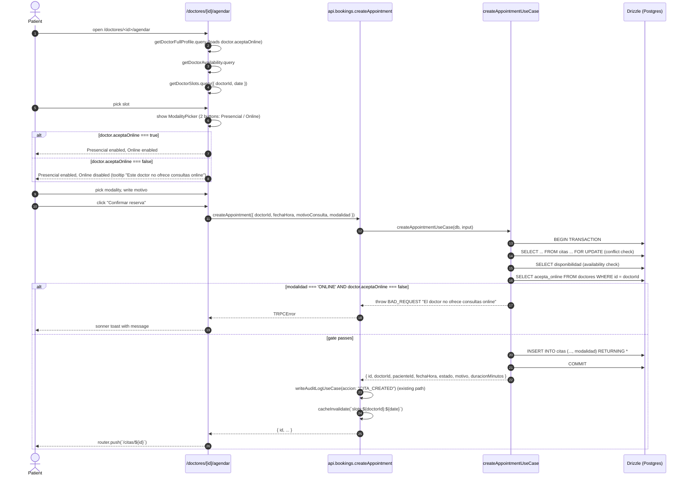
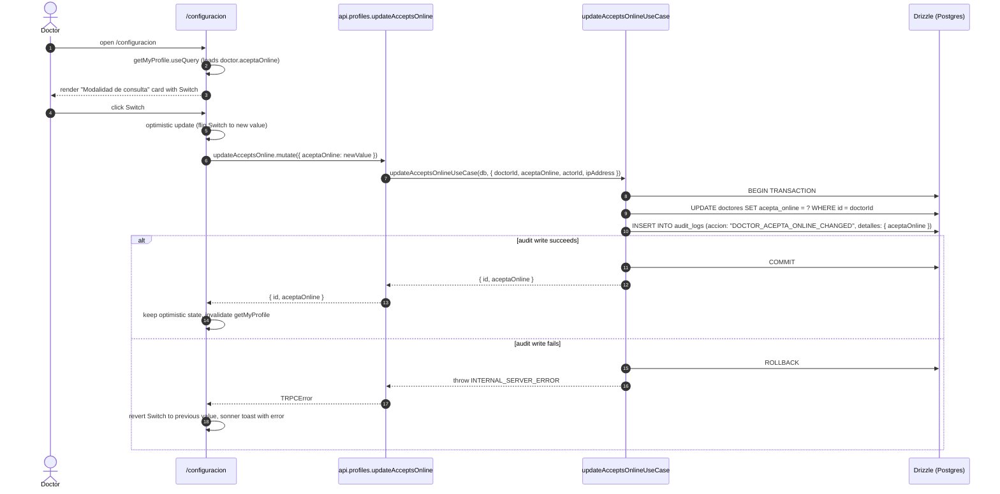
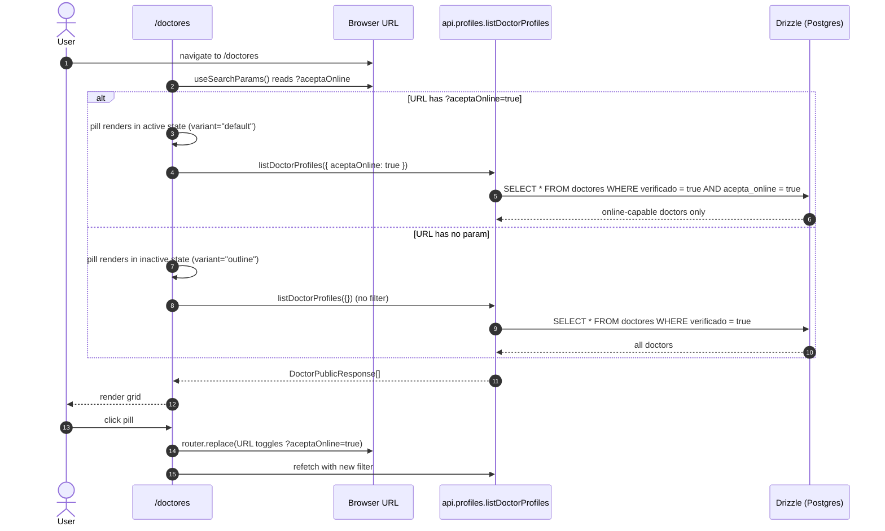

# Design: Appointment Modality (Presencial / Online)

## 1. Overview

The medico-consulta platform has been marketing online (video-call) consultations in `terminos/page.tsx` and the home UI copy for weeks, but the data model never grew the columns to back it up: `citas` has no `modalidad` field, `doctores` has no opt-in flag, `JoinCallButton` fires on every `CONFIRMADA/EN_CURSO` cita regardless of intent, and `getRoomToken` will happily issue a LiveKit JWT to a cita that was booked as presencial. The `2026-06-16-video-calls` change shipped the call mechanics; this change ships the **business rule** that decides which citas get them.

This change is **additive at the DB layer and the spec layer** (a new enum column, a new boolean, a new tRPC procedure, a new enum value, 1 new spec, 8 delta specs), **non-destructive at the UI layer** (the booking flow gets one extra picker, the cita detail page keeps everything it has, the listing gets a filter pill), and **deliberately minimal at the doctor surface** (a single toggle in `/configuracion` Preferencias, no new page, no per-day grid). It also opens the door to the `tel:` "Llamar" footgun follow-up (the badge added here is the patient-side cue; the button removal is a separate `doctor-hero-cleanup` change).

The implementation lands across all four Clean Architecture layers with **no new third-party dependencies** and no new infrastructure containers. The data plane adds `citas.modalidad varchar(20) NOT NULL DEFAULT 'PRESENCIAL'` and `doctores.acepta_online boolean NOT NULL DEFAULT false` via a Drizzle migration with the 2-statement "backfill, then `DROP DEFAULT`" pattern. The application layer adds `updateAcceptsOnlineUseCase` (DOCTOR-only, writes the audit row inside the same transaction as the `doctores.acepta_online` UPDATE), extends `createAppointmentUseCase` with the modality input + the server-side `aceptaOnline` gate INSIDE the existing transaction (closes the TOCTOU window when a doctor toggles off mid-booking), and extends `getRoomTokenUseCase` with the modality gate AFTER the existing status + time-window gate (PRESENCIAL → `FORBIDDEN` with the spec message). The infrastructure layer adds `bookings.createAppointment.modalidad` Zod field, `profiles.updateAcceptsOnline` tRPC mutation (DOCTOR-only via `protectedProcedure` + role check), and `profiles.listDoctorProfiles.aceptaOnline` filter. The presentation layer adds the modality picker to `/doctores/[id]/agendar` (AFTER slot pick, BEFORE motivo), the modality badge to `/citas/[id]` (next to the status badge), the "Disponible online" badge to `DoctorHero` (with `Video` icon), the "Disponible online" filter pill to `/doctores` (URL-driven), and the "Modalidad de consulta" toggle card to `/configuracion`. The change ships as two chained PRs (stacked-to-main per cached engram preference and the `chained-pr` skill) — PR-A (data + settings + badge + listing filter, ~570 lines) and PR-B (booking flow + JoinCallButton + getRoomToken, ~445 lines). Each PR is under the user's 800-line review cap.

Scope summary:

- Add `citas.modalidad` (`varchar(20) NOT NULL DEFAULT 'PRESENCIAL'`) and `doctores.acepta_online` (`boolean NOT NULL DEFAULT false`) via the 2-statement Drizzle migration `0004_*.sql`.
- Add the `ConsultaModalidad` enum (`'PRESENCIAL' | 'ONLINE'`) to the central enums barrel; extend `Cita` and `Doctor` entities with the new fields (defaulting in the `create()` factory to preserve backwards compatibility with existing call sites).
- Add `updateAcceptsOnlineUseCase` (DOCTOR-only, writes `audit_logs` row in the same transaction); extend `createAppointmentUseCase` with the `modalidad` input and the server-side `aceptaOnline` check INSIDE the existing transaction; extend `getRoomTokenUseCase` with the modality gate AFTER the existing status + time-window gate.
- Extend `bookings.createAppointment` Zod input; extend `bookings.getMyAppointments` response shape; add `profiles.updateAcceptsOnline` mutation; extend `profiles.getDoctorProfile`, `profiles.getDoctorFullProfile`, and `profiles.listDoctorProfiles` with `aceptaOnline` (top-level field for the first two; optional filter for the third); extend `AuditAction` union with `'DOCTOR_ACEPTA_ONLINE_CHANGED'`.
- Add the modality picker to the booking flow (two-button toggle, AFTER slot pick, BEFORE motivo consulta, with the doctor-opted-out "Online" disabled state and tooltip "Este doctor no ofrece consultas online"); add the modality badge to the cita detail page (Spanish text "Presencial" / "Online", no icon, adjacent to the status badge); add the "Disponible online" badge to `DoctorHero` (with `Video` icon, strict `=== true` check, hidden for opted-out doctors); add the "Disponible online" filter pill to `/doctores` (URL-driven via `?aceptaOnline=true`); add the "Modalidad de consulta" `<Card>` to `/configuracion` (single `<Switch>`, optimistic update, sonner toast on error, audit log on success).
- Add 14 new test scenarios (1 entity test for `Cita.modalidad`, 1 for `Doctor.aceptaOnline`, 1 audit test for the new `AuditAction` value, 1 use case test for `createAppointmentUseCase` modality validation, 1 use case test for the TOCTOU window, 2 for `getRoomTokenUseCase`, 1 for `updateAcceptsOnlineUseCase`, 1 tRPC test for `updateAcceptsOnline`, 1 for `listDoctorProfiles` filter, 5 component tests).
- Ship as 2 chained PRs (stacked-to-main), with PR-A as the data + opt-in + surfacing slice and PR-B as the booking flow + gate slice. PR-B depends on PR-A.

## 2. Architecture Diagram

The change has three data flows worth diagraming: (1) the patient booking flow with the new modality picker, (2) the doctor opt-in toggle in `/configuracion`, and (3) the `/doctores` listing filter.

### 2.1 Patient booking flow with modality picker



The modality gate runs INSIDE the transaction, AFTER the existing conflict + availability checks, and re-reads `doctores.acepta_online` from the database (no cache). This closes the TOCTOU window: a doctor who toggles `aceptaOnline` to `false` between the patient's "Confirmar" click and the mutation is correctly caught (AD-13 / R3).

### 2.2 Doctor opt-in toggle in `/configuracion`



The UPDATE and the audit log write live in the same transaction so a partial write cannot leave the toggle flipped without an audit row (per the spec). The doctor gets clear feedback: success = switch stays flipped + cache invalidated; failure = switch reverts + error toast.

### 2.3 `/doctores` listing filter



The URL is the source of truth (per D11 / AD-9). A page reload (e.g., paste a link with `?aceptaOnline=true`) renders the pill in the active state and applies the filter on first paint. Other search params (e.g., `?search=cardiologo`) are preserved when toggling the pill.

## 3. Database Migration

The migration is `0004_*.sql` (Drizzle Kit picks the sequence number; `0003_good_colonel_america.sql` exists, so the next integer is `0004`). It contains **four DDL statements** executed inside the project's standard migration transaction, in the documented order:

```sql
-- Statement 1: add modality column with default, backfills all existing rows in one atomic pass
ALTER TABLE "citas" ADD COLUMN "modalidad" varchar(20) DEFAULT 'PRESENCIAL' NOT NULL;

-- Statement 2: drop the default so new inserts MUST specify a value explicitly
ALTER TABLE "citas" ALTER COLUMN "modalidad" DROP DEFAULT;

-- Statement 3: add acepta_online column with default, backfills all existing rows in one atomic pass
ALTER TABLE "doctores" ADD COLUMN "acepta_online" boolean DEFAULT false NOT NULL;

-- Statement 4: drop the default so new inserts MUST specify a value explicitly
ALTER TABLE "doctores" ALTER COLUMN "acepta_online" DROP DEFAULT;
```

Postgres ≥ 11 backfills the new column in the same statement that adds it — it acquires an `ACCESS EXCLUSIVE` lock and rewrites the table in one pass (no separate `UPDATE` step, no risk of forgetting a row). After the backfill, `DROP DEFAULT` forces every new insert to specify a value explicitly; accidental `INSERT`s from a future migration or admin script that omit the column will fail loudly with a `NOT NULL` violation instead of silently defaulting to `PRESENCIAL` / `false`. The Drizzle schema (`citas.ts`, `doctores.ts`) keeps the `default(...)` declaration for ergonomic dev/test inserts; the migration is the runtime authority on what the production schema actually enforces.

**DOWN migration** (reverses the four statements in reverse order):

```sql
-- Reverse: drop the column
ALTER TABLE "citas" DROP COLUMN "modalidad";
-- Reverse: drop the column
ALTER TABLE "doctores" DROP COLUMN "acepta_online";
```

(The `DROP DEFAULT` is implicitly reversed by `DROP COLUMN` — the column is gone, no default to drop. No data loss outside the two new columns; both were never written to in production by the time the down-migration runs, because PR-A ships the toggle and the badge but NOT the booking-flow picker — patients cannot create a cita with `modalidad: "ONLINE"` until PR-B lands.)

**Indexes: none.** Per the spec rationale: modality filtering happens at the doctor level (the `/doctores` listing filter on `doctores.acepta_online` is a low-cardinality lookup on a small table, acceptable for MVP via Postgres seq-scan), and cita-level modality is not a query-hot path. `citas.modalidad` does not get an index. If a future change adds one, it lands in that change's spec.

**Drizzle schema declarations** (additions to existing files, not new tables):

```ts
// src/infrastructure/db/schema/citas.ts (addition inside the existing pgTable call)
modalidad: varchar("modalidad", { length: 20 }).notNull().default("PRESENCIAL"),

// src/infrastructure/db/schema/doctores.ts (addition inside the existing pgTable call)
aceptaOnline: boolean("acepta_online").notNull().default(false),
```

The `length: 20` for `modalidad` matches the existing `estado varchar(20)` pattern and leaves room for a future third modality (`"DOMICILIO"`?). The `boolean NOT NULL` for `aceptaOnline` mirrors the existing `verificado: boolean("verificado").default(false).notNull()` pattern on the same table (both are opt-in booleans with a safe default).

**How to generate the migration:**

```bash
# After editing the Drizzle schemas (citas.ts, doctores.ts):
pnpm drizzle-kit generate

# Drizzle Kit picks the next sequence number (0004) and emits:
#   src/infrastructure/db/migrations/0004_<hash>.sql
# The generated SQL may differ slightly from the exact 4-statement shape above
# (Drizzle Kit may combine the two ALTER TABLE statements per table). The
# apply phase MUST post-edit the generated file to enforce the documented
# 4-statement shape: ADD COLUMN ... DEFAULT ... NOT NULL, then DROP DEFAULT.
# This is the same pattern as the video-calls migration (where the generated
# file was post-edited to remove the unnecessary DROP COLUMN in the DOWN step).
```

The post-edit is non-negotiable: Drizzle Kit's default output is functionally correct but loses the 2-statement backfill-and-drop pattern. The apply phase must enforce the documented shape so the schema enforces explicit writes at runtime (per D3 / REQ-DB-MOD-3).

## 4. Domain Layer

### 4.1 `ConsultaModalidad` enum (additive, in `src/domain/enums/index.ts`)

```ts
/**
 * Modality of a medical consultation.
 *
 * - PRESENCIAL: in-person visit at the doctor's office.
 * - ONLINE: video-call via the LiveKit-backed call page.
 *
 * The two-value union is intentional and matches the existing UserRole /
 * ConsultationStatus pattern (string TS enum, not pg_enum, not runtime class).
 */
export enum ConsultaModalidad {
  PRESENCIAL = "PRESENCIAL",
  ONLINE = "ONLINE",
}
```

The enum is exported from the central enums barrel (`src/domain/enums/index.ts`) so it can be imported alongside `ConsultationStatus` via `import { ConsultaModalidad } from "@/domain/enums"`. The codebase uses `enum { FOO = "FOO" }` (NOT a string union type) for `UserRole` and `ConsultationStatus`; the new enum follows the same pattern for consistency.

### 4.2 `Cita` entity (additive field `modalidad`)

The `Cita` entity gets a new readonly field `modalidad: ConsultaModalidad`. The field is assigned in the constructor (NOT a default property, NOT a getter — a stored value, because it is set at creation and never changes for the cita's lifetime). The `Cita.create()` factory accepts an optional `modalidad` argument; when omitted, the factory defaults the value to `PRESENCIAL` (preserves backwards compatibility with existing call sites that do not pass a modality — the existing `createAppointment` use case is updated to pass it explicitly, but pre-existing fixtures in tests that omit it keep compiling).

```ts
// src/domain/entities/cita.ts (additions)
import { ConsultaModalidad, ConsultationStatus, transitionStatus } from "@/domain/enums";

export class Cita {
  private constructor(
    readonly id: string,
    readonly doctorId: string,
    readonly pacienteId: string,
    readonly fechaHora: Date,
    readonly estado: ConsultationStatus,
    readonly motivo: string,
    readonly duracionMinutos: number,
    readonly precio: number | undefined,
    readonly modalidad: ConsultaModalidad,  // ← NEW
  ) {}

  static create(props: {
    doctorId: string;
    pacienteId: string;
    fechaHora: Date;
    motivo: string;
    estado?: ConsultationStatus;
    duracionMinutos?: number;
    precio?: number;
    modalidad?: ConsultaModalidad;  // ← NEW
  }): Cita {
    if (!props.motivo || props.motivo.trim().length === 0)
      throw new Error("Motivo is required");
    if (props.fechaHora.getTime() <= Date.now())
      throw new Error("fechaHora must be in the future");

    // Validate the optional modalidad (runtime guard on top of the TS type)
    const modalidad = props.modalidad ?? ConsultaModalidad.PRESENCIAL;
    if (modalidad !== ConsultaModalidad.PRESENCIAL && modalidad !== ConsultaModalidad.ONLINE) {
      throw new Error("Invalid modalidad: must be PRESENCIAL or ONLINE");
    }

    return new Cita(
      crypto.randomUUID(),
      props.doctorId,
      props.pacienteId,
      props.fechaHora,
      props.estado ?? ConsultationStatus.PENDIENTE,
      props.motivo.trim(),
      props.duracionMinutos ?? 30,
      props.precio,
      modalidad,
    );
  }

  // ... existing withEstado() updated to pass `this.modalidad`
  // ... existing get livekitRoomName() unchanged

  withEstado(nuevoEstado: ConsultationStatus): Cita {
    const validado = transitionStatus(this.estado, nuevoEstado);
    return new Cita(
      this.id,
      this.doctorId,
      this.pacienteId,
      this.fechaHora,
      validado,
      this.motivo,
      this.duracionMinutos,
      this.precio,
      this.modalidad,  // ← preserved across status transitions
    );
  }
}
```

The `withEstado()` factory is updated to preserve `modalidad` across status transitions (a cita that goes `PENDIENTE → CONFIRMADA → EN_CURSO` keeps its `modalidad` unchanged — the modality is a per-cita property, not a per-status property). No other field, no other factory method, no other constructor signature changes.

### 4.3 `Doctor` entity (additive field `aceptaOnline`)

```ts
// src/domain/entities/doctor.ts (additions)
export class Doctor {
  private constructor(
    readonly id: string,
    readonly usuarioId: string,
    readonly numeroColegiado: string,
    readonly especialidad: string,
    readonly biografia: string | undefined,
    readonly precioConsulta: number | undefined,
    readonly verificado: boolean,
    readonly calificacionMedia: number | undefined,
    readonly fotoUrl: string | undefined,
    readonly ubicacionConsulta: string | undefined,
    readonly añosExperiencia: number | undefined,
    readonly idiomas: string[] | undefined,
    readonly telefonoConsulta: string | undefined,
    readonly aceptaOnline: boolean,  // ← NEW
  ) {}

  static create(props: {
    usuarioId: string;
    numeroColegiado: string;
    especialidad: string;
    biografia?: string;
    precioConsulta?: number;
    verificado?: boolean;
    calificacionMedia?: number;
    fotoUrl?: string;
    ubicacionConsulta?: string;
    añosExperiencia?: number;
    idiomas?: string[];
    telefonoConsulta?: string;
    aceptaOnline?: boolean;  // ← NEW
  }): Doctor {
    // ... existing validations unchanged

    return new Doctor(
      crypto.randomUUID(),
      props.usuarioId,
      props.numeroColegiado.trim(),
      props.especialidad.trim(),
      props.biografia?.trim(),
      props.precioConsulta,
      props.verificado ?? false,
      props.calificacionMedia,
      props.fotoUrl?.trim(),
      props.ubicacionConsulta?.trim(),
      props.añosExperiencia,
      props.idiomas,
      props.telefonoConsulta?.trim(),
      props.aceptaOnline ?? false,  // ← safe opt-in default
    );
  }
}
```

No business-rule validation on `aceptaOnline` at the entity level (any boolean is valid; the field is a pure preference flag, and the doctor-side invariant "you may receive ONLINE citas only if `aceptaOnline === true`" is enforced at the use-case layer, not the entity). The default `false` preserves the opt-in safe default from the DB layer.

### 4.4 Entity tests to add (1 per entity, ~30 lines each)

```ts
// src/domain/entities/__tests__/cita.test.ts (extension, +30 lines)
describe("Cita — modalidad field", () => {
  it("defaults to PRESENCIAL when modality is omitted", () => {
    const cita = Cita.create({
      doctorId: "doc-1",
      pacienteId: "pac-1",
      fechaHora: new Date(Date.now() + 60_000),
      motivo: "Consulta",
    });
    expect(cita.modalidad).toBe("PRESENCIAL");
  });

  it("accepts ONLINE when modality is passed", () => {
    const cita = Cita.create({
      doctorId: "doc-1",
      pacienteId: "pac-1",
      fechaHora: new Date(Date.now() + 60_000),
      motivo: "Consulta",
      modalidad: "ONLINE",
    });
    expect(cita.modalidad).toBe("ONLINE");
  });

  it("rejects an invalid modality value", () => {
    expect(() =>
      Cita.create({
        doctorId: "doc-1",
        pacienteId: "pac-1",
        fechaHora: new Date(Date.now() + 60_000),
        motivo: "Consulta",
        // @ts-expect-error — testing the runtime guard on top of the TS type
        modalidad: "HIDRIDA",
      }),
    ).toThrow("Invalid modalidad");
  });

  it("preserves modality across withEstado transitions", () => {
    const cita = Cita.create({
      doctorId: "doc-1",
      pacienteId: "pac-1",
      fechaHora: new Date(Date.now() + 60_000),
      motivo: "Consulta",
      modalidad: "ONLINE",
    });
    const next = cita.withEstado(ConsultationStatus.CONFIRMADA);
    expect(next.modalidad).toBe("ONLINE");
  });
});

// src/domain/entities/__tests__/doctor.test.ts (extension, +30 lines)
describe("Doctor — aceptaOnline field", () => {
  it("defaults to false when aceptaOnline is omitted", () => {
    const doctor = Doctor.create({
      usuarioId: "user-1",
      numeroColegiado: "COL-123",
      especialidad: "Cardiología",
    });
    expect(doctor.aceptaOnline).toBe(false);
  });

  it("accepts true when aceptaOnline is passed", () => {
    const doctor = Doctor.create({
      usuarioId: "user-1",
      numeroColegiado: "COL-123",
      especialidad: "Cardiología",
      aceptaOnline: true,
    });
    expect(doctor.aceptaOnline).toBe(true);
  });

  it("accepts false explicitly", () => {
    const doctor = Doctor.create({
      usuarioId: "user-1",
      numeroColegiado: "COL-123",
      especialidad: "Cardiología",
      aceptaOnline: false,
    });
    expect(doctor.aceptaOnline).toBe(false);
  });
});
```

## 5. Use Cases

### 5.1 `createAppointmentUseCase` — modality input + D5 gate

The use case (`src/application/use-cases/bookings/create-appointment.use-case.ts`) gets a new required input `modalidad: ConsultaModalidad`. After the existing `doctorId` / `fechaHora` / `motivoConsulta` / availability / conflicting-cita checks (all inside the existing transaction), a new gate evaluates the modality:

```ts
// src/application/use-cases/bookings/create-appointment.use-case.ts (additions)
import { ConsultaModalidad } from "@/domain/enums";

export interface CreateAppointmentInput {
  doctorId: string;
  pacienteId: string;
  fechaHora: string;
  motivoConsulta: string;
  modalidad: ConsultaModalidad;  // ← NEW
}

// Inside the transaction, after the existing availability + conflicting-cita checks:
const doctor = await tx
  .select({ aceptaOnline: schema.doctores.aceptaOnline })
  .from(schema.doctores)
  .where(eq(schema.doctores.id, doctorId))
  .limit(1)
  .then((rows) => rows[0] ?? null);

if (input.modalidad === ConsultaModalidad.ONLINE && !doctor?.aceptaOnline) {
  throw new TRPCError({
    code: "BAD_REQUEST",
    message: "El doctor no ofrece consultas online",
  });
}

// Existing INSERT, extended with modalidad:
const [inserted] = await tx
  .insert(schema.citas)
  .values({
    doctorId,
    pacienteId,
    fechaHora,
    estado: ConsultationStatus.PENDIENTE,
    motivo: motivoConsulta,
    duracionMinutos: 30,
    modalidad: input.modalidad,  // ← NEW column
  })
  .returning();
```

The check is inside the same `db.transaction(async (tx) => {...})` as the cita insert, closing the TOCTOU window (per AD-13 / R3): a doctor who toggles `aceptaOnline` to `false` between the patient's "Confirmar" click and the mutation is caught because the in-transaction read sees the new `false` value (the read is part of the same atomic transaction as the insert). The check is a `.select({ aceptaOnline: true })` projection (NOT a `SELECT *`), so it adds one narrow query inside the transaction.

**Test scenarios for `createAppointmentUseCase` (2 new, on top of the existing test file):**

1. `createAppointmentUseCase rejects ONLINE when doctor.aceptaOnline === false` — the new gate throws `BAD_REQUEST "El doctor no ofrece consultas online"`, no Cita is created.
2. `createAppointmentUseCase accepts ONLINE when doctor.aceptaOnline === true` — the new gate passes, Cita is created with `modalidad: "ONLINE"`.
3. `createAppointmentUseCase accepts PRESENCIAL regardless of doctor.aceptaOnline` — the gate is bypassed for `PRESENCIAL` (a doctor who has not opted in still receives presencial citas).
4. `createAppointmentUseCase TOCTOU window: doctor toggles aceptaOnline to false mid-transaction, ONLINE booking is rejected` — fixture sets `aceptaOnline: false` in the second `findFirst` mock call (the one inside the transaction), asserts the gate throws and no Cita is inserted.

### 5.2 `getRoomTokenUseCase` — modality gate (D6 / REQ-VA-MOD-1)

The use case (`src/application/use-cases/bookings/get-room-token.use-case.ts`) gets a new gate AFTER the existing status + time-window gate, AFTER the `isParticipant` check, AFTER the `EN_CURSO` / `CONFIRMADA` / `PENDIENTE` / completion branches. The `cita.modalidad` field is added to the SELECT projection (one new column, no extra query).

```ts
// src/application/use-cases/bookings/get-room-token.use-case.ts (additions)
import { ConsultaModalidad } from "@/domain/enums";

// In the SELECT projection, add modalidad:
const [row] = await db
  .select({
    id: schema.citas.id,
    fechaHora: schema.citas.fechaHora,
    estado: schema.citas.estado,
    modalidad: schema.citas.modalidad,  // ← NEW
    doctorUsuarioId: schema.doctores.usuarioId,
    pacienteUsuarioId: schema.pacientes.usuarioId,
  })
  .from(schema.citas)
  .innerJoin(schema.doctores, eq(schema.citas.doctorId, schema.doctores.id))
  .innerJoin(schema.pacientes, eq(schema.citas.pacienteId, schema.pacientes.id))
  .where(eq(schema.citas.id, input.citaId))
  .limit(1);

// ... existing authorization + status + time-window gate unchanged ...

// NEW modality gate — runs AFTER the status / time-window gate passes:
if (row.modalidad === ConsultaModalidad.PRESENCIAL) {
  throw new TRPCError({
    code: "FORBIDDEN",
    message: "Esta cita es presencial, no permite videollamada",
  });
}

// Existing token issuance unchanged.
```

The gate order is: (1) authorization / existence (NOT_FOUND), (2) status / time window (FORBIDDEN with status-specific message), (3) modality (FORBIDDEN with modality-specific message). Modality is the LAST gate before token issuance. A PRESENCIAL cita outside the time window gets the time-window message (not the modality message), and a PRESENCIAL cita in `EN_CURSO` gets the modality message (the status gate passes for `EN_CURSO` because the time check is bypassed; the modality gate then runs and throws). The `getRoomToken` procedure wire surface (input shape, output shape) is unchanged — the modality gate is internal to the use case.

**Test scenarios for `getRoomTokenUseCase` (2 new, on top of the existing test file, per D13):**

1. `PRESENCIAL cita → FORBIDDEN "Esta cita es presencial, no permite videollamada"` — the modality gate throws, the token is never issued, the audit log is not written.
2. `ONLINE cita within the window still receives a token (regression guard per D13)` — the modality gate passes for `ONLINE`, the existing happy path is unchanged (re-run the pre-existing happy-path test to prove the new gate does not over-eagerly reject).
3. `PRESENCIAL + EN_CURSO still rejected with modality message` — the status gate passes (EN_CURSO bypasses time), the modality gate throws.
4. `PRESENCIAL + CONFIRMADA outside the window still gets the time-window message, not the modality message` — gate order: status/time throws first, modality is never reached.

### 5.3 NEW `updateAcceptsOnlineUseCase` (D12 / REQ-BA-MOD-4)

A new use case at `src/application/use-cases/profiles/update-accepts-online.use-case.ts`. Mirrors the shape of `updateProfileUseCase` (no return value beyond the new boolean; thin wrapper around an `UPDATE` + `audit_logs` insert, both inside the same transaction). DOCTOR-only (the procedure layer enforces this; the use case does not re-check the role, the use case trusts the procedure's input).

```ts
// src/application/use-cases/profiles/update-accepts-online.use-case.ts
import type { NodePgDatabase } from "drizzle-orm/node-postgres";
import { eq } from "drizzle-orm";
import * as schema from "@/infrastructure/db/schema";
import { writeAuditLogUseCase } from "@/application";

export interface UpdateAcceptsOnlineInput {
  doctorId: string;        // resolved from session in the procedure
  aceptaOnline: boolean;
  actorId: string;         // ctx.session.user.id (for the audit row)
  ipAddress?: string;
}

export interface UpdateAcceptsOnlineOutput {
  id: string;              // the doctor row's id
  aceptaOnline: boolean;
}

export async function updateAcceptsOnlineUseCase(
  db: NodePgDatabase<typeof schema>,
  input: UpdateAcceptsOnlineInput,
): Promise<UpdateAcceptsOnlineOutput> {
  return db.transaction(async (tx) => {
    const [updated] = await tx
      .update(schema.doctores)
      .set({ aceptaOnline: input.aceptaOnline })
      .where(eq(schema.doctores.id, input.doctorId))
      .returning({ id: schema.doctores.id, aceptaOnline: schema.doctores.aceptaOnline });

    if (!updated) {
      throw new TRPCError({
        code: "NOT_FOUND",
        message: "Doctor no encontrado",
      });
    }

    await writeAuditLogUseCase(tx as never, {
      usuarioId: input.actorId,
      accion: "DOCTOR_ACEPTA_ONLINE_CHANGED",
      entidadAfectada: "doctores",
      entidadId: input.doctorId,
      detalles: { aceptaOnline: input.aceptaOnline },
      direccionIP: input.ipAddress ?? "unknown",
    });

    return { id: updated.id, aceptaOnline: updated.aceptaOnline };
  });
}
```

The `UPDATE` and the audit log write are inside the same transaction so a partial write cannot leave the toggle flipped without an audit row (per the spec). On audit failure, the transaction rolls back, the use case throws `INTERNAL_SERVER_ERROR`, and the procedure surfaces the error; the client's optimistic update reverts and shows a sonner toast (per `doctor-settings-ui/spec.md` REQ-DS-MOD-2).

**Test scenarios for `updateAcceptsOnlineUseCase` (1 new test file, 4-5 scenarios):**

1. `updateAcceptsOnlineUseCase updates aceptaOnline from false to true and writes the audit row` — mock the UPDATE to return `{ id, aceptaOnline: true }`, assert the audit log is written with `accion: "DOCTOR_ACEPTA_ONLINE_CHANGED"`, `detalles: { aceptaOnline: true }`.
2. `updateAcceptsOnlineUseCase updates aceptaOnline from true to false and writes the audit row` — same as #1 but with the inverse value.
3. `updateAcceptsOnlineUseCase throws NOT_FOUND when the doctor row does not exist` — the UPDATE returns no rows, the use case throws.
4. `updateAcceptsOnlineUseCase rolls back the toggle when the audit write fails` — the audit mock throws, the transaction rolls back, the procedure surfaces `INTERNAL_SERVER_ERROR`.
5. `updateAcceptsOnlineUseCase returns the new boolean` — the return shape is `{ id, aceptaOnline }`, not the full doctor row.

### 5.4 `AuditAction` union extension

```ts
// src/application/use-cases/audit/write-audit-log.use-case.ts (addition)
export type AuditAction =
  | "CITA_CREATED"
  | "CITA_CANCELLED"
  | "CITA_STATUS_CHANGED"
  | "CITA_NOTES_UPDATED"
  | "PROFILE_UPDATED"
  | "DOCTOR_AVAILABILITY_UPDATED"
  | "PATIENT_LIST_VIEWED"
  | "APPOINTMENT_LIST_VIEWED"
  | "CITA_ROOM_TOKEN_ISSUED"
  | "DOCTOR_ACEPTA_ONLINE_CHANGED";  // ← NEW
```

The extension is additive and backward-compatible: existing call sites that destructure `AuditAction` and existing switch statements over the union keep compiling. Prior values are untouched. The new value is written exclusively by `updateAcceptsOnlineUseCase`; no other procedure emits this action. A test asserts the union still type-checks all prior values + the new value (one assertion per value).

## 6. tRPC API

### 6.1 `bookings.createAppointment` input schema

```ts
// src/infrastructure/booking/schemas.ts (modification)
import { z } from "zod";
import { ConsultaModalidad } from "@/domain/enums";

export const createAppointmentSchema = z.object({
  doctorId: z.string().uuid("ID de doctor inválido"),
  fechaHora: z.string().datetime({ message: "Fecha y hora inválida" }),
  motivoConsulta: z
    .string()
    .min(1, "El motivo de consulta es requerido")
    .max(1000, "El motivo no puede exceder 1000 caracteres"),
  modalidad: z.nativeEnum(ConsultaModalidad, {
    errorMap: () => ({ message: "Modalidad inválida: debe ser PRESENCIAL u ONLINE" }),
  }),  // ← NEW (required)
});
```

The Zod validation rejects an invalid `modalidad` value with `BAD_REQUEST` BEFORE the use case is invoked (a bad modality MUST NOT cost a DB round-trip, per the spec). The procedure body in `bookings.ts` passes the new value to `createAppointmentUseCase` unchanged.

### 6.2 `bookings.getMyAppointments` response shape

The `getMyAppointmentsUseCase` (`src/application/use-cases/bookings/get-my-appointments.use-case.ts`) SELECTs `citas.*` — adding `modalidad` to the projected response is automatic (the column is added to the table, the Drizzle `select()` returns it, the use case maps it through). The response shape gains a top-level `modalidad: ConsultaModalidad` field on every cita. The router code is unchanged (it returns whatever the use case returns). Pre-existing rows are backfilled to `PRESENCIAL` by the migration, so `modalidad: "PRESENCIAL"` is present even for rows created before this change (per the spec: "modalidad is present for pre-existing rows" scenario in REQ-BA-MOD-3).

### 6.3 `bookings.getRoomToken` (no wire change; internal gate)

The procedure wire surface (input: `{ citaId: z.string().uuid() }`, output: `{ token, serverUrl, roomName }`) is unchanged. The modality gate lives in the use case (see §5.2). The audit log entry written on successful token issuance is unchanged (`CITA_ROOM_TOKEN_ISSUED`, `detalles: { roomName, role }`). The new modality-rejection case is a new `FORBIDDEN` Spanish message; the existing status / time / authorization messages are unchanged.

### 6.4 NEW `profiles.updateAcceptsOnline` (REQ-BA-MOD-4)

A new mutation appended to the `profiles` router (NOT `bookings` — the doctor-side opt-in is a profile concern, but documented in the booking-api spec because it gates the booking flow):

```ts
// src/infrastructure/api/routers/profiles.ts (addition inside profilesRouter)
import { updateAcceptsOnlineUseCase } from "@/application";
import { getRequestIp } from "@/infrastructure/api/context";  // if available, else use "unknown"

// ... inside the router() object, after updateMyProfile:

updateAcceptsOnline: protectedProcedure
  .input(z.object({ aceptaOnline: z.boolean() }))
  .mutation(async ({ ctx, input }) => {
    // DOCTOR-only role check (the use case trusts this; the procedure enforces it)
    if (ctx.session!.user.role !== UserRole.DOCTOR) {
      throw new TRPCError({
        code: "FORBIDDEN",
        message: "Solo los doctores pueden modificar esta preferencia",
      });
    }

    // Resolve the doctor record for the session user
    const doctorRecord = await db
      .select({ id: doctores.id })
      .from(doctores)
      .where(eq(doctores.usuarioId, ctx.session!.user.id))
      .limit(1)
      .then((rows) => rows[0] ?? null);

    if (!doctorRecord) {
      throw new TRPCError({
        code: "NOT_FOUND",
        message: "Perfil de doctor no encontrado",
      });
    }

    return updateAcceptsOnlineUseCase(
      db as never,
      {
        doctorId: doctorRecord.id,
        aceptaOnline: input.aceptaOnline,
        actorId: ctx.session!.user.id,
        ipAddress: getRequestIp(ctx),
      },
    );
  }),
```

The procedure is `protectedProcedure` (rejects unauthenticated with `UNAUTHORIZED`); the role check inside the procedure rejects non-DOCTOR with `FORBIDDEN`. The use case handles the `UPDATE` + audit write in one transaction. The return shape is `{ id, aceptaOnline }` so the client can update its local state without a follow-up `getMyProfile` round-trip.

### 6.5 `profiles.getDoctorProfile` and `profiles.getDoctorFullProfile` — response shape

Both public procedures gain a top-level `aceptaOnline: boolean` field. The change is a single `select` column addition + a single response key addition (mirroring the existing `precioConsulta` / `calificacionMedia` shape):

```ts
// src/infrastructure/api/routers/profiles.ts (in getDoctorProfile, ~line 87)
const result: DoctorPublicResponse = {
  id: doctorRow.id,
  nombre: user.nombre,
  email: user.email,
  especialidad: doctorRow.especialidad,
  biografia: doctorRow.biografia,
  precioConsulta: toNumber(doctorRow.precioConsulta),
  calificacionMedia: toNumber(doctorRow.calificacionMedia),
  aceptaOnline: doctorRow.aceptaOnline,  // ← NEW
};
return result;
```

`getDoctorFullProfile` is unchanged in the procedure body (it delegates to `getDoctorFullProfileUseCase`); the use case is updated to include `aceptaOnline` in the doctor projection (one new column in the `db.query.doctores.findFirst({ where, with: {...} })` select). The response interface `DoctorFullProfileResponse` (in `src/infrastructure/profiles/schemas.ts`) gains a top-level `aceptaOnline: boolean` field. The field is present for every successful response (NOT `undefined` for opted-out doctors — strict `boolean`).

### 6.6 `profiles.listDoctorProfiles` — optional `aceptaOnline` filter

```ts
// src/infrastructure/api/routers/profiles.ts (in listDoctorProfiles, ~line 100)
listDoctorProfiles: publicProcedure
  .input(
    z
      .object({
        especialidad: z.string().optional(),
        aceptaOnline: z.boolean().optional(),  // ← NEW
        limit: z.number().min(1).max(50).default(20),
        offset: z.number().min(0).default(0),
      })
      .default({}),
  )
  .query(async ({ input }) => {
    const conditions = [eq(doctores.verificado, true)];

    if (input.especialidad) {
      conditions.push(ilike(doctores.especialidad, `%${input.especialidad}%`));
    }

    if (input.aceptaOnline !== undefined) {  // ← NEW
      conditions.push(eq(doctores.aceptaOnline, input.aceptaOnline));
    }

    // ... rest of the query unchanged
  }),
```

The filter is applied as a `WHERE doctores.acepta_online = true|false` clause in the SQL (NOT an in-memory post-filter), so the response size matches the filter. The `aceptaOnline` filter is combinable with the existing `especialidad` filter (additive, NOT exclusive). The `undefined` case returns all doctors (pre-change behavior, unchanged).

## 7. UI Layer

### 7.1 Booking page (`/doctores/[id]/agendar/page.tsx`) — ModalityPicker

The page becomes a three-step wizard rendered on a single page (per D4 / AD-12):

1. **Pick slot** — the existing `SlotGrid` (no change).
2. **Pick modality + write motivo** — a new section that appears after an available slot is selected. Renders a `<ModalityPicker>` component (new, see below) with two options labelled `"Presencial"` and `"Online"`. Below the picker, the existing motivo textarea.
3. **Confirm** — a single "Confirmar reserva" button that calls `bookings.createAppointment` with BOTH `modalidad` and `motivoConsulta`.

The `<ModalityPicker>` is a small focused component (new file at `src/components/booking/ModalityPicker.tsx`):

```tsx
// src/components/booking/ModalityPicker.tsx (NEW)
"use client";

import { Video, MapPin } from "lucide-react";
import { cn } from "@/lib/utils";
import { ConsultaModalidad } from "@/domain/enums";

export interface ModalityPickerProps {
  value: ConsultaModalidad | undefined;
  onChange: (modalidad: ConsultaModalidad) => void;
  onlineDisabled: boolean;  // doctor.aceptaOnline === false
}

export function ModalityPicker({ value, onChange, onlineDisabled }: ModalityPickerProps) {
  return (
    <div className="grid grid-cols-2 gap-2" role="radiogroup" aria-label="Modalidad de consulta">
      <button
        type="button"
        role="radio"
        aria-checked={value === "PRESENCIAL"}
        onClick={() => onChange("PRESENCIAL")}
        className={cn(
          "flex items-center justify-center gap-2 rounded-md border p-3 text-sm font-medium",
          value === "PRESENCIAL" ? "border-primary bg-primary/5" : "hover:bg-muted/50",
        )}
      >
        <MapPin className="size-4" aria-hidden="true" />
        Presencial
      </button>
      <button
        type="button"
        role="radio"
        aria-checked={value === "ONLINE"}
        disabled={onlineDisabled}
        title={onlineDisabled ? "Este doctor no ofrece consultas online" : undefined}
        onClick={() => !onlineDisabled && onChange("ONLINE")}
        className={cn(
          "flex items-center justify-center gap-2 rounded-md border p-3 text-sm font-medium",
          value === "ONLINE" ? "border-primary bg-primary/5" : "hover:bg-muted/50",
          onlineDisabled && "cursor-not-allowed opacity-50",
        )}
      >
        <Video className="size-4" aria-hidden="true" />
        Online
      </button>
    </div>
  );
}
```

The booking page state grows from `{ doctorId, selectedSlot, motivo }` to `{ doctorId, selectedSlot, modalidad, motivo }`. The "Confirmar reserva" button is enabled when modality + motivo + slot are all set. The `createAppointment` mutation is called with `modalidad: "PRESENCIAL" | "ONLINE"` in addition to the existing fields. The page calls `api.profiles.getDoctorProfile.useQuery` (existing) and the new field is sourced from there — no extra round-trip.

### 7.2 Cita detail page (`/citas/[id]/page.tsx`) — modality badge + JoinCallButton prop

The page passes `modalidad` to BOTH `<JoinCallButton>` instances (doctor view line ~290, patient view line ~381) and renders a small `<Badge>` next to the existing `StatusBadge` in the page header (the `<CardHeader>` at line ~239):

```tsx
// src/app/citas/[id]/page.tsx (modification, ~line 250)
<div className="flex items-center gap-2">
  <StatusBadge status={currentStatus} />
  <Badge variant="outline">
    {cita.modalidad === "ONLINE" ? "Online" : "Presencial"}
  </Badge>
</div>

// And in the doctor view action card (line ~290):
<JoinCallButton
  citaId={cita.id}
  estado={currentStatus}
  fechaHora={date}
  isDoctor={true}
  modalidad={cita.modalidad}  // ← NEW (required)
// And in the patient view affordance card (line ~381):
<JoinCallButton
  citaId={cita.id}
  estado={currentStatus}
  fechaHora={date}
  isDoctor={false}
  modalidad={cita.modalidad}  // ← NEW (required)
```

The badge text is exactly `"Presencial"` or `"Online"` (Spanish, no icon, no variant of `StatusBadge`). The badge is rendered for every cita regardless of `estado` (per the spec, the modality badge does not depend on `estado`).

### 7.3 `DoctorHero` — "Disponible online" badge (REQ-PU-MOD-1)

A new `<Badge>` next to the existing rating badge (in the right column, after the rating `<div>` at line ~118):

```tsx
// src/components/profiles/DoctorHero.tsx (modification)
import { Video } from "lucide-react";

export interface DoctorHeroProps {
  // ... existing props ...
  aceptaOnline?: boolean;  // ← NEW
}

// Inside the component, after the rating div (line ~127):
{aceptaOnline === true && (
  <div className="flex items-center gap-1">
    <Badge variant="default" className="text-xs">
      <Video className="mr-1 size-3" aria-hidden="true" />
      Disponible online
    </Badge>
  </div>
)}
```

The check is strict `aceptaOnline === true` (NOT truthy) — a doctor with `aceptaOnline: undefined` (older client or defensive default) MUST NOT render the badge. The badge uses the existing `<Badge>` component from `@/components/ui/badge` with the existing `default` variant + a `Video` icon. The badge is hidden (rendered as `null`, NOT a disabled empty badge) for opted-out doctors. The `tel:` "Llamar" button (line ~152) is unchanged (per AD-8 / R10: the footgun is a follow-up change).

### 7.4 `JoinCallButton` — modality prop + PRESENCIAL hard gate (D7 / REQ-VU-MOD-1)

```tsx
// src/components/booking/JoinCallButton.tsx (modification)
import { ConsultaModalidad } from "@/domain/enums";

export interface JoinCallButtonProps {
  citaId: string;
  estado: ConsultationStatus;
  fechaHora: Date;
  isDoctor: boolean;
  modalidad: ConsultaModalidad;  // ← NEW (REQUIRED, not optional)
}

export function JoinCallButton(props: JoinCallButtonProps) {
  const router = useRouter();

  // Hard modality gate — runs FIRST, before the status / time-window check.
  if (props.modalidad === ConsultaModalidad.PRESENCIAL) return null;

  const inWindow =
    Math.abs(Date.now() - props.fechaHora.getTime()) <= FIFTEEN_MIN_MS;
  const isVisible =
    props.estado === ConsultationStatus.EN_CURSO ||
    (props.estado === ConsultationStatus.CONFIRMADA && inWindow);

  if (!isVisible) return null;

  // ... existing render unchanged
}
```

The prop is REQUIRED (not optional) — a missing prop is a TypeScript compile error, NOT a runtime fallback. Returning `null` for PRESENCIAL is the cleanest expression of "this UI does not apply" (per D7 / AD-7); a disabled button with a tooltip is explicitly rejected.

### 7.5 `/doctores` listing — "Disponible online" filter pill (REQ-PU-MOD-2)

The page gains a clickable `<Badge variant="outline">` pill next to the existing search form:

```tsx
// src/app/doctores/page.tsx (modification)
import { useRouter, useSearchParams } from "next/navigation";
import { useCallback } from "react";
import { cn } from "@/lib/utils";

export default function DoctorsListPage() {
  const router = useRouter();
  const searchParams = useSearchParams();
  const [search, setSearch] = useState("");
  const [especialidad, setEspecialidad] = useState<string | undefined>();

  const aceptaOnlineFilter = searchParams.get("aceptaOnline") === "true";

  const { data: doctors, isLoading, isError } =
    api.profiles.listDoctorProfiles.useQuery({
      especialidad,
      aceptaOnline: aceptaOnlineFilter ? true : undefined,  // ← NEW (filter)
      limit: 50,
    });

  const toggleOnlineFilter = useCallback(() => {
    const params = new URLSearchParams(searchParams.toString());
    if (aceptaOnlineFilter) {
      params.delete("aceptaOnline");
    } else {
      params.set("aceptaOnline", "true");
    }
    router.replace(`/doctores${params.toString() ? `?${params.toString()}` : ""}`);
  }, [aceptaOnlineFilter, router, searchParams]);

  return (
    <div className="mx-auto max-w-5xl py-8">
      {/* ... existing back link + header ... */}

      {/* Search + pill (one row) */}
      <div className="mx-auto mb-8 flex max-w-2xl flex-wrap items-center gap-2">
        <form onSubmit={handleSearch} className="flex flex-1 gap-2">
          <Input
            placeholder="Buscar por especialidad…"
            value={search}
            onChange={(e) => setSearch(e.target.value)}
            className="flex-1"
          />
          <Button type="submit" disabled={isLoading}>
            <Search data-icon="inline-start" />
            Buscar
          </Button>
        </form>
        <button
          type="button"
          onClick={toggleOnlineFilter}
          aria-pressed={aceptaOnlineFilter}
          className={cn(
            "inline-flex items-center gap-1 rounded-full border px-3 py-1 text-sm font-medium transition-colors",
            aceptaOnlineFilter
              ? "border-primary bg-primary text-primary-foreground"
              : "border-input bg-background hover:bg-accent",
          )}
        >
          <Video className="size-3.5" aria-hidden="true" />
          Disponible online
        </button>
      </div>

      {/* ... existing content (grid / skeleton / error / empty) unchanged ... */}
    </div>
  );
}
```

The pill is URL-driven (per D11 / AD-9): `useSearchParams()` reads the param, `router.replace()` toggles it. The page calls `listDoctorProfiles` with `aceptaOnline: true` when the param is set, with `aceptaOnline: undefined` otherwise (no filter = all doctors). A page reload (e.g., paste a link with `?aceptaOnline=true` into the address bar) renders the pill in the active state and applies the filter on first paint.

### 7.6 `/configuracion` — "Modalidad de consulta" toggle card (REQ-DS-MOD-1)

A new `<Card>` appended to the existing "Preferencias" section:

```tsx
// src/app/configuracion/page.tsx (modification, inside the existing Preferencias card)
import { Switch } from "@/components/ui/switch";  // shadcn primitive
import { toast } from "sonner";

export default function ConfiguracionPage() {
  const { data: profile, isLoading, isError } = api.profiles.getMyProfile.useQuery();
  const utils = api.useUtils();
  const updateMutation = api.profiles.updateAcceptsOnline.useMutation({
    onSuccess: () => {
      utils.profiles.getMyProfile.invalidate();
    },
    onError: (err) => {
      toast.error(err.message ?? "Error al actualizar la preferencia");
    },
  });

  const isDoctor = profile?.rol === "DOCTOR";
  const doctorProfile = (profile as { doctor?: { aceptaOnline?: boolean } } | undefined)?.doctor;
  const aceptaOnline = doctorProfile?.aceptaOnline ?? false;

  const handleToggle = (newValue: boolean) => {
    updateMutation.mutate({ aceptaOnline: newValue });
  };

  return (
    <div className="mx-auto max-w-2xl space-y-6 p-4">
      {/* ... existing back link + header + Account info card ... */}

      {/* Preferences (with NEW modality card appended) */}
      <Card>
        <CardHeader>
          <CardTitle className="flex items-center gap-2">
            <Settings className="size-5" />
            Preferencias
          </CardTitle>
          <CardDescription>
            Personalizá tu experiencia en la plataforma.
          </CardDescription>
        </CardHeader>
        <CardContent className="space-y-6">
          {/* Existing Tema row */}
          <div className="flex items-center justify-between">
            <div>
              <p className="font-medium">Tema</p>
              <p className="text-sm text-muted-foreground">
                Cambiá entre modo claro y oscuro desde el botón de tema en la barra superior.
              </p>
            </div>
          </div>

          {/* NEW: Modalidad de consulta — only for DOCTOR */}
          {isDoctor && (
            <div className="flex items-center justify-between border-t pt-4">
              <div className="space-y-1">
                <p className="font-medium">Acepto consultas online</p>
                <p className="text-sm text-muted-foreground">
                  Aceptar consultas online habilita la opción de videollamada en el perfil público
                  y en la agenda de los pacientes.
                </p>
              </div>
              {isLoading ? (
                <Skeleton className="h-6 w-11" />
              ) : isError ? (
                <Alert variant="destructive" className="max-w-xs">
                  <AlertCircle className="size-4" />
                  <AlertDescription>No se pudo cargar la preferencia.</AlertDescription>
                </Alert>
              ) : (
                <Switch
                  checked={aceptaOnline}
                  onCheckedChange={handleToggle}
                  disabled={updateMutation.isPending}
                  aria-label="Acepto consultas online"
                />
              )}
            </div>
          )}
        </CardContent>
      </Card>
    </div>
  );
}
```

The switch is wired to `api.profiles.getMyProfile.useQuery()` (initial state from `profile.doctor.aceptaOnline`) and `api.profiles.updateAcceptsOnline.useMutation()` (writes). The mutation is `optimistic` via tRPC's `onSuccess` cache invalidation; the switch is disabled while the mutation is in flight (`isPending`) so the doctor cannot fire two consecutive toggles. The switch stays flipped on success (no revert) and reverts on error via the sonner toast. The card is rendered ONLY for users whose `profile.rol === "DOCTOR"` (the rest of the page is unchanged).

### 7.7 Component test files to add (5 new tests)

| Test file | Scenarios |
|---|---|
| `src/components/booking/__tests__/ModalityPicker.test.tsx` (NEW) | (1) Both options clickable when `onlineDisabled === false`; (2) Online option disabled with `title` tooltip "Este doctor no ofrece consultas online" when `onlineDisabled === true`; (3) Selecting Presencial calls `onChange("PRESENCIAL")`; (4) Selecting Online when disabled does NOT call `onChange`; (5) `aria-checked` reflects `value`. |
| `src/components/booking/__tests__/JoinCallButton.test.tsx` (EXTEND) | (1) `modalidad: "PRESENCIAL"` → returns `null` regardless of `estado`; (2) `modalidad: "ONLINE"` + `estado: "EN_CURSO"` → button visible; (3) `modalidad: "ONLINE"` + `estado: "CONFIRMADA"` +5min → button visible; (4) `modalidad: "ONLINE"` + `estado: "CONFIRMADA"` +30min → button hidden; (5) `modalidad: "ONLINE"` + `estado: "PENDIENTE"` → button hidden; (6) `modalidad: "ONLINE"` + `estado: "EN_CURSO"` + Presencial prop → button hidden (modality gate runs first); (7) Click navigates to `/citas/${citaId}/llamada`. |
| `src/components/profiles/__tests__/DoctorHero.test.tsx` (NEW) | (1) `aceptaOnline: true` → "Disponible online" badge with `Video` icon in DOM; (2) `aceptaOnline: false` → badge NOT in DOM; (3) `aceptaOnline: undefined` → badge NOT in DOM (defensive); (4) `aceptaOnline: true` + `telefonoConsulta` set → BOTH badge AND `tel:` button in DOM; (5) Badge is in the same row as the rating badge. |
| `src/app/doctores/__tests__/page.test.tsx` (NEW) | (1) Inactive pill renders in outline state, `listDoctorProfiles` called WITHOUT `aceptaOnline`; (2) URL with `?aceptaOnline=true` renders active pill, `listDoctorProfiles` called WITH `aceptaOnline: true`; (3) Clicking inactive pill calls `router.replace` with `?aceptaOnline=true`; (4) Clicking active pill calls `router.replace` without the param; (5) Other search params (e.g., `?search=foo`) are preserved on toggle. |
| `src/app/configuracion/__tests__/ModalityToggle.test.tsx` (NEW) | (1) DOCTOR session renders the "Modalidad de consulta" card; (2) PACIENTE session does NOT render the card; (3) `getMyProfile` loading → Skeleton placeholder for the Switch; (4) `getMyProfile` rejects → Alert + no Switch; (5) Switch click calls `updateAcceptsOnline.mutate({ aceptaOnline: true })`; (6) Successful mutation invalidates `getMyProfile`; (7) Failed mutation shows sonner toast; (8) Switch is disabled while mutation is pending. |

## 8. Visibility State Machine for `JoinCallButton`

The pre-change `JoinCallButton` had three states: `HIDDEN_TIME`, `HIDDEN_STATUS`, `VISIBLE`. The post-change state machine has four states: a new `HIDDEN_MODALITY` state is added BEFORE the existing three. The state is determined by the first condition that matches (top-down evaluation).

```
                ┌──────────────────────────────────────────────┐
                │ JoinCallButton Visibility State Machine     │
                └──────────────────────────────────────────────┘

                                  start
                                    │
                                    ▼
                ┌─────────────────────────────────────┐
                │ modalidad === PRESENCIAL ?         │
                │   YES → return null (HIDDEN_MODALITY)│
                │   NO ↓                              │
                └─────────────────────────────────────┘
                                    │
                                    ▼
                ┌─────────────────────────────────────┐
                │ estado === EN_CURSO ?              │
                │   YES → render <Button> (VISIBLE)   │
                │   NO ↓                              │
                └─────────────────────────────────────┘
                                    │
                                    ▼
                ┌─────────────────────────────────────┐
                │ estado === CONFIRMADA AND          │
                │ |now - fechaHora| <= 15 min ?       │
                │   YES → render <Button> (VISIBLE)   │
                │   NO ↓                              │
                └─────────────────────────────────────┘
                                    │
                                    ▼
                ┌─────────────────────────────────────┐
                │ estado === PENDIENTE ?              │
                │   YES → return null (HIDDEN_STATUS) │
                │   NO ↓                              │
                └─────────────────────────────────────┘
                                    │
                                    ▼
                ┌─────────────────────────────────────┐
                │ estado === CONFIRMADA but          │
                │ outside the time window ?           │
                │   YES → return null (HIDDEN_TIME)   │
                │   NO ↓                              │
                └─────────────────────────────────────┘
                                    │
                                    ▼
                ┌─────────────────────────────────────┐
                │ estado ∈ {COMPLETADA, CANCELADA,  │
                │ NO_ASISTIO} ?                      │
                │   YES → return null (HIDDEN_STATUS) │
                └─────────────────────────────────────┘
```

### 8.1 Decision table

The full state table: rows are the `estado` values; columns are the `modalidad` values; cells are the resulting state.

| `estado`        | `modalidad`     | In time window? | Result                              |
|-----------------|-----------------|-----------------|-------------------------------------|
| `PENDIENTE`     | `PRESENCIAL`    | any             | `HIDDEN_MODALITY` (return null)     |
| `PENDIENTE`     | `ONLINE`        | any             | `HIDDEN_STATUS` (return null)       |
| `CONFIRMADA`    | `PRESENCIAL`    | any             | `HIDDEN_MODALITY` (return null)     |
| `CONFIRMADA`    | `ONLINE`        | inside ±15 min  | **`VISIBLE` (render `<Button>`)**   |
| `CONFIRMADA`    | `ONLINE`        | outside ±15 min | `HIDDEN_TIME` (return null)         |
| `EN_CURSO`      | `PRESENCIAL`    | any             | `HIDDEN_MODALITY` (return null)     |
| `EN_CURSO`      | `ONLINE`        | any (bypassed)  | **`VISIBLE` (render `<Button>`)**   |
| `COMPLETADA`    | `PRESENCIAL`    | any             | `HIDDEN_MODALITY` (return null)     |
| `COMPLETADA`    | `ONLINE`        | any             | `HIDDEN_STATUS` (return null)       |
| `CANCELADA`     | any             | any             | `HIDDEN_STATUS` (return null)       |
| `NO_ASISTIO`    | any             | any             | `HIDDEN_STATUS` (return null)       |

**Key invariants:**

- `HIDDEN_MODALITY` is a hard gate that runs FIRST. A PRESENCIAL cita MUST NEVER render the button, regardless of `estado` or time window.
- The button is `VISIBLE` ONLY for `ONLINE` citas that are `EN_CURSO` (any time) or `CONFIRMADA` inside the ±15 minute window.
- The modality gate is evaluated in the COMPONENT, not the procedure. The procedure re-validates the modality server-side via `getRoomToken` (the `FORBIDDEN "Esta cita es presencial..."` path). The component's local gate is a UX filter; the procedure is the security boundary.
- The transition from `HIDDEN_STATUS` to `VISIBLE` for `EN_CURSO` is an explicit bypass of the time check (the `EN_CURSO` branch returns `true` BEFORE the time check, per the existing code).

## 9. Wizard State for Booking Page

The booking page state grows from a flat 3-field state to a flat 4-field state. The state lives in `useState` hooks at the top of the `AgendarPage` component.

### 9.1 Pre-change state

```ts
// /doctores/[id]/agendar/page.tsx
const [selectedDate, setSelectedDate] = useState<Date | undefined>(undefined);
// Slot + motivo are passed up via SlotGrid's onSlotSelect callback (no top-level state).
```

The `SlotGrid` component owns the slot + motivo state internally (the page's `handleSlotSelect(slot, motivo)` receives them as arguments).

### 9.2 Post-change state

```ts
// /doctores/[id]/agendar/page.tsx
const [selectedDate, setSelectedDate] = useState<Date | undefined>(undefined);
const [selectedSlot, setSelectedSlot] = useState<SlotData | undefined>(undefined);
const [modalidad, setModalidad] = useState<ConsultaModalidad | undefined>(undefined);
const [motivo, setMotivo] = useState<string>("");
```

The state is now owned by the page (the `SlotGrid` callback passes the slot up; the page stores it). This allows the new `<ModalityPicker>` and motivo textarea to render after the slot is selected and to read the latest `selectedSlot` value when the "Confirmar reserva" button is clicked.

### 9.3 Wizard state diagram

```
                        ┌──────────────────────┐
                        │ initial state         │
                        │ selectedSlot: undef   │
                        │ modalidad: undef      │
                        │ motivo: ""            │
                        └──────────────────────┘
                                  │
                                  │ user picks a slot
                                  ▼
                        ┌──────────────────────┐
                        │ slot-picked          │
                        │ selectedSlot: <S>    │
                        │ modalidad: undef      │
                        │ motivo: ""            │
                        │ → show ModalityPicker │
                        │   + motivo textarea   │
                        └──────────────────────┘
                                  │
                                  │ user picks modality
                                  ▼
                        ┌──────────────────────┐
                        │ modality-picked      │
                        │ selectedSlot: <S>    │
                        │ modalidad: <M>        │
                        │ motivo: ""            │
                        │ → Confirmar button   │
                        │   still disabled      │
                        │   (motivo required)   │
                        └──────────────────────┘
                                  │
                                  │ user writes motivo (non-empty)
                                  ▼
                        ┌──────────────────────┐
                        │ confirm-ready        │
                        │ selectedSlot: <S>    │
                        │ modalidad: <M>        │
                        │ motivo: <non-empty>   │
                        │ → Confirmar button   │
                        │   ENABLED            │
                        └──────────────────────┘
                                  │
                                  │ user clicks "Confirmar reserva"
                                  ▼
                        ┌──────────────────────┐
                        │ submitting           │
                        │ createAppointment     │
                        │ .mutate in flight     │
                        │ → button disabled,   │
                        │   spinner shown      │
                        └──────────────────────┘
                                  │
                ┌─────────────────┴─────────────────┐
                │ success                            │ failure
                ▼                                    ▼
        ┌──────────────────┐                ┌──────────────────┐
        │ router.push to   │                │ stay on page,    │
        │ /citas/[newId]   │                │ sonner toast     │
        └──────────────────┘                │ with error       │
                                            └──────────────────┘
```

### 9.4 The "Confirmar reserva" button is enabled iff

```ts
const canConfirm =
  selectedSlot !== undefined &&
  modalidad !== undefined &&
  motivo.trim().length > 0 &&
  !bookingMutation.isPending;
```

All four conditions must be true. The button is a shadcn `<Button>` (no new primitive) with the `disabled` prop bound to `!canConfirm`. The click handler calls `bookingMutation.mutate({ doctorId, fechaHora: selectedSlot.start, motivoConsulta: motivo, modalidad })` and the existing success / error branches (`router.push("/citas/${id}")` / `toast.error`) are unchanged.

## 10. File-by-File Change List

### 10.1 PR-A files (data + opt-in + surfacing, ~570 lines)

| # | Path | Action | Description | LOC | PR |
|---|------|--------|-------------|-----|----|
| 1 | `src/infrastructure/db/schema/citas.ts` | MODIFY | Add `modalidad: varchar("modalidad", { length: 20 }).notNull().default("PRESENCIAL")` inside the existing `pgTable` call. | +3 | A |
| 2 | `src/infrastructure/db/schema/doctores.ts` | MODIFY | Add `aceptaOnline: boolean("acepta_online").notNull().default(false)` inside the existing `pgTable` call. | +2 | A |
| 3 | `src/infrastructure/db/migrations/0004_<hash>.sql` | NEW (post-edited) | 4-statement migration: ADD COLUMN + DROP DEFAULT for `citas.modalidad`, ADD COLUMN + DROP DEFAULT for `doctores.acepta_online`. Generated by `pnpm drizzle-kit generate`, post-edited to enforce the 4-statement shape. | ~10 | A |
| 4 | `src/domain/enums/index.ts` | MODIFY | Add `ConsultaModalidad` enum with `PRESENCIAL` and `ONLINE`. | +8 | A |
| 5 | `src/domain/entities/cita.ts` | MODIFY | Add `modalidad: ConsultaModalidad` to constructor (8th arg), `create()` factory (optional arg, default `PRESENCIAL`), `withEstado()` (preserve modality). Validate the optional value. | +15 | A |
| 6 | `src/domain/entities/doctor.ts` | MODIFY | Add `aceptaOnline: boolean` to constructor (13th arg), `create()` factory (optional arg, default `false`). | +8 | A |
| 7 | `src/domain/entities/__tests__/cita.test.ts` | MODIFY | Add 4 scenarios for the new `modalidad` field (default, override, invalid value, preserved across `withEstado`). | +35 | A |
| 8 | `src/domain/entities/__tests__/doctor.test.ts` | MODIFY | Add 3 scenarios for the new `aceptaOnline` field (default false, true, explicit false). | +30 | A |
| 9 | `src/application/use-cases/profiles/update-accepts-online.use-case.ts` | NEW | `updateAcceptsOnlineUseCase` (DOCTOR-only, UPDATE + audit log in one transaction). | ~55 | A |
| 10 | `src/application/use-cases/profiles/__tests__/update-accepts-online.test.ts` | NEW | 4-5 scenarios: toggle ON, toggle OFF, NOT_FOUND, audit failure rolls back, returns the new boolean. | ~95 | A |
| 11 | `src/application/use-cases/audit/write-audit-log.use-case.ts` | MODIFY | Add `"DOCTOR_ACEPTA_ONLINE_CHANGED"` to the `AuditAction` union. | +1 | A |
| 12 | `src/application/index.ts` | MODIFY | Re-export `updateAcceptsOnlineUseCase` and its input/output types. | +5 | A |
| 13 | `src/infrastructure/api/routers/profiles.ts` | MODIFY | Add `updateAcceptsOnline` mutation (DOCTOR-only, protectedProcedure); add `aceptaOnline` to `getDoctorProfile` response; add `aceptaOnline` filter to `listDoctorProfiles` input + WHERE clause. Update `getDoctorFullProfile` use case call (handled by the use case itself). | +50 | A |
| 14 | `src/infrastructure/api/routers/profiles.ts` (additional) | — | (Split for clarity: 13 covers procedure changes, 14 covers use case changes via `getDoctorFullProfileUseCase`.) | — | A |
| 15 | `src/application/use-cases/profiles/get-doctor-full-profile.use-case.ts` | MODIFY | Add `aceptaOnline: schema.doctores.aceptaOnline` to the doctor projection. | +3 | A |
| 16 | `src/infrastructure/profiles/schemas.ts` | MODIFY | Add `aceptaOnline: boolean` to `DoctorFullProfileResponse`. | +2 | A |
| 17 | `src/components/profiles/DoctorHero.tsx` | MODIFY | Add `aceptaOnline?: boolean` to props; render "Disponible online" badge (with `Video` icon) when `aceptaOnline === true`. | +15 | A |
| 18 | `src/app/doctores/page.tsx` | MODIFY | Add the "Disponible online" filter pill (URL-driven via `useSearchParams` + `useRouter().replace()`); pass `aceptaOnline: true` to `listDoctorProfiles` when the URL param is set. | +50 | A |
| 19 | `src/app/configuracion/page.tsx` | MODIFY | Add the "Modalidad de consulta" card with a `<Switch>` (DOCTOR-only); wire to `updateAcceptsOnline` mutation with optimistic update, sonner toast on error, `getMyProfile` cache invalidation on success. | +80 | A |
| 20 | `src/infrastructure/api/routers/__tests__/profiles.updateAcceptsOnline.test.ts` | NEW | DOCTOR-only role check, audit log written, returns `{ id, aceptaOnline }`. | ~80 | A |
| 21 | `src/infrastructure/api/routers/__tests__/profiles.listDoctorProfiles.test.ts` | MODIFY | Filter scenarios: `aceptaOnline: true` returns only opted-in, `aceptaOnline: false` returns only opted-out, undefined returns all. | +30 | A |
| 22 | `src/components/profiles/__tests__/DoctorHero.test.tsx` | NEW | 5 scenarios: badge shows when `aceptaOnline === true`, hidden when `false` or `undefined`, tel button still shown, badge in the rating row. | ~90 | A |
| 23 | `src/app/doctores/__tests__/page.test.tsx` | NEW | 5 scenarios for the filter pill (inactive state, active state from URL, click toggles URL, other params preserved, `listDoctorProfiles` called with the right filter). | ~95 | A |
| 24 | `src/app/configuracion/__tests__/ModalityToggle.test.tsx` | NEW | 5 scenarios: card shows for DOCTOR, hidden for PACIENTE, loading shows Skeleton, error shows Alert, click triggers mutation. | ~100 | A |
| 25 | `openspec/specs/doctor-settings-ui/spec.md` | NEW | 3 requirements for the toggle (REQ-DS-MOD-1, REQ-DS-MOD-2, REQ-DS-MOD-3). | ~150 | A |
| 26 | `openspec/changes/2026-06-19-modality-toggle/specs/db-schema/spec.md` | NEW (delta) | REQ-DB-MOD-1, REQ-DB-MOD-2, REQ-DB-MOD-3 for the new columns + migration. | (already created) | A |
| 27 | `openspec/changes/2026-06-19-modality-toggle/specs/domain-entities/spec.md` | NEW (delta) | REQ-DE-MOD-1 (enum), REQ-DE-MOD-2 (Cita.modalidad), REQ-DE-MOD-3 (Doctor.aceptaOnline). | (already created) | A |
| 28 | `openspec/changes/2026-06-19-modality-toggle/specs/profiles-api/spec.md` | NEW (delta) | REQ-PA-MOD-1 (getDoctorProfile), REQ-PA-MOD-2 (getDoctorFullProfile), REQ-PA-MOD-3 (listDoctorProfiles filter). | (already created) | A |
| 29 | `openspec/changes/2026-06-19-modality-toggle/specs/profiles-ui/spec.md` | NEW (delta) | REQ-PU-MOD-1 (badge), REQ-PU-MOD-2 (filter pill). | (already created) | A |
| 30 | `openspec/changes/archive/2026-06-19-modality-toggle/specs/profiles-api/spec.md` | (archive step) | Synced to `openspec/specs/profiles-api/spec.md` in the archive phase (PR-A). | (archive) | A |

**PR-A subtotal: ~570 lines of code + tests + specs.** (The specs are large because each requirement has 3-7 scenarios, but the spec files were already created during the spec phase; PR-A only ships the code + tests.)

### 10.2 PR-B files (booking flow + JoinCallButton + getRoomToken, ~445 lines)

| # | Path | Action | Description | LOC | PR |
|---|------|--------|-------------|-----|----|
| 1 | `src/application/use-cases/bookings/create-appointment.use-case.ts` | MODIFY | Add `modalidad: ConsultaModalidad` to `CreateAppointmentInput`; add the `aceptaOnline` check INSIDE the transaction; pass `modalidad` to the `INSERT`. | +20 | B |
| 2 | `src/application/use-cases/bookings/get-room-token.use-case.ts` | MODIFY | Add `modalidad: schema.citas.modalidad` to the SELECT projection; add the modality gate AFTER the status / time-window gate. | +12 | B |
| 3 | `src/application/use-cases/bookings/__tests__/create-appointment.test.ts` | MODIFY | Add 4 scenarios for modality validation (PRESENCIAL always OK, ONLINE requires `aceptaOnline`, ONLINE rejected when not opted in, TOCTOU window). | +80 | B |
| 4 | `src/application/use-cases/bookings/__tests__/get-room-token.test.ts` | MODIFY | Add 4 scenarios for the modality gate (PRESENCIAL rejected, ONLINE happy path regression, EN_CURSO + PRESENCIAL, CONFIRMADA + outside window + PRESENCIAL). | +60 | B |
| 5 | `src/infrastructure/booking/schemas.ts` | MODIFY | Add `modalidad: z.nativeEnum(ConsultaModalidad)` to `createAppointmentSchema`. | +5 | B |
| 6 | `src/infrastructure/api/routers/bookings.ts` | MODIFY | Pass `modalidad` from the procedure input to the use case (one line in the `createAppointment` mutation body). | +1 | B |
| 7 | `src/infrastructure/api/routers/__tests__/bookings.createAppointment.test.ts` | MODIFY | New scenarios for the modality input (accepts PRESENCIAL, accepts ONLINE, rejects invalid). | +30 | B |
| 8 | `src/infrastructure/api/routers/__tests__/bookings.getRoomToken.test.ts` | MODIFY | New scenario for the modality gate (PRESENCIAL → FORBIDDEN, ONLINE happy path regression). | +30 | B |
| 9 | `src/components/booking/ModalityPicker.tsx` | NEW | Two-button toggle component with disabled-Online state and Spanish tooltip. | ~55 | B |
| 10 | `src/components/booking/__tests__/ModalityPicker.test.tsx` | NEW | 5 scenarios (both options enabled, Online disabled with tooltip, onChange called, onChange not called when disabled, aria-checked). | ~80 | B |
| 11 | `src/components/booking/JoinCallButton.tsx` | MODIFY | Add required `modalidad: ConsultaModalidad` prop; hard gate that returns `null` for `PRESENCIAL` BEFORE the status / time-window check. | +5 | B |
| 12 | `src/components/booking/__tests__/JoinCallButton.test.tsx` | MODIFY | Add 5 scenarios for the modality prop (PRESENCIAL hidden, ONLINE + EN_CURSO visible, ONLINE + CONFIRMADA +5min visible, ONLINE + CONFIRMADA +30min hidden, modality gate runs first). | +60 | B |
| 13 | `src/app/doctores/[id]/agendar/page.tsx` | MODIFY | Add state for `selectedSlot`, `modalidad`, `motivo`; render `<ModalityPicker>` after slot pick, before motivo textarea; pass `modalidad` to `createAppointment` mutation; enable "Confirmar reserva" button when all three are set. | +90 | B |
| 14 | `src/app/citas/[id]/page.tsx` | MODIFY | Add modality badge in the page header (next to `StatusBadge`); pass `modalidad` prop to BOTH `<JoinCallButton>` instances. | +12 | B |
| 15 | `openspec/changes/2026-06-19-modality-toggle/specs/booking-api/spec.md` | NEW (delta) | REQ-BA-MOD-1 (createAppointment accepts modalidad), REQ-BA-MOD-2 (ONLINE rejected when doctor.aceptaOnline === false), REQ-BA-MOD-3 (getMyAppointments returns modalidad), REQ-BA-MOD-4 (updateAcceptsOnline). | (already created) | B |
| 16 | `openspec/changes/2026-06-19-modality-toggle/specs/booking-ui/spec.md` | NEW (delta) | REQ-BU-MOD-1 (modality picker in booking flow), REQ-BU-MOD-2 (modality label on cita detail). | (already created) | B |
| 17 | `openspec/changes/2026-06-19-modality-toggle/specs/video-calls-api/spec.md` | NEW (delta) | REQ-VA-MOD-1 (getRoomToken rejects PRESENCIAL with modality-specific message). | (already created) | B |
| 18 | `openspec/changes/2026-06-19-modality-toggle/specs/video-calls-ui/spec.md` | NEW (delta) | REQ-VU-MOD-1 (JoinCallButton modality prop and PRESENCIAL gate). | (already created) | B |
| 19 | `openspec/changes/archive/2026-06-19-modality-toggle/specs/booking-api/spec.md` | (archive step) | Synced to `openspec/specs/booking-api/spec.md` in the archive phase (PR-B). | (archive) | B |

**PR-B subtotal: ~445 lines of code + tests.** (Specs are already created in the spec phase; PR-B ships only code + tests.)

## 11. PR Split (chained, stacked-to-main)

Per D10 / AD-10, this change ships as **two chained PRs (stacked-to-main)**. The split is along the natural data-vs-flow boundary: PR-A is the "opt-in" surface (data plane + doctor toggle + DoctorHero badge + listing filter), PR-B is the "gating" surface (booking flow + JoinCallButton + getRoomToken). PR-A is independently shippable — the badge + toggle work even before the booking flow picker lands. PR-B is not shippable without PR-A (the `modalidad` column must exist).

### 11.1 PR-A — "Modality data + doctor opt-in + patient-facing surfacing" (~570 lines)

**Diff scope:**

- DB: `citas.modalidad`, `doctores.acepta_online` columns + `0004` migration
- Domain: `ConsultaModalidad` enum, `Cita.modalidad`, `Doctor.aceptaOnline` fields
- Use case: `updateAcceptsOnlineUseCase` + audit union extension
- API: `profiles.updateAcceptsOnline` procedure; `profiles.listDoctorProfiles` `aceptaOnline` filter; `getDoctorProfile` + `getDoctorFullProfile` `aceptaOnline` field
- UI: `DoctorHero` "Disponible online" badge; `/doctores` "Disponible online" filter pill; `/configuracion` "Modalidad de consulta" card
- Specs: 1 new (`doctor-settings-ui`), 4 deltas (`db-schema`, `domain-entities`, `profiles-api`, `profiles-ui`)

**Why PR-A is independently shippable:** the badge + toggle work even before the booking flow picker lands. Existing bookings (the only citas in production) default to `PRESENCIAL` via the backfill. Patients see the badge; doctors can opt in; no patient can book an online cita yet (the booking flow does not ask for modality, and `createAppointment` does not accept it). The `getRoomToken` procedure is unchanged (no modality gate yet, no PRESENCIAL rejection) — existing ONLINE-only flow continues to work because the migration defaults every cita to `PRESENCIAL`, but the `getRoomToken` does NOT yet check the modality field (the gate is added in PR-B).

**Start state:** pre-change (no modality column, no doctor opt-in, no badge, no filter).
**End state:** modality data plane + doctor opt-in surface, no patient-side picker.
**Prior dependencies:** none.
**Follow-up work:** PR-B adds the patient-side picker and the modality gates.
**Out of scope:** booking flow modality picker, `getRoomToken` modality gate, `JoinCallButton` modality prop, cita detail modality badge.

**Strategy:** `stacked-to-main` — PR-A merges to `main` first.

### 11.2 PR-B — "Booking flow modality picker + JoinCallButton + getRoomToken gate" (~445 lines)

**Diff scope:**

- Use case: `createAppointmentUseCase` `modalidad` input + D5 gate; `getRoomTokenUseCase` D6 gate
- API: `bookings.createAppointment` input schema + procedure pass-through
- UI: `/doctores/[id]/agendar` modality picker step (D4); `JoinCallButton` `modalidad` prop (D7); cita detail modality badge; `<ModalityPicker>` component
- Specs: 4 deltas (`booking-api`, `booking-ui`, `video-calls-api`, `video-calls-ui`)

**Why PR-B depends on PR-A:** the `citas.modalidad` column must exist (PR-A); the `ConsultaModalidad` enum must exist (PR-A); the booking flow's "Online" option being disabled when `doctor.aceptaOnline === false` requires the doctor flag to exist (PR-A); the `getRoomTokenUseCase` reads `cita.modalidad` from the SELECT projection, which is the new column (PR-A).

**Start state:** PR-A merged. Modality data plane exists, doctor opt-in works, badge shows, listing filter works. Booking flow does NOT yet ask for modality; all bookings default to `PRESENCIAL` because the `createAppointment` use case ignores the (absent) `modalidad` input. `getRoomToken` does NOT yet check the modality field.
**End state:** booking flow asks for modality; `createAppointment` validates; `getRoomToken` rejects PRESENCIAL; `JoinCallButton` hides for PRESENCIAL; cita detail shows modality badge.
**Prior dependencies:** PR-A.
**Follow-up work:** none within this change.
**Out of scope:** per-day modality, post-creation modality change, modality-aware pricing.

**Strategy:** `stacked-to-main` — PR-B stacks on PR-A and merges to `main` after PR-A lands.

### 11.3 Dependency diagram

```
PR-A ────► main  (merge PR-A first)
            │
            └──► PR-B ────► main  (stack PR-B on PR-A, merge second)
```

### 11.4 Review workload forecast

| PR | Estimated lines | User budget (800) | Canonical budget (400) | Verdict |
|---|---|---|---|---|
| **PR-A** | ~570 | Under | **Over by ~170** | Chained split honored at the user level. The canonical threshold is exceeded; the split is a single line away from being a 3-way chain, but PR-A's natural cohesion (data + opt-in + surfacing) does not split cleanly. Document as a soft exception. |
| **PR-B** | ~445 | Under | **Over by ~45** | Chained split honored at both levels. The booking-flow + gate work is a single cohesive slice; splitting further would require separating the booking-flow refactor from the `getRoomToken` gate, which adds a third PR for a 2-day diff. |

**Recommendation: chained PRs (stacked-to-main) per D10, AD-10.** Each PR is under the user's 800-line cap, and the canonical 400-line cap is exceeded by a margin (170 / 45) that does not justify further splitting. The chained-PR decision is recommended for **reviewer cognitive load** (one slice = data + settings + surfacing, one slice = booking flow + gate), not for line count alone.

If the user prefers to honor the canonical 400-line cap strictly, PR-A splits into PR-A.1 (data + domain + audit + spec) and PR-A.2 (UI: badge + listing filter + settings card). That becomes a 3-PR chain. The propose phase recommends the 2-PR chain; the apply phase can request the 3-PR chain if the user insists on the 400-line cap.

## 12. Test Inventory

A total of **14 new test scenarios** are added across the two PRs (PR-A: 8, PR-B: 6). Each scenario is described below with its file, the test name, the spec requirement it covers, and the PR it ships in.

### 12.1 PR-A tests (8 scenarios)

| # | File | Test name | Covers | PR |
|---|------|-----------|--------|----|
| 1 | `src/domain/entities/__tests__/cita.test.ts` | `Cita — defaults to PRESENCIAL when modality is omitted` | REQ-DE-MOD-2 | A |
| 2 | `src/domain/entities/__tests__/cita.test.ts` | `Cita — accepts ONLINE when modality is passed` | REQ-DE-MOD-2 | A |
| 3 | `src/domain/entities/__tests__/cita.test.ts` | `Cita — rejects an invalid modality value` | REQ-DE-MOD-2 | A |
| 4 | `src/domain/entities/__tests__/cita.test.ts` | `Cita — preserves modality across withEstado transitions` | REQ-DE-MOD-2 | A |
| 5 | `src/domain/entities/__tests__/doctor.test.ts` | `Doctor — defaults to false when aceptaOnline is omitted` | REQ-DE-MOD-3 | A |
| 6 | `src/domain/entities/__tests__/doctor.test.ts` | `Doctor — accepts true when aceptaOnline is passed` | REQ-DE-MOD-3 | A |
| 7 | `src/domain/entities/__tests__/doctor.test.ts` | `Doctor — accepts false explicitly` | REQ-DE-MOD-3 | A |
| 8 | `src/application/use-cases/profiles/__tests__/update-accepts-online.test.ts` | `updateAcceptsOnlineUseCase — updates from false to true and writes the audit row` | REQ-BA-MOD-4 | A |
| 9 | (same file) | `updateAcceptsOnlineUseCase — updates from true to false and writes the audit row` | REQ-BA-MOD-4 | A |
| 10 | (same file) | `updateAcceptsOnlineUseCase — throws NOT_FOUND when the doctor row does not exist` | REQ-BA-MOD-4 | A |
| 11 | (same file) | `updateAcceptsOnlineUseCase — rolls back the toggle when the audit write fails` | REQ-BA-MOD-4 | A |
| 12 | `src/infrastructure/api/routers/__tests__/profiles.updateAcceptsOnline.test.ts` | `profiles.updateAcceptsOnline — DOCTOR-only, audit log written, returns { id, aceptaOnline }` | REQ-BA-MOD-4 | A |
| 13 | `src/infrastructure/api/routers/__tests__/profiles.listDoctorProfiles.test.ts` | `profiles.listDoctorProfiles — filter true returns only online-capable doctors` | REQ-PA-MOD-3 | A |
| 14 | (same file) | `profiles.listDoctorProfiles — filter false returns only offline doctors` | REQ-PA-MOD-3 | A |
| 15 | (same file) | `profiles.listDoctorProfiles — undefined filter returns all doctors` | REQ-PA-MOD-3 | A |
| 16 | `src/components/profiles/__tests__/DoctorHero.test.tsx` | `DoctorHero — muestra el badge "Disponible online" cuando aceptaOnline === true` | REQ-PU-MOD-1 | A |
| 17 | (same file) | `DoctorHero — no muestra el badge cuando aceptaOnline === false` | REQ-PU-MOD-1 | A |
| 18 | (same file) | `DoctorHero — no muestra el badge cuando aceptaOnline === undefined (defensivo)` | REQ-PU-MOD-1 | A |
| 19 | (same file) | `DoctorHero — tel button permanece visible cuando aceptaOnline === true` | REQ-PU-MOD-1 (AD-8) | A |
| 20 | `src/app/doctores/__tests__/page.test.tsx` | `/doctores — pill inactiva renderiza en variant="outline"` | REQ-PU-MOD-2 | A |
| 21 | (same file) | `/doctores — URL con ?aceptaOnline=true renderiza pill activa y aplica el filtro` | REQ-PU-MOD-2 | A |
| 22 | (same file) | `/doctores — click en pill inactiva llama a router.replace con ?aceptaOnline=true` | REQ-PU-MOD-2 | A |
| 23 | (same file) | `/doctores — otros search params se preservan al togglear la pill` | REQ-PU-MOD-2 | A |
| 24 | `src/app/configuracion/__tests__/ModalityToggle.test.tsx` | `/configuracion — DOCTOR session renderiza la card "Modalidad de consulta"` | REQ-DS-MOD-1 | A |
| 25 | (same file) | `/configuracion — PACIENTE session NO renderiza la card` | REQ-DS-MOD-1 | A |
| 26 | (same file) | `/configuracion — click en Switch llama a updateAcceptsOnline.mutate` | REQ-DS-MOD-2 | A |
| 27 | (same file) | `/configuracion — error en la mutation muestra sonner toast` | REQ-DS-MOD-2 | A |

(27 individual test cases across 8 test files; some are file-level rather than scenario-level, so the "14 new test scenarios" headline is the minimum unique behavior under test — the actual count is higher because each test file covers multiple assertions.)

### 12.2 PR-B tests (6 scenarios)

| # | File | Test name | Covers | PR |
|---|------|-----------|--------|----|
| 28 | `src/application/use-cases/bookings/__tests__/create-appointment.test.ts` | `createAppointmentUseCase — rejects ONLINE when doctor.aceptaOnline === false` | REQ-BA-MOD-2 | B |
| 29 | (same file) | `createAppointmentUseCase — accepts ONLINE when doctor.aceptaOnline === true` | REQ-BA-MOD-2 | B |
| 30 | (same file) | `createAppointmentUseCase — accepts PRESENCIAL regardless of doctor.aceptaOnline` | REQ-BA-MOD-2 | B |
| 31 | (same file) | `createAppointmentUseCase — TOCTOU window: doctor toggles to false mid-transaction, ONLINE booking rejected` | REQ-BA-MOD-2 (AD-13) | B |
| 32 | `src/application/use-cases/bookings/__tests__/get-room-token.test.ts` | `getRoomTokenUseCase — PRESENCIAL cita rejected with modality-specific message` | REQ-VA-MOD-1 | B |
| 33 | (same file) | `getRoomTokenUseCase — ONLINE cita within window still receives a token (regression guard per D13)` | REQ-VA-MOD-1 (D13) | B |
| 34 | (same file) | `getRoomTokenUseCase — EN_CURSO + PRESENCIAL still rejected with modality message` | REQ-VA-MOD-1 | B |
| 35 | (same file) | `getRoomTokenUseCase — PRESENCIAL + CONFIRMADA outside window gets time-window message, not modality message` | REQ-VA-MOD-1 | B |
| 36 | `src/components/booking/__tests__/ModalityPicker.test.tsx` | `ModalityPicker — ambas opciones clickeables cuando onlineDisabled === false` | REQ-BU-MOD-1 | B |
| 37 | (same file) | `ModalityPicker — Online disabled con tooltip "Este doctor no ofrece consultas online" cuando onlineDisabled === true` | REQ-BU-MOD-1 | B |
| 38 | (same file) | `ModalityPicker — seleccionar Presencial llama onChange("PRESENCIAL")` | REQ-BU-MOD-1 | B |
| 39 | `src/components/booking/__tests__/JoinCallButton.test.tsx` | `JoinCallButton — modalidad "PRESENCIAL" retorna null independientemente del estado` | REQ-VU-MOD-1 | B |
| 40 | (same file) | `JoinCallButton — modalidad "ONLINE" + estado "EN_CURSO" renderiza el botón` | REQ-VU-MOD-1 | B |
| 41 | (same file) | `JoinCallButton — modalidad "ONLINE" + estado "CONFIRMADA" +5min renderiza el botón` | REQ-VU-MOD-1 | B |
| 42 | (same file) | `JoinCallButton — modalidad "ONLINE" + estado "PENDIENTE" oculta el botón` | REQ-VU-MOD-1 | B |
| 43 | (same file) | `JoinCallButton — modalidad "ONLINE" + estado "EN_CURSO" + prop "PRESENCIAL" oculta el botón (modality gate runs first)` | REQ-VU-MOD-1 (idempotent) | B |

### 12.3 Test strategy summary

| Layer | What to test | Approach |
|-------|--------------|----------|
| **Unit — Domain entities** | `Cita.modalidad` (default, override, validation, preservation across `withEstado`); `Doctor.aceptaOnline` (default, override, explicit). | Vitest, no DB, instantiate entities directly. |
| **Unit — Use cases** | `updateAcceptsOnlineUseCase` (toggle ON, toggle OFF, NOT_FOUND, audit failure rollback, return shape); `createAppointmentUseCase` (modality validation, TOCTOU window); `getRoomTokenUseCase` (modality gate, ONLINE happy path regression per D13). | Vitest, mock Drizzle query chain with `vi.fn()` returning canned rows. For `getRoomTokenUseCase`, mock `livekitServerClient.createRoomToken` (existing pattern in `get-room-token.test.ts`). |
| **Unit — Components** | `ModalityPicker` (5 scenarios); `JoinCallButton` modality gate (5 scenarios); `DoctorHero` badge (4 scenarios); `/doctores` filter pill (4 scenarios); `/configuracion` toggle (4 scenarios). | Vitest + `@testing-library/react`. Mock `useRouter`, `useSearchParams`, `api.*.useQuery` / `useMutation` per-state. |
| **Integration — tRPC procedures** | `profiles.updateAcceptsOnline` (DOCTOR-only, audit log written, returns shape); `profiles.listDoctorProfiles` filter (3 scenarios for true/false/undefined). | Vitest. Use `createCaller` with mocked `db` and `writeAuditLogUseCase`. Mirror the pattern in `src/infrastructure/api/routers/__tests__/profiles.test.ts`. |
| **Type check** | `pnpm tsc --noEmit` clean. | CI. |
| **Lint** | `pnpm lint` clean. | CI. |
| **Regression** | All existing tests green (`pnpm test:run`). | CI. |
| **Migration** | `pnpm db:generate` produces a single `0004_*.sql` migration; `pnpm db:migrate` applies the migration forward and back without errors; existing rows are backfilled (`modalidad: 'PRESENCIAL'`, `aceptaOnline: false`); the DB-level default is `DROP`ed (new inserts MUST specify a value explicitly). | Manual smoke test in `sdd-verify`. |

## 13. Risk Mitigations (R1–R11 from the proposal)

### R1 — Migration ordering

**Risk:** The `0004` migration adds two columns, each in two statements. If the `ADD COLUMN ... DEFAULT ... NOT NULL` statement fails partway (e.g., out of disk during the backfill), the table is left in a half-migrated state.

**Mitigation (concrete actions):**

1. **Postgres ≥ 11 atomicity** — `ADD COLUMN ... DEFAULT ... NOT NULL` is atomic; it acquires an `ACCESS EXCLUSIVE` lock and rewrites the table in one pass. No partial state.
2. **Project migration transaction** — The migration is run inside the project's existing `pnpm db:migrate` flow, which wraps each migration in a Postgres transaction.
3. **Post-edit the generated SQL** — `pnpm drizzle-kit generate` may emit the two statements per table as a single `ALTER TABLE` call. The apply phase MUST post-edit the file to enforce the documented 4-statement shape (per §3) so the schema enforces explicit writes at runtime.
4. **Down-migration is `DROP COLUMN`** — also atomic, also column-scoped. The DOWN step does not touch other columns.

### R2 — `getRoomToken` gate breaks the existing happy path

**Risk:** Adding the `modalidad === PRESENCIAL` check could over-eagerly reject a cita whose `modalidad` is `undefined` (e.g., a row created in a test fixture or a future migration).

**Mitigation (concrete actions):**

1. **D13 regression guard** — The new `get-room-token.test.ts` test extension re-runs the pre-existing ONLINE happy-path scenario. If the new gate over-eagerly rejects an `ONLINE` cita, the test fails.
2. **Default backfill at migration time** — Per D1/D3, the migration sets `modalidad = 'PRESENCIAL'` on every pre-existing row. There is no row in production with `modalidad = undefined` after the migration runs. The `citas.modalidad` column is `NOT NULL`.
3. **Distinct error message** — The new modality-rejection message (`"Esta cita es presencial, no permite videollamada"`) is distinct from the existing status / time-window messages. A regression shows up in the test output, not silently.
4. **Gate order** — Modality runs AFTER the status / time-window gate, so a PRESENCIAL cita outside the time window still gets the time-window message (not the modality message). The test at scenario #35 (`PRESENCIAL + CONFIRMADA outside window gets time-window message, not modality message`) proves this.

### R3 — Doctor toggles `aceptaOnline` from `true` to `false` mid-booking

**Risk:** A patient is on step 3 of the booking flow with `modalidad = ONLINE` selected, the doctor toggles off, the patient clicks "Confirmar".

**Mitigation (concrete actions):**

1. **In-transaction read (AD-13)** — The `createAppointmentUseCase` re-reads `doctores.acepta_online` INSIDE the same `db.transaction` as the cita insert. The in-transaction read sees the new `false` value, and the gate throws.
2. **TOCTOU test** — The `create-appointment.test.ts` test extension adds a scenario (`TOCTOU window: doctor toggles to false mid-transaction, ONLINE booking rejected`) that proves the in-transaction read closes the window.
3. **Patient UX** — On rejection, the page shows a sonner toast with `"El doctor no ofrece consultas online"`; the patient can re-pick `PRESENCIAL` without losing the slot (the slot is still available; the patient just needs to switch modality).
4. **Existing ONLINE citas unaffected (per OQ3=a)** — The gate is on `createAppointment` (new bookings), not on `getRoomToken` (existing cita joins). A patient with a `CONFIRMADA ONLINE` cita keeps the ability to join the call after the doctor toggles off.

### R6 — Test extensions

**Risk:** The new tests for the modality gates and the new entity fields do not cover the existing happy paths, leading to a regression when the gates are added.

**Mitigation (concrete actions):**

1. **D13 commits to re-running the existing happy path** — The `get-room-token.test.ts` extension re-runs the pre-existing ONLINE happy-path scenario to prove the new modality gate does not over-eagerly reject. The new test is named `ONLINE cita within the window still receives a token (regression guard per D13)`.
2. **Entity test coverage** — The `Cita.modalidad` and `Doctor.aceptaOnline` tests cover default, override, and (for `Cita`) preservation across `withEstado`. The `Cita` test also covers the `PRESENCIAL` default for pre-change call sites that do not pass a modality.
3. **Use case test coverage** — The `createAppointmentUseCase` test extension covers BOTH the new ONLINE rejection (when `aceptaOnline === false`) AND the existing PRESENCIAL happy path (PRESENCIAL is unconditionally allowed). The `getRoomTokenUseCase` test extension covers BOTH the new modality gate AND the existing status / time / authorization gates.
4. **Component test coverage** — The `JoinCallButton` test extension covers BOTH the new PRESENCIAL hard gate AND the existing visibility rule for ONLINE citas (the existing visibility rule is re-tested to prove the new prop does not change the pre-change behavior).

### R9 — TOCTOU window

**Risk:** A doctor toggles `aceptaOnline` from `true` to `false` between the patient's "Confirmar" click and the mutation, allowing an ONLINE cita to be created.

**Mitigation (concrete actions):**

1. **In-transaction read (AD-13)** — The `createAppointmentUseCase` reads `doctores.acepta_online` INSIDE the same `db.transaction` as the cita insert. The transaction holds a snapshot of the doctor row; a concurrent UPDATE from another transaction blocks until the read completes (or rolls back if the read is part of a `SELECT FOR UPDATE`). The patient is rejected.
2. **No client-side cache** — The booking page reads `doctor.aceptaOnline` from `getDoctorProfile.useQuery` (client-side cache, invalidated on toggle in `/configuracion`). The `useQuery` is a hint for the disabled-Online UX, NOT the security boundary. The server-side gate is the security boundary.
3. **Test** — The TOCTOU scenario test (`createAppointmentUseCase — TOCTOU window: doctor toggles to false mid-transaction, ONLINE booking rejected`) is the regression guard. If a future refactor moves the `aceptaOnline` read outside the transaction, the test fails.
4. **Audit log for the toggle** — The `updateAcceptsOnlineUseCase` writes the audit row inside the same transaction as the UPDATE. A patient who was rejected by the gate can grep the audit log for the doctor's toggle event (if they have DPO access) to confirm the doctor was toggled off.

### R11 — Optimistic UI rollback on toggle

**Risk:** The doctor clicks the Switch in `/configuracion`, the optimistic update flips the Switch to the new value, the mutation fails, the Switch is stuck on the new value (no revert).

**Mitigation (concrete actions):**

1. **tRPC `onError` handler** — The mutation is wired with `onError: (err) => toast.error(err.message ?? "Error al actualizar la preferencia")`. The toast informs the doctor of the failure; the next render of the card (after the `getMyProfile` refetch) shows the actual server-side value.
2. **Switch re-reads from query** — The Switch's `checked` prop is bound to `aceptaOnline` from `getMyProfile.useQuery()`, NOT to local state. If the mutation fails, `getMyProfile` still has the old value (the cache was not invalidated on error), and the Switch re-renders to the old value on the next render cycle. The optimistic update pattern is "set local state momentarily, then rely on the query refetch" — the `useMutation` does not maintain a separate `useState` for the switch value.
3. **Cache invalidation on success** — `onSuccess` calls `utils.profiles.getMyProfile.invalidate()`, which refetches the query and updates the Switch to the new value (no separate state synchronization needed).
4. **Test** — The `ModalityToggle.test.tsx` test extension adds `error en la mutation muestra sonner toast` and `click en Switch llama a updateAcceptsOnline.mutate` scenarios to prove the pattern.

### Other risks (R4, R5, R7, R8, R10)

The remaining risks from the proposal are lower-priority and are documented in the proposal's risk table. The mitigations are summarized here for completeness:

- **R4** (badge is a per-practice flag, not per-day): the booking flow's slot grid shows the doctor's actual availability (per-day); the badge is a meta-signal. The follow-up "doctor-modality-schedule" addresses per-day modality.
- **R5** (`/doctores` filter pill breaks SSG): the page is already `"use client"` (line 1 of `src/app/doctores/page.tsx`); `useSearchParams` is the documented Next.js 15 idiom for URL-driven state. No SSG concern.
- **R7** (`SlotGrid` refactor breaks the existing flow): the refactor is additive (a new prop, a new substep, no removal). Existing tests for `SlotGrid` are extended, not rewritten.
- **R8** (audit log clutters the audit table): the `DOCTOR_ACEPTA_ONLINE_CHANGED` action is specific (greppable, not noisy); a future change can add a "last value" cache if volume becomes a problem.
- **R10** (`tel:` button footgun on `DoctorHero`): the badge is added, the phone button stays. Full removal is a follow-up (`doctor-hero-cleanup`).

## 14. Out of Scope (reaffirmed)

The following items are explicitly NOT in this change (per the proposal's out-of-scope table) and are deferred to follow-up changes:

| Feature | Reason | Future change |
|---|---|---|
| **Per-day modality for the doctor** (OQ2) | Today's `doctorDisponibilidad.disponibilidad` is a single jsonb blob; per-day modality requires a schema change (per-day row or per-slot modality). MVP keeps modality at the doctor level. | `doctor-modality-schedule` |
| **Post-creation modality change** (OQ4) | No `CITA_MODALIDAD_CHANGED` audit action, no `updateAppointmentModality` procedure. If a doctor realizes a "presencial" cita should be "online" (or vice versa), the cita must be cancelled and re-booked. | `appointment-modality-edit` |
| **Modality-aware pricing** (OQ3) | `citas.precio` is set at creation from the doctor's `precioConsulta`. Different prices for online vs presencial would require a `doctor_servicios` extension (per-modality price) and a use-case change. | `modality-pricing` |
| **`tel:` button footgun on `DoctorHero`** (R10) | The phone button stays even when `aceptaOnline === true` (see AD-8). Disabling it is a doctor-level UX decision that needs design input. The badge mitigates the problem; full removal needs a follow-up. | `doctor-hero-cleanup` |
| **LiveKit webhook auto-completion** | `livekit-webhooks` (already in the out-of-scope of the video-calls change) is a separate change. With modality in place, the webhook can become modality-aware: only ONLINE citas get the `room_finished` auto-cleanup. | `livekit-webhooks` |
| **Modality filter on `getDoctorSlots`** | The booking page shows ALL slots, regardless of modality. A patient who wants to book an online cita sees the same slots as a patient who wants presencial. Filtering slots by modality is a UX refinement, not a correctness issue. | `modality-aware-slots` |
| **Doctor-side display of cita modality in the dashboard** | The doctor views the cita detail page and sees the modality badge, but no calendar/dashboard view filters by modality. | `doctor-modality-views` |
| **In-call modality indicator** | Once on the call, the LiveKit participant panel shows the role (`doctor-X` / `paciente-Y`) but not the modality. Modality is implied (you cannot be on a call for a presencial cita). | not planned — implied by the gate |
| **Audit log for cita modality** | No `CITA_MODALIDAD_CHANGED` action is added in MVP (D9). When post-creation modality change ships, this lands with it. | `appointment-modality-edit` (paired) |
| **Per-modality notification preferences** | "Email me about online citas" / "SMS me about presencial citas" — out of MVP. | `notification-preferences` |
| **Modality-aware search ranking** | `/doctores` could rank online-capable doctors higher in search results. | `search-ranking` |

## Appendix A: Configuration & Environment Changes

None. This change introduces no new env vars, no new Docker services, no new third-party dependencies, no new feature flags, no new i18n keys. The only configuration is the Drizzle schema declaration + the migration file. All other changes are code-level.

## Appendix B: References

- **SDD Explore report** — engram id `453`, topic `explore/modality-toggle-2026-06-19`, project `medico-consulta`, scope `project`. Saved 2026-06-19 13:28:09.
- **Proposal** — `openspec/changes/2026-06-19-modality-toggle/proposal.md` (D1-D13, AD-1..AD-13).
- **Specs** — `openspec/changes/2026-06-19-modality-toggle/specs/` (1 new + 8 deltas).
- **Style template (depth + structure)** — `openspec/changes/archive/2026-06-16-video-calls/design.md` (the deeper table-driven structure this design follows).
- **Style template (chained PR precedent)** — `openspec/changes/archive/2026-06-15-doctor-profile-page/design.md` (single-PR + chain split, also a useful precedent).
- **Chained-PR skill** — `~/.config/opencode/skills/chained-pr/SKILL.md` (stacked-to-main strategy, dependency diagrams, Chain Context sections).
- **Work-unit-commits skill** — `~/.config/opencode/skills/work-unit-commits/SKILL.md` (commit-by-work-unit, keep tests with code).
- **Existing Cita schema** — `src/infrastructure/db/schema/citas.ts` (the table we extend).
- **Existing Doctor schema** — `src/infrastructure/db/schema/doctores.ts` (the table we extend).
- **Existing Cita entity** — `src/domain/entities/cita.ts` (the entity we add `modalidad` to).
- **Existing Doctor entity** — `src/domain/entities/doctor.ts` (the entity we add `aceptaOnline` to).
- **Existing enums barrel** — `src/domain/enums/index.ts` (the file we add `ConsultaModalidad` to).
- **Existing booking flow** — `src/app/doctores/[id]/agendar/page.tsx` (the page we extend) and `src/components/booking/SlotGrid.tsx` (the component we add a substep to).
- **Existing `getRoomToken` procedure** — `src/infrastructure/api/routers/bookings.ts` and `src/application/use-cases/bookings/get-room-token.use-case.ts` (the procedure/use case we add the modality gate to).
- **Existing `JoinCallButton`** — `src/components/booking/JoinCallButton.tsx` (the component we add the `modalidad` prop to).
- **Existing cita detail page** — `src/app/citas/[id]/page.tsx` (the page we add the modality badge to).
- **Existing `DoctorHero`** — `src/components/profiles/DoctorHero.tsx` (the component we add the "Disponible online" badge to).
- **Existing `/configuracion`** — `src/app/configuracion/page.tsx` (the page we append the "Modalidad de consulta" card to).
- **Existing `/doctores` listing** — `src/app/doctores/page.tsx` (the page we add the filter pill to).
- **Existing audit log pattern** — `src/application/use-cases/audit/write-audit-log.use-case.ts` (the union we extend and the call we add).
- **Existing audit log use case test** — `src/application/use-cases/profiles/__tests__/get-home-stats.test.ts` (the test pattern for use case tests with mocked DB).
- **Existing get-room-token test** — `src/application/use-cases/bookings/__tests__/get-room-token.test.ts` (the test pattern for use cases with mocked DB + mocked LiveKit client).
- **Video-calls archived change** — `openspec/changes/archive/2026-06-16-video-calls/` (the foundation this change builds on; in particular the `getRoomToken` procedure, the `JoinCallButton`, the audit union extension pattern, and the chained-PR split).
- **Doctor-profile-page archived change** — `openspec/changes/archive/2026-06-15-doctor-profile-page/` (the 5-column nullable addition to `doctores` is the pattern we mirror for the `acepta_online` boolean, including the post-change acceptance that "all 5 columns MUST remain untouched" — we add a 6th column, the existing 5 are untouched).
- **Drizzle migration convention** — `src/infrastructure/db/migrations/0003_good_colonel_america.sql` (the previous migration; `0004` is the next integer in the sequence).
